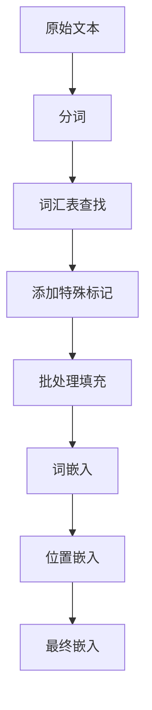

# SimpleTokenizer

一个简单而功能完整的文本分词器，专为Transformer模型设计。支持词汇表构建、文本编码/解码、位置编码和嵌入生成。

## 🚀 特性

- **简单分词**：基于空格的分词，支持文本清洗
- **词汇表构建**：从语料库自动构建词汇表
- **特殊标记**：支持 `<pad>`, `<bos>`, `<eos>`, `<unk>` 特殊标记
- **位置编码**：支持正弦位置编码和可学习位置编码
- **设备支持**：自动检测并使用CUDA/CPU
- **批处理**：支持批量文本处理和填充
- **嵌入生成**：结合词嵌入和位置嵌入

## 📦 安装

```bash
# 确保已安装PyTorch
pip install torch
```

## 🔧 使用方法

### 基本用法

```python
from simple_tokenizer import SimpleTokenizer

# 1. 准备语料库
corpus = [
    "Transformer is almost the origin of large models",
    "All modern LMs are based on the transformer architecture",
    "Attention is all you need",
]

# 2. 创建分词器
tokenizer = SimpleTokenizer(
    corpus=corpus,
    max_vocab=10000,
    d_model=256,
    max_pos_len=1024
)

# 3. 编码文本
text = "attention is all you need"
encoded = tokenizer.encode(text)
print(f"Encoded: {encoded}")

# 4. 解码
decoded = tokenizer.decode(encoded)
print(f"Decoded: {decoded}")
```

### 批处理

```python
# 批量处理文本
batch_texts = [
    "Transformer is the origin",
    "attention is all you need"
]

# 获取token IDs和注意力掩码
input_ids, attention_mask = tokenizer.collate_fn(batch_texts, max_len=12)
print(f"Input IDs shape: {input_ids.shape}")      # [2, 12]
print(f"Attention mask shape: {attention_mask.shape}")  # [2, 12]

# 获取嵌入
embeddings = tokenizer.get_embeddings(input_ids)
print(f"Embeddings shape: {embeddings.shape}")    # [2, 12, 256]
```

## 🏗️ 类结构

### SimpleTokenizer

主要的分词器类，包含所有核心功能。

#### 初始化参数

| 参数 | 类型 | 默认值 | 描述 |
|------|------|--------|------|
| `corpus` | List[str] | None | 用于构建词汇表的文本语料库 |
| `max_vocab` | int | 10000 | 最大词汇表大小 |
| `d_model` | int | 256 | 嵌入维度 |
| `max_pos_len` | int | 1024 | 最大位置长度 |

#### 主要方法

##### `tokenize(text: str) -> List[str]`
对单个文本进行分词。

```python
tokens = tokenizer.tokenize("Hello world!")
# 返回: ["hello", "world"]
```

##### `encode(text: str, add_bos=True, add_eos=True) -> List[int]`
将文本编码为token ID序列。

```python
ids = tokenizer.encode("hello world")
# 返回: [1, 123, 456, 2]  # [<bos>, hello, world, <eos>]
```

##### `decode(ids: List[int]) -> str`
将token ID序列解码为文本。

```python
text = tokenizer.decode([1, 123, 456, 2])
# 返回: "hello world"
```

##### `collate_fn(texts: List[str], max_len=None) -> Tuple[Tensor, Tensor]`
批量处理文本，返回填充后的token IDs和注意力掩码。

```python
input_ids, attention_mask = tokenizer.collate_fn(texts, max_len=10)
# input_ids: [batch_size, max_len]
# attention_mask: [batch_size, max_len]
```

##### `get_embeddings(input_ids: Tensor) -> Tensor`
获取文本的嵌入表示（词嵌入 + 位置嵌入）。

```python
embeddings = tokenizer.get_embeddings(input_ids)
# 返回: [batch_size, seq_len, d_model]
```

## 🔍 核心功能详解

### 1. 分词过程

```python
def tokenize(self, text):
    text = text.lower()  # 转小写
    text = re.sub(r"[^a-z\s]", "", text)  # 只保留字母和空格
    return text.split()  # 按空格分词
```

### 2. 词汇表构建

```python
# 特殊标记 + 高频词汇
vocab = ["<pad>", "<bos>", "<eos>", "<unk>"] + most_common_tokens
```

### 3. 位置编码

支持两种位置编码方式：

#### 正弦位置编码（默认）
```python
# 预计算正弦位置编码
pos_embeddings = self._create_sinusoidal_embeddings()
```

#### 可学习位置编码
```python
# 可学习的嵌入层
self.pos_emb = nn.Embedding(max_pos_len, d_model)
```

### 4. 设备支持

```python
# 自动检测设备
self.device = torch.device("cuda" if torch.cuda.is_available() else "cpu")

# 所有张量自动移动到正确设备
input_ids = torch.tensor(input_ids, device=self.device)
```

## 📊 数据流程



## 🎯 使用场景

### 1. 与Transformer模型结合

```python
# 创建分词器
tokenizer = SimpleTokenizer(corpus=corpus, d_model=256)

# 创建Transformer模型
from transformer_model import TransformerModel
model = TransformerModel(
    vocab_size=tokenizer.get_vocab_size(),
    d_model=256,
    nhead=8,
    num_encoder_layers=6,
    num_decoder_layers=6
)

# 处理文本
input_ids, attention_mask = tokenizer.collate_fn(texts)
output = model(input_ids, target_ids)
```

### 2. 文本预处理

```python
# 批量文本预处理
def preprocess_texts(texts):
    input_ids, attention_mask = tokenizer.collate_fn(texts)
    embeddings = tokenizer.get_embeddings(input_ids)
    return embeddings, attention_mask
```

## ⚙️ 配置选项

### 词汇表设置
```python
tokenizer = SimpleTokenizer(
    max_vocab=50000,  # 更大的词汇表
    corpus=large_corpus
)
```

### 嵌入维度
```python
tokenizer = SimpleTokenizer(
    d_model=512,  # 更大的嵌入维度
    max_pos_len=2048  # 更长的序列支持
)
```

### 位置编码
```python
# 在_init_embeddings中修改
self.use_sinusoidal_pos = False  # 使用可学习位置编码
```

## 🔧 高级用法

### 自定义分词规则

```python
class CustomTokenizer(SimpleTokenizer):
    def tokenize(self, text):
        # 自定义分词逻辑
        text = text.lower()
        # 添加自定义清洗规则
        text = re.sub(r"[^a-z0-9\s]", "", text)
        return text.split()
```

### 处理特殊标记

```python
# 获取特殊标记ID
special_ids = tokenizer.get_special_token_ids()
print(f"PAD ID: {special_ids['pad_id']}")
print(f"BOS ID: {special_ids['bos_id']}")
print(f"EOS ID: {special_ids['eos_id']}")
print(f"UNK ID: {special_ids['unk_id']}")
```

## 📈 性能优化

### 1. 预计算位置编码
```python
# 位置编码在初始化时预计算，避免重复计算
pos_embeddings = self._create_sinusoidal_embeddings()
```

### 2. 设备优化
```python
# 所有张量自动在正确设备上创建
input_ids = torch.tensor(input_ids, device=self.device)
```

### 3. 批处理效率
```python
# 向量化批处理，提高效率
input_ids, attention_mask = tokenizer.collate_fn(texts)
```

## 🐛 常见问题

### Q: 如何处理未知词汇？
A: 未知词汇会被映射到 `<unk>` 标记。

### Q: 如何调整序列长度？
A: 使用 `max_len` 参数控制最大序列长度，超出部分会被截断。

### Q: 如何添加新的特殊标记？
A: 修改 `special_tokens` 列表并重新构建词汇表。

### Q: 内存使用过多怎么办？
A: 减少 `max_vocab` 和 `max_pos_len` 参数。

## 📝 示例代码

完整的使用示例请参考 `simple_tokenizer.py` 文件末尾的示例代码。

## 🤝 贡献

欢迎提交Issue和Pull Request来改进这个分词器！

## 📄 许可证

MIT License
