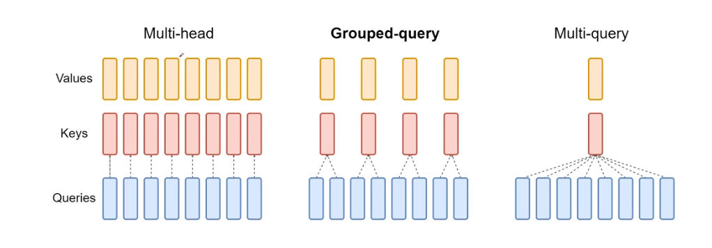
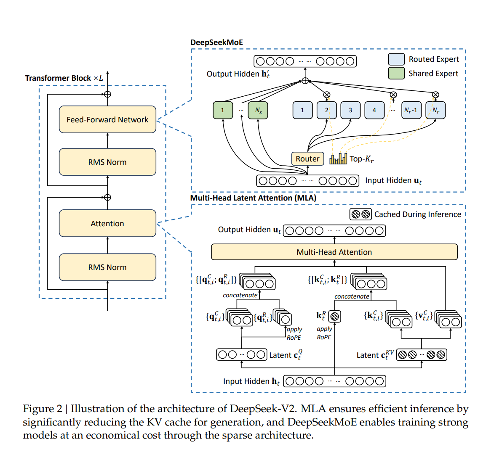
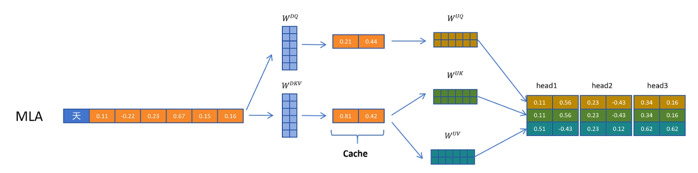

# LLM Arch: Deepseek

[TOC]

## DeepSeek 模型总体特点总结

DeepSeek 系列模型在学术界和工业界最大的标签是**“极致的性价比”**与**“算法/工程协同优化”**。

1. **架构创新优先**：不同于LLaMA系模型主要依赖堆算力和数据，DeepSeek 早期就引入了 **MoE (Mixture-of-Experts)** 和 **MLA (Multi-Head Latent Attention)**，在同等激活参数下，性能远超稠密(dense)模型。
2. **长上下文与推理成本优化**：通过MLA解决了长Context下的KV Cache显存瓶颈问题。
3. **全链路开源**：不仅开源权重，还开源了关于RL训练（如DeepSeek-R1-Zero）的技术细节，是目前开源社区的风向标。

## 核心技术：MLA (Multi-Head Latent Attention)

这是DeepSeek V2中提出的核心注意力机制，也是我们作为网络优化研究者需要重点关注的模块。

### 0. KV Cache

#### 0.1 KV Cache简介

简单来说，**KV Cache 是一种“以显存换速度”（Space-for-Time）的优化技术**。LLM 的生成是**自回归（Autoregressive）**的，即“预测下一个 Token”。例如，我们假设用户输入是 `A B`，模型要生成 `C`，然后是 `D`， `E`。

没有 KV Cache 时（低效）：

1. **Step 1**: 输入 `A B` $\rightarrow$ 计算 `A` 和 `B` 的 Attention $\rightarrow$ 输出 `C`。
2. **Step 2**: 输入 `A B C` $\rightarrow$ **重新计算** `A`、`B` 和 `C` 的 Attention $\rightarrow$ 输出 `D`。
3. **Step 3**: 输入 `A B C D` $\rightarrow$ **重新计算** `A`、`B`、`C` 和 `D` 的 Attention $\rightarrow$ 输出 `E`。

**问题**：我们会发现 `A`和 `B` 的 Key 和 Value 向量在每一步都被重复计算了。对于 Transformer 这种 $\mathcal{O}(N^2)$ 的架构，随着序列变长，这种重复计算是极大的浪费。

使用 KV Cache 时（高效）：

1. **Step 1 (Prefill)**: 输入 `A B` $\rightarrow$ 计算出 `A` 和 `B` 的 Key/Value 向量 $\rightarrow$ **存入显存 (Cache)** $\rightarrow$ 输出 `C`。
2. **Step 2 (Decoding)**: 输入 `C` (以及之前存好的 Cache) $\rightarrow$ 只计算 `C` 的 Key/Value $\rightarrow$ 从显存读出 `A` 和 `B` 的 KV $\rightarrow$ 拼接 $\rightarrow$ 输出 `D`。

**结果**：我们不需要重新通过巨大的权重矩阵计算之前的 Token，只需要从显存里读取之前算好的向量。

#### 0.2 原理

在 Transformer 的 Self-Attention 层（回忆：**self-attn**: 让序列中每个 token 去看同一序列里的其他 token（建模上下文依赖、长程关系），**cross-attn**：让一个序列（query）去看另一个序列（key/value），本质是“条件化 / 对齐 / 融合外部信息” ）中：
$$
Attention(Q, K, V) = \text{Softmax}(\frac{QK^T}{\sqrt{d_k}})V
$$
在第 $t$ 步生成时：

1. 我们只有一个当前的 Query 向量：$q_t$（对应当前最新的一个 Token）。

2. 我们需要和**之前所有** Token 的 Key ($k_{1...t}$) 做点积。

3. 我们需要用权重加权**之前所有** Token 的 Value ($v_{1...t}$)。

4. 注意这里容易混淆：

   - $q_t \in \mathbb{R}^{d_h}$：第 $t$ 个 token 的 query 向量（一行）
   - $K_{1:t} \in \mathbb{R}^{t \times d_h}$：历史所有 token 的 key 向量堆起来（多行）

   所以注意力分数实际是：
   $$
   q_t K_{1:t}^{\top}
   $$
   形状是：

   - $q_t$ 是 $(1 \times d_h)$
   - $K_{1:t}^{\top}$ 是 $(d_h \times t)$
   - 结果是 $(1 \times t)$：**对每个历史 token 给一个相似度分数**。

KV Cache 的操作流程：
$$
K_{current} = \text{Concat}(K_{cache}, k_{new}) \\
V_{current} = \text{Concat}(V_{cache}, v_{new})
$$
之后更新 Cache：
$$
K_{cache} \leftarrow K_{current} \\ V_{cache} \leftarrow V_{current}
$$

#### 0.3 什么时候 KV cache 不能直接复用？

KV cache 能复用的前提是投影矩阵 `W`不会变。几个典型例外/边界：

1. **如果我们在生成过程中更新了权重（在线学习/训练态）**：旧 KV 立刻失效，必须重算。所以一般训练阶段不能使用KV cache，
2. **非因果 self-attn（比如 encoder 的双向注意力）且输入会变**：如果我们“追加”token 并要求所有位置都能看新 token，那旧位置的表示会变，cache就不成立。
3. **位置编码处理方式发生变化**： cache 里的 K/V 隐含了位置信息（RoPE/绝对位置等）。如果我们在同一段 cache 上“平移位置”或改 RoPE 设定，可能要重算或做 RoPE 的特殊缓存策略。

只有推理阶段`W` 固定 + causal mask 保证旧 token 表示不变 → **旧 KV 永远有效**，所以可以 cache。

### 1. 背景痛点：KV Cache 爆炸

在传统的 MHA (Multi-Head Attention) 甚至 GQA (Grouped-Query Attention) 中，随着序列长度增加，虽然 KV Cache 节省了计算量（FLOPs），但KV Cache 占用的显存会线性（甚至更快）增长，成为推理吞吐量的最大瓶颈。假设我们使用半精度（FP16, 2 bytes），KV Cache 的大小估算如下：

$$\text{Size} = 2 \times 2 \times n_{layers} \times d_{model} \times \text{Context Length} \times \text{Batch Size}$$

- 第一个 2：Key 和 Value 两个矩阵。
- 第二个 2：FP16 占 2 个字节。
- $n_{layers}$：层数。
- $d_{model}$：隐藏层维度（通常等于 $n_{heads} \times d_{head}$）。

### 1.5 解决方法：GQA （Grouped-Query Attention）

*Fig 1 MHA/MQA/GQA, 图片来自[视频](https://www.bilibili.com/video/BV1BYXRYWEMj/?spm_id_from=333.337.search-card.all.click&vd_source=8e4240c01961f6b9da120f45fca69100)*

将 Query Heads 分组（Group）。每组 Query 共享一个 Key/Value Head。这样做无需像MHA那样计算很多的KV导致显存爆炸，又不会像MQA那样压缩太狠导致KV太过稀疏影响性能，是一种这种的方案

### 2. MLA 的解决方案：低秩键值联合压缩

*Fig.2 DeepSeek MLA and MoE, 来自原Deepseek V2论文*

MLA 的核心思想是**“压缩”**。它不再缓存完整的 Key 和 Value 矩阵，而是将 KV 投影到一个低维的潜在向量（Latent Vector）中。

- Low-Rank Key-Value Joint Compression (低秩KV联合压缩):

  MLA 将 Key 和 Value 的生成过程分解为：
  $$
  Input \rightarrow Down Projection (Latent Vector) \rightarrow Up Projection (Key/Value)
  $$
  在推理时，我们只需要

  - 缓存这个低维的 Latent Vector(即input经过向下压缩的矩阵$W^{DownKV}$得到的特征)，而不是展开后的 High-dim Key/Value。
  - 之后，再通过向上解压矩阵$W^{UpK}$和$W^{UpV}$进行解压得到KV。
  - Q也做同样处理。

  这使得 KV Cache 的大小被压缩到了原来的 $1/4$ 甚至更低（相比于 GQA）。

- Decoupled RoPE (解耦旋转位置编码):

  由于 RoPE 对位置敏感，直接对带有 RoPE 的 Key 进行压缩会破坏位置信息。MLA 采用了一种巧妙的 Decoupled（解耦） 策略：

  - **Content part:** 负责语义，进行深度压缩（Low-rank）。
  - **RoPE part:** 负责位置，单独保留一个小维度的向量，不进行压缩。
  - 计算 Attention Score 时，将这两部分分别计算后相加。
  - 注意，仅对Key和Q进行这样的操作，V保持原样

### 3. 结论

MLA 使得 DeepSeek V2/V3 在推理阶段的 KV Cache 极小，从而支持超大的 Batch Size 和超长的 Context（128k），这是其 API 价格极低的技术根基。

## Deepseek MoE

传统MoE（如 Mixtral 8*7B）有一些问题：

- **知识混合 (Knowledge Hybridity)**：因为专家数量少且参数量大，每个专家被迫学习极其混杂的知识。比如 `Expert #1` 可能既要负责“Python 代码生成”，又要负责“法文翻译”。这导致专家无法专业化，难以掌握细微的语义。
- **知识冗余 (Knowledge Redundancy)**：有些知识是通用的（比如基本的语法结构、连词 `and`, `the`）。在标准 MoE 中，由于每个 Token 只能访问选定的 2 个专家，这意味着**所有的专家都必须在其参数里重复存储这些通用知识**，造成参数浪费。

DeepSeekMoE (V2/V3) 的设计哲学可以总结为：**把大专家切碎，并分离出通用专家。**MoE发生在FFN层。

### 专家分类

#### 1. Fine-Grained Experts (细粒度专家)

DeepSeek 不使用 多 个大专家，而是使用**几十甚至上百个小专家**（例如 V3 中有 256 个 Routed Experts）。

- **做法**：将 FFN 的中间层维度 $d_{ff}$ 切分得更细。
- **路由**：从 Top-2 变为 Top-K（例如 Top-8）。
- **优势**：每个专家变得极小，可以极度**专业化**。
  - Expert A 专门负责 Python 的 `import` 语句。
  - Expert B 专门负责线性代数的矩阵乘法概念。
  - 这种“组合式”的表达能力比几个“全能大专家”更强。

> Note: 这里要搞清两个概念，
>
> - 在多数 MoE 论文/实现里，“专家”并不等于“学科专家（例如心理学，生物学等）”。更贴切的理解是——**专家是对“当前 token 的表征特征”更擅长的一组 FFN**。这些特征往往是**词源/子词形态、语法角色、标点/括号/换行、数字形态、代码样式、语言片段**等“局部而高频”的模式，而不是整块的知识领域。
> - 这里的路由指的是**Token-level的路由**，即**每个token都会被送去不同的专家**。这是因为在一个 Sequence 中，上下文的语义在快速跳变，例如模型要回答：首先我们定义函数... (需要通用语言/数学定义专家) ... $\int x^2 dx$ ... (需要符号计算专家) ... print(result) ... (需要代码专家) ... 综上所述 ... (需要逻辑总结专家)"...所以路由为每个 Token $x_t$ 选取分数最高的 $K$ 个 Routed Experts（例如 V3 中是 256 选 8），然后每个token各走各的，计算完成后再加权求和并拼回 Sequence。
> - 可以把 DeepSeek（或者任何 MoE 模型）想象成一座 60 层高的摩天大楼（相当于有 60 个 decoder block），数据（Token embedding）像一个访客，必须从第 1 楼坐电梯逐层往上走，直到顶层输出。每一层楼最前方由一个专门的前台（Router），而里面坐着 256 个专家（以及几个共享专家），每一层楼的专家都是独立的，且相同序号的专家在不同楼层的功能可能不同。他们独立决策，且随着层数上升，专家的职能会进化。

#### 2. Shared Experts (共享专家) 

这是 DeepSeekMoE 最具辨识度的设计。

- **做法**：专门划出一部分参数，设立为“共享专家”（Shared Experts）。

- **机制**：**无论 Router 选择了哪些路由专家，共享专家永远被激活。**

- 数学表达：
  $$
  Output = x + \text{Dense}(x) + \text{Router}(x)
  $$
  更具体地：
  $$
  h_{out} = x + \sum_{i \in Shared} FFN_i(x) + \sum_{j \in TopK(Router(x))} g_{j,x} \cdot FFN_j(x)
  $$

- **优势**：

  - **通用知识归位**：基本的语法、句法、逻辑连接词由 Shared Dense Experts 统一负责。
  - **路由专家减负**：Routed Experts 不再需要存储通用知识，只需专注于特定领域的长尾知识（Long-tail knowledge）。

### V3 的进阶：无辅助损失的负载均衡 (Auxiliary-Loss-Free Load Balancing)

这部分对于研究 RL 和 Optimization 特别重要。

#### 1. 传统困境：Aux Loss 的双刃剑

在训练 MoE 时，为了防止“路由崩塌”（即所有 Token 都涌向同一个专家，导致其他专家饿死），通常会加一个 **Auxiliary Loss (辅助损失)** 来强行要求 Token 均匀分布到各个专家。其大概意思是，我们通过计算每个专家调用的频率和所有专家调用的频率的比值过softmax来做L2 loss，由可惜不等式可以证明当所有专家的概率趋近相等时取最小loss。该loss会和主loss拼接
$$
Loss = Loss_{CE} + \alpha \cdot Loss_{Aux}
$$
**问题**：$Loss_{Aux}$ 会干扰 $Loss_{CE}$。为了满足负载均衡，Router 被迫去选那些“虽然不适合处理这个 Token，但是比较空闲”的专家。这直接损害了模型性能。

#### 2. DeepSeek V3 的解法：Bias-only Balancing

DeepSeek V3 彻底去掉了 Aux Loss。

它采用了一种类似 RL 中的探索策略，或者说控制论中的反馈调节：

- 引入 Bias：在 Router 的计算中加入一个可学习的 Bias 项 $b_i$。

  $$g_i(x) = \text{Sigmoid}(x \cdot w_i + b_i)$$, $w_i$是被top_k选中的第i个专家权重。

- **动态调节**：

  - 统计每个专家的负载（Load）。
  - 如果 Expert $i$ 负载过重 $\to$ **减小** $b_i$（抑制它被选中）。
  - 如果 Expert $i$ 负载过轻 $\to$ **增加** $b_i$（鼓励它被选中）。

- **结果**：模型在训练过程中只优化 Cross-Entropy Loss（保证性能最优化），而负载均衡完全通过动态调整 Bias 来实现。这被称为“性能无损”的均衡策略。

但是，文章也提到了，为了避免在一个sequence里面出现**极端的LB不均衡**，他们也部署了类似aux loss的**互补辅助loss**（Complementary Sequence-Wise Auxiliary Loss）， The sequence-wise balance loss encourages the expert load on each sequence to be balanced. 

我们看一个例子，假设一个里面有 100 条短句子和 1 条 128k 长度的长文（比如一本小说），那么这个loss会鼓励模型将小说拆分成短句和其他100条句子打乱送入不同expert，而不ℹi出现将128k长文都送给一个专家。

### 总结：DeepSeekMoE vs 标准 MoE

| **特性**         | **标准 MoE (如 Mixtral/Grok-1)** | **DeepSeekMoE (V2/V3)**            |
| ---------------- | -------------------------------- | ---------------------------------- |
| **专家规模**     | 少量大专家 (e.g., 8)             | 大量小专家 (e.g., 64/256)          |
| **激活方式**     | Top-2                            | Top-K (e.g., Top-8) + **Shared**   |
| **通用知识处理** | 冗余存储在所有专家中             | 由 **Shared Experts** 集中处理     |
| **负载均衡**     | 依赖 Aux Loss (损害性能)         | **Aux-Loss-Free** (动态 Bias 调节) |
| **计算效率**     | 高，但参数利用率低               | 极高，参数利用率（专业化）极高     |

### 

## 模型演进：V2 vs V3 vs R1

这三代模型代表了DeepSeek在不同维度的突破：**架构确立**、**工程极致**、**推理范式**。

### 1. DeepSeek-V2：架构奠基者

- **发布时间**：2024年中。
- **核心贡献**：确立了 **MLA + DeepSeekMoE** 的架构范式。
  - **DeepSeekMoE**：不同于传统的 MoE（如 Mixtral 的 Top-2），V2 引入了 **"Fine-grained Experts" (细粒度专家)** 和 **"Shared Experts" (共享专家)**。
    - 它将一个大专家切分成多个小专家，提高专业化程度。
    - 设立固定被激活的“共享专家”，用于捕获通用知识，避免路由崩塌。
- **地位**：证明了“魔改”Transformer结构可以在不损失性能的前提下大幅降低显存和计算量。

### 2. DeepSeek-V3：工程与训练稳定性的巅峰

- **发布时间**：2024年底。
- **规模**：总参数 671B，激活参数 37B（以极小的激活代价达到了 GPT-4 级别的性能）。
- **核心变化 (相对于 V2)**：
  - **FP8 混合精度训练**：这是业界首次在大规模模型上成功应用原生 FP8 训练，极大地提升了训练效率。
  - **Auxiliary-Loss-Free Load Balancing**：在 MoE 路由中，去掉了传统的负载均衡辅助损失函数（Aux loss 通常会损害模型性能），改用一种动态调整 Bias 的策略来平衡专家负载。
  - **MTP (Multi-Token Prediction)**：引入多 Token 预测作为训练目标。传统的 LLM 训练是“走一步看一步”（Next Token Prediction, NTP），而 deepseek设计了一个串行（Sequential）的 MTP 模块链, 要求模型“走一步看三步”。这不仅提升了推理速度，更重要的是提升了模型对**长程依赖（Long-term Dependency）**的理解能力。MTP 在推理阶段实现了 2倍以上的 TPS (Tokens Per Second) 提升。
    - 注意，DS仍然在优化NTP，训练时的总 Loss 是加权和：$$\mathcal{L}_{total} = \mathcal{L}_{NTP} + \lambda \sum_{k=1}^{D} \mathcal{L}_{MTP_k}$$
      - $\mathcal{L}_{NTP}$：主模型的 Cross-Entropy Loss。
      - $\mathcal{L}_{MTP_k}$：第 $k$ 个 MTP 模块预测第 $k+1$ 个 Token 的 Loss。
      - $\lambda$：权重系数。通常 MTP 的 Loss 权重会设得小一点，因为预测未来太难了，不要让它带偏了主任务。
- **针对RL研究者的Note**：V3 的基础能力非常强，是后续 R1 进行 RL 训练的强大 Base Model。

### 3. DeepSeek-R1：RL 驱动的推理模型 (System 2)

- **发布时间**：2025年初（近期爆火）。
- **定位**：对标 OpenAI o1，专注于**推理 (Reasoning)** 能力。
- **核心方法**：**大规模强化学习 (RL)**。
  - **DeepSeek-R1-Zero**：不使用任何 SFT（监督微调）数据，直接在 Base 模型上应用纯 RL 算法。模型在训练过程中自然涌现出了“自我反思”、“长链条思维 (CoT)”以及“Aha moments”。
  - **GRPO (Group Relative Policy Optimization)**：这是 R1 的算法核心（我们应该会很感兴趣）。
    - 传统的 PPO 需要一个巨大的 Value Model (Critic) 来估计优势函数，这在 671B 的模型上极其昂贵。
    - **GRPO** 抛弃了 Critic 模型。它通过对同一个 Prompt 采样一组输出 (Group)，计算它们在组内的相对优势。这极大地节省了 RL 训练的显存和计算资源。
- **蒸馏 (Distillation)**：R1 的思维链数据被用来蒸馏更小的模型（如 Qwen-32B-Distill），证明了强大的推理能力可以被“传授”给小模型。

**总结对比表**

| **特性**      | **DeepSeek-V2**     | **DeepSeek-V3**           | **DeepSeek-R1**            |
| ------------- | ------------------- | ------------------------- | -------------------------- |
| **主要定位**  | 高性价比 MoE 验证   | 极致工程与 SOTA 基座      | 推理/逻辑/数学 (System 2)  |
| **Attention** | **MLA** (首创)      | MLA                       | MLA                        |
| **FFN 架构**  | DeepSeekMoE         | DeepSeekMoE               | DeepSeekMoE                |
| **训练精度**  | BF16                | **FP8** (原生)            | -                          |
| **RL 算法**   | -                   | -                         | **GRPO** (去 Critic PPO)   |
| **关键创新**  | 细粒度 MoE, 压缩 KV | 无 Aux Loss 负载均衡, MTP | 纯 RL 涌现思维链, 自我修正 |

## Deepseek 3.2 

2025年12月，deepseek发布了最新模型V3.2。如果说 V3 是架构和训练系统的里程碑，那么 V3.2 则是专注于“长上下文效率”与“Agent（智能体）能力”的深度优化版本。主要带来了以下几个方面的更新。

### 架构层面：DeepSeek Sparse Attention (DSA)

#### 1. 核心机制：Lightning Indexer + Top-k Selection

DSA 不再计算所有 Key-Value 的注意力，而是通过两步走来实现稀疏化：

- **Lightning Indexer (闪电索引器)**：这是一个轻量级的模块（FP8实现），用于快速计算 Query 和 Key 之间的粗略相关性分数 $I_{t,s}$ 。（复杂度,$O(L^2)$, L=seq_len）
  $$
  I_{t,s} = \sum w \cdot \text{ReLU}(q^I \cdot k^I)
  $$

- **Fine-grained Selection (细粒度选择)**：根据 Indexer 的分数，选出 Top-k 个最相关的 Key-Value 对（KV entries）。

- **Attention 计算**：主模型只对这 Top-k 个 KV 对进行 Attention 计算 。（复杂度$O(KL)$）

在训练阶段, 先对lightning indexer dense model进行训练，直到其接近正常的注意力分布（有点像蒸馏原先模型的能力）；然后再进行稀疏的整体模型的训练以适应这个闪电indexer。注意！文中提到lighting indexer是从计算图中拿走的，即不参与言语模型的梯度更新。他们二者是分开计算的。

#### 2. MLA 下的 DSA 实例化

这是一个非常工程化的细节：V3.2 的 DSA 是基于 **MLA 的 MQA (Multi-Query Attention) 模式** 实例化的 。

- **回顾 MLA**：MLA 可以通过矩阵变换等效为 MHA。
- **V3.2 的做法**：为了计算效率，每一个 Latent Vector (压缩后的 KV) 被所有 Query Heads 共享（类似 MQA）。Lightning Indexer 决定检索哪些 Latent Vectors 。

### 2. Post-traing：专家蒸馏 以及scalable RL framewrok

V3.2 披露了更多**工程级的修正**，旨在让大规模 post training 更稳定 。

#### 2.1 Specialist Distillation：先分后总的“超级教师”策略

DeepSeek-V3.2 并不是直接在一个通用模型上从头练 RL，而是采用了一种 **"Divide-and-Conquer"（分而治之）** 的数据生产策略。

**2.1.1 制造“偏科天才” (Specialist Models)**

DeepSeek 首先基于同一个 V3.2 Base Checkpoint，针对不同领域分别训练了6个**专用专家模型（Specialist Models）** 。

- **覆盖领域**：数学、编程、通用逻辑推理、通用 Agent 任务、Agent 代码生成、Agent 搜索 。
- **训练方式**：每个专家模型都使用了**大规模的 RL 计算资源进行专门的强化训练**(文章原话) 。这意味着每个专家在自己的领域都达到了极高的水平（类似于 DeepSeek-R1 在数学上的地位）。

**2.1.2. 生成双模态数据 (Thinking & Non-thinking)**

这些“偏科天才”被用作**教师**，生成合成数据来教导最终的 V3.2 模型。有趣的是，他们生成了两类数据 ：

- **Thinking Mode Data**：包含完整的长思维链（Long Chain-of-Thought），用于提升推理能力。
- **Non-thinking Mode Data**：直接生成最终答案，用于提升常规问答的响应速度和格式规范。

**2.1.3 蒸馏回主模型**

这些领域特定的数据被收集起来，用于微调最终的 DeepSeek-V3.2。

- **结果**：实验表明，仅通过蒸馏（SFT），V3.2 的性能就已经非常接近那些专用专家了 。这极大地降低了后续 RL 阶段探索的难度。不同的蒸馏数据，也可以进行不同的模型模式训练（thinking and non-thinking）

#### 2.2 Mixed RL Training：拒绝“灾难性遗忘”的单阶段 RL

这是 V3.2 与许多其他模型（通常采用多阶段 RL，如先做推理 RL，再做对话 RL，最后做安全 RL）最大的不同点。

**2.2.1 One-Stage All-In (单阶段混合)**

DeepSeek-V3.2 将 **Reasoning (推理)**、**Agent (智能体)** 和 **Human Alignment (人类对齐)** 全部合并到了**同一个 RL 阶段**中进行训练 。

- **动机**：传统的多阶段（Multi-stage）训练（或者课程学习）往往面临**灾难性遗忘（Catastrophic Forgetting）**的问题：模型学会了安全说话，变笨了；学会了写代码，数学变差了。

- **解法**：通过混合训练，模型在同一个 Update Step 中同时接收来自不同任务的梯度信号，从而在保持通用能力的同时提升特定能力 。

  

**2.2.2 异构奖励机制 (Heterogeneous Rewards)**

既然任务混合了，Reward 怎么算？DeepSeek 对不同任务给予不同的反馈信号：

- **对于推理和 Agent 任务** ：
  - **Rule-based Outcome Reward**：基于规则的结果奖励（如代码通过测试、数学答案匹配）。
  - **Length Penalty**：长度惩罚（防止思维链无限啰嗦，这在 V3.2 正式版中被严格执行，但在 Speciale 版本中被放宽）。
  - **Language Consistency Reward**：语言一致性奖励（防止中英混杂）。
- **对于通用任务** ：
  - **Generative Reward Model**：使用一个专门的 Reward Model（通常也是 LLM）根据特定 Rubrics（评分标准）对生成的 Prompt 进行打分。

#### 2.3 强化学习的改进

**2.3.1 Unbiased KL Estimate (无偏 KL 估计)**

传统的 PPO/GRPO 在计算 KL 散度（用于约束 Policy 变化）时，使用的是 Schulman (2020) 的 k3 估计器。

- **问题**：当当前策略 $\pi_\theta$ 的概率远小于参考策略 $\pi_{ref}$ 时（$\pi_\theta \ll \pi_{ref}$），k3 估计器的梯度会变得非常大且无界，导致训练不稳定。

- V3.2 改进：引入了基于 Importance Sampling 的无偏 KL 估计器 。
  $$
  D_{KL} = \frac{\pi_\theta}{\pi_{old}} (\frac{\pi_{ref}}{\pi_{\theta}} -\log \frac{\pi_{ref}}{\pi_{\theta}} - 1)
  $$
  这消除了系统性估计误差，使得收敛更加平滑。

**2.3.2. Off-Policy Sequence Masking (离策略序列掩码)**

- **问题**：RL 训练数据通常是分批生成的，生成时的 Policy ($\pi_{old}$) 和当前更新的 Policy ($\pi_\theta$) 可能已经偏离了。如果某个序列的偏离程度（KL散度）过大，且 Advantage 为负（模型表现不好），强行学习会让模型迷失。

- **V3.2 改进**：引入掩码 $M_{i,t}$。如果一个序列的 Advantage $< 0$ **且** KL 散度超过阈值 $\delta$，直接在 Loss 中 mask 掉这个序列，不进行更新。

  > "Intuitively, the model benefits the most by learning from its own mistakes, whereas highly off-policy negative samples can be detrimental." 

**2.3.3. Keep Routing (MoE 路由一致性) —— *关键点***

这是解决 MoE + RL 训练不稳定的核心技巧。

- **做法**：在训练更新时，**强制使用与 Inference (采样) 阶段完全相同的专家路由路径**，而不是重新计算路由 12。
- **原理**：如果不锁定路由，参数更新会导致 Router 的决策变化，进而导致“输入没变，但激活的专家变了”，这会引入巨大的参数空间抖动（Active Parameter Subspace Shift）。锁定路由确保了是在优化“当时那个决策”的参数 13。

**2.3.4 Keep Sampling Mask**

把Top-P/top-k采样的内容的mask也记录下来共训练使用。通常我们认为 **Top-p (Nucleus Sampling)** 只是为了让生成的文本更多样化，是一个纯粹的“推理策略”。但在 RL（特别是 PPO/GRPO）的训练过程中，**Keep Sampling Mask** 的存在是为了解决一个严肃的数学严谨性问题：**重要性采样（Importance Sampling）中的动作空间（Action Space）不匹配问题。**举例：

想象我们在做一道单选题，选项有 A, B, C, D, E。

- **推理时 ($\pi_{old}$)**：Top-p采样觉得 D 和 E 太离谱了，直接把它们mask了。我们只能在 {A, B, C} 里选，最后选了 A。
  - 选 A 的概率是 $P(A) / (P(A)+P(B)+P(C))$。
- **训练时 ($\pi_\theta$)**：现在我们要评估选 A 选得好不好。
  - **如果不带 Mask**：我们是在 {A, B, C, D, E} 里面重新计算 A 的概率。
    - 概率变成 $P'(A) / (P'(A)+P'(B)+P'(C)+P'(D)+P'(E))$。
  - **带 Keep Sampling Mask**：我们强行把 D 和 E 也挡住，只允许模型在 {A, B, C} 的范围内重新评估 A 的概率。

### 3.agent应用层面：Thinking in Tool-Use

DeepSeek-R1 证明了思维链（CoT）对逻辑推理的重要性，V3.2 将这种能力迁移到了 **Tool-Use (工具调用)** 场景 。

#### 1. Context Management (上下文管理)

之前的模型（如 R1）在多轮对话中，往往会在第二轮丢弃之前的“思维过程（Thinking Process）”。

- **V3.2 的策略**：
  - **保留思维**：只要是在同一个任务的 Tool Call 循环中（Tool Call -> Tool Output -> Tool Call），模型会**一直保留之前的思维链** 。
  - **何时丢弃**：只有当**新的用户消息 (User Message)** 进来时，才丢弃之前的思维链，但保留工具调用的结果历史 。

#### 2. 大规模合成数据 (Large-Scale Synthesis)

为了训练 Agent，V3.2 构建了一个庞大的合成数据流水线：

- **Search Agent**：通过多 Agent 协作（提问、搜索、回答、验证）生成了 50,275 个高质量搜索任务 。
- **Code Agent**：从 GitHub 挖掘 Issue-PR 对，构建了自动化测试环境，生成了 24,667 个可执行的修复任务 。
- **General Agent**：合成了 1,827 个极其复杂的规划类任务（如旅行计划），这些任务“生成难，验证容易” 。

## References

[1] Liu, A., Feng, B., Xue, B., Wang, B., Wu, B., Lu, C., ... & Piao, Y. (2024). Deepseek-v3 technical report. *arXiv preprint arXiv:2412.19437*.

[2] Liu, A., Feng, B., Wang, B., Wang, B., Liu, B., Zhao, C., ... & Xu, Z. (2024). Deepseek-v2: A strong, economical, and efficient mixture-of-experts language model. *arXiv preprint arXiv:2405.04434*.

[3] Liu, A., Mei, A., Lin, B., Xue, B., Wang, B., Xu, B., ... & Wang, Y. (2025). Deepseek-v3. 2: Pushing the frontier of open large language models. *arXiv preprint arXiv:2512.02556*.

## Appendix

### MLA低秩投影计算细节

#### A. 核心推导：投影矩阵是如何被“吸收”的？

在标准 Transformer 中，Attention 的核心计算是 $Q \cdot K^T$。

MLA 的核心目标是：在显存（KV Cache）里只存低维的 Latent Vector，但在计算 Attention 时等效于高维向量的效果。

1. 定义变量

假设：

- $h_t$: 输入的 hidden state。
- $W_{DK}, W_{UK}$: Key 的降维（Down）和升维（Up）投影矩阵。
- $W_{DQ}, W_{UQ}$: Query 的降维（Down）和升维（Up）投影矩阵。

2. MLA 的 Key 生成（训练时视角）

MLA 对 Key 进行了低秩分解：

$$c_{KV} = h_t \cdot W_{DK} \quad (\text{Latent Vector，维度极小})$$

$$k = c_{KV} \cdot W_{UK} \quad (\text{恢复出的高维 Key})$$

注意：$c_{KV}$ 是压缩的（比如 512维），$k$ 是展开的（比如 $n_{heads} \times d_{head}$）。

3. 矩阵吸收（推理时视角 - The Magic）

计算 Attention Score 时：

Score = q \cdot k^T

代入展开后的 $q$ 和 $k$：

$$Score = (c_{Q} \cdot W_{UQ}) \cdot (c_{KV} \cdot W_{UK})^T$$

利用矩阵转置性质 $(AB)^T = B^T A^T$ 和结合律：

$$Score = c_{Q} \cdot W_{UQ} \cdot W_{UK}^T \cdot c_{KV}^T$$

关键点来了：我们可以把中间的项 $W_{UQ} \cdot W_{UK}^T$ 或者更简单地，把 $W_{UK}^T$ “吸收” 到 Query 一侧（也就是作为新的Query投影矩阵），通过这样的吸收融合可以大大减少计算量。在推理阶段，我们定义一个等效 Query ($q_{absorbed}$)：

$$q_{absorbed} = (c_{Q} \cdot W_{UQ}) \cdot W_{UK}^T$$

那么 Attention 就变成了：

$$Score = q_{absorbed} \cdot c_{KV}^T$$

结论：

在 KV Cache 中，**我们只需要存储低维的 $c_{KV}$**。那个负责把 $c_{KV}$ 变回高维 $k$ 的矩阵 $W_{UK}$，被我们数学上移到了 Query 那边去计算了。这意味着不需要在显存中显式构建高维的 Key 矩阵。

#### B. 冲突爆发：为什么这导致了 RoPE 无法使用？

**上述的“矩阵吸收”技巧，要求 Query 和 Key 之间的交互必须是线性的，中间不能插入位置编码。**

1. 标准 RoPE 的位置

Rotary Positional Embedding (RoPE) 是作用在 $q$ 和 $k$ 上的旋转变换 $R_m$（$m$ 是位置）：

$$Score = (q \cdot R_m) \cdot (k \cdot R_n)^T$$

或者写成相对位置形式：

$$Score = q \cdot R_{m-n} \cdot k^T$$

2. 冲突点

如果我们想用 MLA 的矩阵吸收，同时又要加 RoPE，就会遇到死胡同。因为我们希望计算的是（带位置信息的 Score）：

$$Score = \text{RoPE}(q) \cdot \text{RoPE}(k)^T$$

代入 MLA 的定义：

$$Score = \text{RoPE}(c_Q \cdot W_{UQ}) \cdot \text{RoPE}(c_{KV} \cdot W_{UK})^T$$

**问题出在 $W_{UK}$ 上：**

- RoPE 是对最终的 Head Dimension 进行旋转。
- $W_{UK}$ 必须参与旋转前的运算，或者在旋转后才能与 $Q$ 结合。
- 由于 RoPE 是一个依赖于位置 $m$ 的旋转矩阵，它**不能**简单地和静态权重矩阵 $W_{UK}$ 交换顺序或合并。
- 如果我们把 $W_{UK}$ 像之前那样吸收到 Query 里，那么 Cache 里存的就是没有位置信息的 $c_{KV}$。
- **如果不存位置信息，Attention 就变成了 Bag-of-Words，模型不知道 Token 的顺序，完全失效。**

**这就形成了一个悖论：**

- 要压缩 KV Cache $\rightarrow$ 必须把 $W_{UK}$ 吸收到 Query 侧。
- 要把 $W_{UK}$ 吸收到 Query 侧 $\rightarrow$ Key Cache 里就不能包含 RoPE（因为 RoPE 必须作用在高维 Head 上，而cache只有通过$W_{UK}$ 才能成为高维）。
- Key Cache 里没有 RoPE $\rightarrow$ 丢失位置信息。

#### C. 解决方案：Decoupled RoPE (解耦 RoPE)

DeepSeek 的解决思路非常“简单粗暴”：既然 $c_{KV}$ 为了压缩不能带 RoPE，那我就**再单独搞一个极小的向量专门存 RoPE**。

这就是 **"Decoupled Strategy"**：将 Key 分为两部分。

1. Content Part (语义部分 - 负责压缩)

这一部分使用上述的 **Matrix Absorption** 技巧。

- Cache 内容：$c_{KV}$ (低维，无位置信息)。
- Query 处理：$q_{content} = q \cdot W_{UK}^T$ (吸收了 Up-projection)。
- 计算：$Score_{content} = q_{content} \cdot c_{KV}^T$。

2. RoPE Part (位置部分 - 不压缩)

这一部分单独拿出来，不进行低秩压缩，直接使用 RoPE。

- 生成一个专门的、维度很小的 Key 向量 $k^R$ (例如维度只有 64，远小于主维度的 128 或 larger)。
- 生成对应的 Query 向量 $q^R$。
- 对这两个小向量应用标准 RoPE。
- Cache 内容：$k^R$ (带位置信息)。
- 计算：$Score_{rope} = \text{RoPE}(q^R) \cdot \text{RoPE}(k^R)^T$。

3. 最终融合 (Fusion)

最终的 Attention Score 是两部分的加和：

$$Score_{total} = Score_{content} + Score_{rope}$$

$$Score_{total} = (q_{absorbed} \cdot c_{KV}^T) + (\text{RoPE}(q^R) \cdot \text{RoPE}(k^R)^T)$$

在原论文中，实际计算为

### 对GRPO的无偏KL估计

#### 1. 为什么原来的估计是“有偏”的？

在 PPO/GRPO 中，我们的目标是限制当前策略 $\pi_\theta$ 不要偏离参考策略 $\pi_{ref}$ 太远。我们需要计算的是：
$$
D_{KL}(\pi_\theta \| \pi_{ref}) = \sum_x \pi_\theta(x) \log \frac{\pi_\theta(x)}{\pi_{ref(x)}}
$$
**注意看求和符号前面的概率**：KL 散度的定义是基于 **$\pi_\theta$（当前策略）** 的分布来加权的。但在训练时，我们的数据样本 $x$ 是从 $\pi_{old}$（旧策略/采样策略） 采样出来的。如果我们直接用 Schulman (2020) 提出的 k3 估计器（近似计算）：$$k3 \approx \log \frac{\pi_\theta(x)}{\pi_{ref}(x)} - 1$$，然后对这些从 $\pi_{old}$ 采样的样本求平均：
$$
\mathbb{E}_{x \sim \pi_{old}} [k3] = \sum_x \pi_{old}(x) (\log \frac{\pi_\theta(x)}{\pi_{ref}(x)} - 1)
$$
问题出现了：公式里想要的是 $\sum \pi_\theta$，但实际操作是 $\sum \pi_{old}$。当 $\pi_{old}$ 和 $\pi_\theta$ 差异较大时（Off-policy），这个估计值就偏了。特别是当 $\pi_\theta \ll \pi_{ref}$ 时，旧的 k3 估计器会给出极其嘈杂且有偏的梯度 1。

#### 2. 加上 IS 值通过数学推导实现“无偏”

DeepSeek-V3.2 引入的公式（Eq. 7）如下 （稍微在原式子基础上，利用对数的负号性质做了一点推导）：
$$
\text{Est}_{unbiased} = \frac{\pi_\theta}{\pi_{old}} (\frac{\pi_{ref}}{\pi_{\theta}} -\log \frac{\pi_{ref}}{\pi_{\theta}} - 1) = \frac{\pi_\theta}{\pi_{old}} (\log \frac{\pi_\theta}{\pi_{ref}} - 1) + \frac{\pi_{ref}}{\pi_{old}}
$$
让我们对这个式子在 $\pi_{old}$ 分布下求**数学期望**：

$$\begin{aligned} \mathbb{E}_{x \sim \pi_{old}} [\text{Est}_{unbiased}] &= \sum_x \pi_{old}(x) \cdot \left[ \frac{\pi_\theta(x)}{\pi_{old}(x)} (\log \frac{\pi_\theta(x)}{\pi_{ref}(x)} - 1) + \frac{\pi_{ref}(x)}{\pi_{old}(x)} \right] \\ &= \sum_x \left[ \pi_{old}(x) \cdot \frac{\pi_\theta(x)}{\pi_{old}(x)} (\dots) + \pi_{old}(x) \cdot \frac{\pi_{ref}(x)}{\pi_{old}(x)} \right] \\ &= \sum_x \left[ \pi_\theta(x) (\log \frac{\pi_\theta(x)}{\pi_{ref}(x)} - 1) + \pi_{ref}(x) \right] \quad \leftarrow \text{注意这里分布变成了 } \pi_\theta \\ &= \underbrace{\sum_x \pi_\theta(x) \log \frac{\pi_\theta(x)}{\pi_{ref}(x)}}_{KL(\pi_\theta \| \pi_{ref})} - \underbrace{\sum_x \pi_\theta(x)}_{1} + \underbrace{\sum_x \pi_{ref}(x)}_{1} \\ &= KL(\pi_\theta \| \pi_{ref}) - 1 + 1 \\ &= KL(\pi_\theta \| \pi_{ref}) \end{aligned}$$

结论：

通过乘上 Importance Sampling Ratio $\frac{\pi_\theta}{\pi_{old}}$，我们成功地把基于 $\pi_{old}$ 的采样均值，强行“扭转”成了基于 $\pi_\theta$ 的真实 KL 值。

