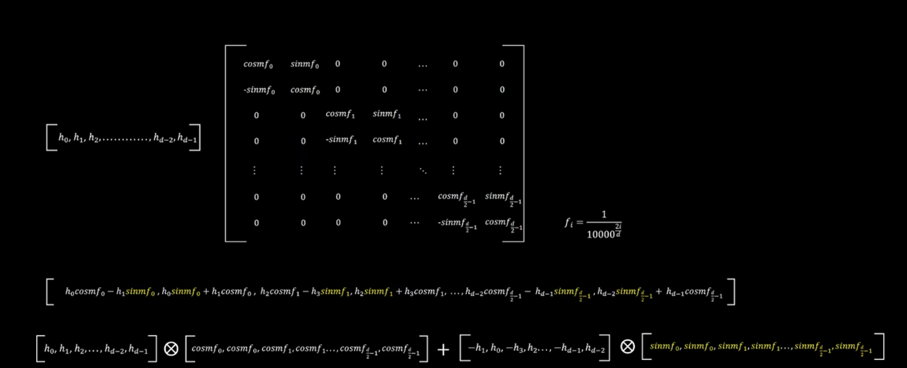

# LLM - 架构
[TOC]


## Encoder-Only

### BERT

#### 简介

BERT，全名为 *Bidirectional Encoder Representations from Transformers*，是由 Google 团队在 2018年发布的预训练语言模型。常见参数量110M～340M（base 版本-12层 Encoder Layer，768 的隐藏层维度，总参数量 110M，large 版本-24层 Encoder Layer，1024 的隐藏层维度，总参数量 340M），其特点：

1. 堆叠 Transformer encoder
2. 预训练+微调范式 （此范式由同年6月的GPT提出，BERT 10月）

BERT 是针对于 NLU 任务打造的预训练模型，其输入一般是文本序列，而输出一般是 Label，例如情感分类的积极、消极 Label，本质依然是**seq2seq模型**（即encoder,decoder架构，按时间步处理，专门用于 **输入和输出都是序列**，天然适合 **输入和输出长度都不固定**的任务：RNN / LSTM / GRU）。为适配各种 NLU （Natural Language Understanding，NLU）任务，在模型的最顶层加入了一个分类头 prediction_heads，用于将多维度的隐藏状态通过线性层转换到分类维度（例如，如果一共有两个类别，prediction_heads 输出的就是两维向量）


#### 激活函数

其激活函数： GELU 函数，全名为高斯误差线性单元激活函数，这也是自 BERT 才开始被普遍关注的激活函数。GELU 的计算方式为：
$$
\text{GELU}(x) = x \cdot \Phi(x)
$$
其中$\Phi(x)$是标准正态分布的累积分布函数 (CDF)。为了加速，Hendrycks & Gimpel (2016) 提出了一个 **tanh 近似**：
$$
\text{GELU}(x) \approx 0.5x \left( 1 + \tanh\!\Big(\sqrt{\tfrac{2}{\pi}} \cdot (x + 0.044715x^3)\Big)\right)
$$
$0.044715x^3$ 是一个修正项，让近似曲线和精确公式更贴合。传统激活函数（如 ReLU）是 **硬性截断**：小于 0 就直接丢弃，大于 0 全部保留。**GELU 引入概率思想**：

- 不再“全保留或全丢弃”，而是根据输入 x 在 **高斯分布中的概率** 来决定“保留多少”。相当于把神经元的输出乘上一个 **依赖于自身的概率因子**。
- 例如：输入值越大，被保留的概率就越高；输入值越小（尤其是负数），被“抑制”的概率就越大。


#### 位置编码Position Embedding

在原版 Transformer 里，PE 是直接加在输入 embedding 上的，保证序列从一开始就带有位置信息。通常使用Sinusoidal 类函数，**绝对位置编码**，不可训练。
$$
P E(pos,2i) = sin(pos/100002i/dmode)
$$
BERT 使用的是 **可训练的绝对位置 embedding**：

- 本质就是一张 **Embedding Lookup 表**（可以看作特殊的 Linear 层）。

- 每个位置 $i$ 都对应一个向量 $\mathbf{p}_i \in \mathbb{R}^n$，训练时和词向量一起更新。

- 最终输入是：
  $$
  \mathbf{h}_i = \mathbf{w}_i + \mathbf{t}_i + \mathbf{p}_i
  $$
  （词向量 + segment 向量 + 位置向量）

在 BERT 中，这个 $p_i$ 是通过 **位置 index（0,1,2,...,n-1， n是序列长度）** 去查一个可学习的embedding 矩阵得到的，也就是说，这层参数矩阵接收 **位置 index**，所以模型被“强行”限定：它学到的就是位置信息。而有的BERT变种模型在 attention 后加位置信息，属于**相对位置编码 (RPE)** 或 **位置偏置 (Position Bias)** 的做法，比如：

- **Transformer-XL**、**T5**、**DeBERTa**

- 它们不再在输入 embedding 上加“绝对位置”，而是直接在 **Attention Score 里融入相对位置信息**：
  $$
  \text{Attention}(Q,K,V) = \text{softmax}\!\left(\frac{QK^T + \text{Bias}_{pos}}{\sqrt{d}}\right)V
  $$
  其中 $\text{Bias}_{pos}$​ 就是相对位置矩阵。注意力分数矩阵：
  $$
  QK^T \in \mathbb{R}^{n \times n}
  $$

​      我们希望 $B$ 也是一个 **分数矩阵**，能和 $QK^T$ 对齐相加。所以：
$$
B \in \mathbb{R}^{n \times n}
$$
​	每个元素 $B_{ij}$ 取决于 token $i$ 和 token $j$ 的相对位置差 $(i-j)$。具体做法：有一个 **查表（这个表可以学习的linear）函数** $f(i-j)$，返回一个标量偏置 $b_{i-j}$，这样就能填满整个 $n \times n$ 的矩阵。

这么做的好处是：

- **对长序列更稳健**（不依赖固定 index）。
- **能泛化到更长的输入**（解决 BERT/Transformer 在长序列上迁移性差的问题）。


#### 适用的任务（也是预训练的任务）

**1. MLM (Masked Language Model)**

- **任务**：随机遮住句子里的一部分词（如 15%），让模型预测被遮住的词是什么。
- **目的**：让模型学会利用上下文双向信息来理解语义（区别于传统语言模型只看左边或右边）。
- **为什么适合 BERT**：BERT 的 Encoder 架构（双向 Transformer）天然能同时看左边和右边的词，非常适合做这种双向填空。

```
输入：I <MASK> you because you are <MASK>
输出：<MASK> - love; <MASK> - wonderful
```


**2. NSP (Next Sentence Prediction)**

- **任务**：输入两句话，模型判断第二句是否是第一句的真实后续（还是随机拼接的）。
- **目的**：让模型学会句子间的关系，增强对篇章级语义和逻辑关系的建模。
- **为什么适合 BERT**：BERT 输入时有 **segment embedding**（区分句子 A/B），可以自然地处理两个句子并建模它们的关系。
- 后续被质疑太简单，RoBERTa时期被取消

```
输入：
    Sentence A：I love you.
    Sentence B: Because you are wonderful.
输出：
    1（是连续上下文）

输入：
    Sentence A：I love you.
    Sentence B: Because today's dinner is so nice.
输出：
    0（不是连续上下文）
```


#### 下游任务微调

作为 NLP 领域里程碑式的成果，BERT 的一个重大意义就是正式确立了预训练-微调的两阶段思想，即在海量无监督语料上进行预训练来获得通用的文本理解与生成能力，再在对应的下游任务上进行微调。该种思想的一个重点在于，预训练得到的强大能力能否通过低成本的微调快速迁移到对应的下游任务上。

针对这一点，BERT 设计了更通用的输入和输出层来适配多任务下的迁移学习。对每一个输入的文本序列，BERT 会在其首部加入一个特殊 token `<CLS>`。在后续编码中，该 token 代表的即是整句的状态，也就是句级的语义表征。在进行 NSP 预训练时，就使用了该 token 对应的特征向量来作为最后分类器的输入。

在完成预训练后，针对每一个下游任务，只需要使用一定量的全监督人工标注数据，对预训练的 BERT 在该任务上进行微调即可。所谓微调，其实和训练时更新模型参数的策略一致，只不过在特定的任务、更少的训练数据、更小的 batch_size 上进行训练，更新参数的幅度更小。

-----

### 后续变种

 **RoBERTa (Robustly Optimized BERT, Facebook, 2019)**  335M-1.2B

**改进点**

- 去掉了 **NSP** 任务（发现 NSP 并不能明显提升性能）。
- 使用 **更大的 batch size** （8K ，BERT 256）和 **更长的训练时间**。
- 使用 **动态 Masking**（每次训练重新选择 Mask，而不是固定的 Mask）。
- 更大的 bpe 词表（Byte Pair Encoding，字节对编码，bert30k->RBA 50k），训练数据规模扩大（从 16GB 提升到 160GB）。

**效果**
证明了 BERT 的潜力其实被“欠训练”了，RoBERTa 比 BERT 在多数 NLP benchmark 上都有显著提升。

<br>

**ALBERT (A Lite BERT, Google & TTIC, 2019)** ~12M / 18M

**改进点**

- **参数共享**：所有层之间共享权重，大幅减少参数量。
- **分解 Embedding**：把大词表 embedding 矩阵分解为两个小矩阵（降低存储成本）。
- **替换 NSP → SOP（Sentence Order Prediction）**：更关注句子顺序关系，而不是简单拼接。

**效果**
参数更少，但性能不降反升，在一些 GLUE 任务上超过 BERT Large。

<br>

**DeBERTa (Decoding-enhanced BERT with Disentangled Attention, Microsoft, 2020)** ~400M

**改进点**

- **Disentangled Attention**：把 token 的 **内容 embedding** 和 **位置 embedding** 分开处理，而不是简单相加。
- **Relative Position Bias**：在 Attention score 中引入相对位置信息（比 BERT 的绝对位置更强大）。
- **大规模预训练**：结合更大的数据集和训练技巧。

**效果**
 在 GLUE、SQuAD 等任务上刷新了当时的 SOTA。

<br>

## Encoder-Decoder PLM

### T5（Text-to-Text Transfer Transformer）

| 特点     | Transformer (2017) | T5 (2019)                                                    |
| -------- | ------------------ | ------------------------------------------------------------ |
| 架构     | Encoder–Decoder    | Encoder–Decoder（修改版：相对位置编码、Pre-LN<br />（LayerNorm 放在 **每个子层之前**（Pre-LN），而不是之后，更稳定）） |
| 位置编码 | 正弦绝对位置编码   | 可学习的相对位置编码                                         |
| 任务设定 | 机器翻译为主       | **MLM**，统一 Text-to-Text 框架，所有任务转化为“输入文本→输出文本”，<br />每一步预测下一个 token，损失是交叉熵 (cross entropy)；而BERT是并行预测所有被 mask 的位置 |
| 训练方式 | 有监督训练         | 自监督预训练（span corruption）+ 微调                        |
| 数据规模 | WMT (几百万句对)   | C4 (750GB 文本)                                              |
| 参数规模 | ~65M (Base)        | Small (60M) → 11B (超大)                                     |

#### Text-to-Text 框架是谁提出的？

- “统一 Text-to-Text 框架”就是 T5提出的。
- 它的思想是：把所有 NLP 任务都转化为 “输入文本 → 输出文本”，例如：
  - 分类任务：`"text: ... question: ..." → "yes"`
  - 翻译任务：`"translate English to German: ..." → "..."`
- **训练目标**：Span Corruption（随机去掉 span，用 sentinel token 替换，decoder 预测缺失的文本片段）。

#### RMSNorm

与原始 Transformer 模型不同，T5 模型的LayerNorm 采用了 **RMSNorm**，在原始 Transformer中，使用的是 **LayerNorm (LN)**，即：
$$
\text{LN}(x) = \frac{x - \mu}{\sigma} \cdot \gamma + \beta
$$

- $\mu$ = 均值
- $\sigma$ = 标准差
- $\gamma, \beta$ = 可训练参数

其**特点**是同时依赖均值和方差。减均值（$x-\mu$）：**会改变输入的中心分布**，数值波动更大；同时依赖均值和方差，**计算上更复杂，也容易引入小噪声**。而在 T5中使用的是 **RMSNorm (Root Mean Square Layer Normalization)**。

- 公式：

$$
\text{RMSNorm}(x) = \frac{x}{\text{RMS}(x)} \cdot \gamma
$$

其中：
$$
\text{RMS}(x) = \sqrt{\frac{1}{d} \sum_{i=1}^{d} x_i^2+\epsilon}
$$
其**特点**：

- 只使用 **均方根 (RMS)**，不减去均值 $\mu$。 $\epsilon$是一个小常数，用于数值稳定性（以避免除以零的情况）
- 没有偏置 $\beta$，只保留可学习的缩放参数 $\gamma$。（在LLaMA中，可能会引入偏置）
- 计算更简单，数值更稳定(这种归一化有助于通过确保权重的规模不会变得过大或过小来稳定学习过程，这在具有许多层的深度学习模型中特别有用)。

这种norm在后面的LLaMA也被使用

```python
# 实现
import torch
import torch.nn as nn

class RMSNorm(nn.Module):
    """
    Root Mean Square Layer Normalization (RMSNorm)
    公式：
        y = x * (weight / rms(x)), 
        其中 rms(x) = sqrt(mean(x^2) + eps)
    与 LayerNorm 区别：不减均值、只按均方根做缩放；通常不带 bias。
    """
    def __init__(self, dim: int, eps: float = 1e-8, bias: bool = False):
        super().__init__()
        self.eps = eps
        self.weight = nn.Parameter(torch.ones(dim))
        self.bias = nn.Parameter(torch.zeros(dim)) if bias else None

    def forward(self, x: torch.Tensor) -> torch.Tensor:
        # x: (..., dim)
        # 计算最后一维上的均方根
        rms = x.pow(2).mean(dim=-1, keepdim=True).add(self.eps).sqrt()
        x_hat = x / rms
        y = x_hat * self.weight
        if self.bias is not None:
            y = y + self.bias
        return y

```


#### Pre-LN

Transformer 里，每个子层（注意力/FFN）之后是：
$$
x_{l+1} = \text{LayerNorm}(x_l + \text{Sublayer}(x_l))
$$
也就是 **先子层计算，再残差相加，最后 LayerNorm**。这叫 **Post-LN**（因为 LN 在最后）。**问题**：

- 当层数很深时，梯度容易消失或爆炸。
- 训练超大模型（几百层）时不稳定。

而在 **Pre-LN** 中，归一化放在子层 **输入之前**：
$$
x_{l+1} = x_l + \text{Sublayer}(\text{LayerNorm}(x_l))
$$
即：**先 LayerNorm，再进入子层，最后加残差**。为什么更稳定？

- 在 Pre-LN 中，**残差是恒等映射**（identity mapping）。
  - 梯度能直接从高层回传到低层，不容易衰减。
  - 所以即便堆叠 100+ 层，模型依然能稳定训练。
- Post-LN 中，残差路径总是被 LayerNorm 干扰，梯度传播不畅

<br>


## Decoder-Only PLM

### GPT (Generative Pre-trained Transformers)

#### GPT架构

GPT是由 OpenAI 团队于 2018年发布的预训练语言模型。在 2020年发布的 GPT-3 成就了 LLM 时代的基础，并以 GPT-3 为基座模型的 ChatGPT 成功打开新时代的大门，成为 LLM 时代的最强竞争者之一。


*Fig.2 GPT 系列架构图解, 图片截取自 [HappyLLM](https://github.com/datawhalechina/happy-llm/blob/main/docs/chapter3/%E7%AC%AC%E4%B8%89%E7%AB%A0%20%E9%A2%84%E8%AE%AD%E7%BB%83%E8%AF%AD%E8%A8%80%E6%A8%A1%E5%9E%8B.md)*

#### 模型架构——Decoder Only

GPT使用了 Decoder 来进行模型结构的堆叠，也天生适用于文本生成任务。简单对比一下他们

**1. Encoder-only 的局限**

- **主要适用任务**：自然语言理解（NLU），如分类、句子匹配、embedding 提取。
- **预训练方式**：MLM + 对比学习 (Contrastive Learning)。
- **问题**：
  - MLM 任务需要人为设计 mask（筛选被遮蔽的token），难以 scaling。
  - Embedding 模型虽然能用于**检索和排序**，但在通用大模型场景下表达能力有限。
  - BERT 为什么不能自回归？
    - BERT 使用 **双向注意力**（non-causal），每个 token 可以看到左边和右边的信息。
    - 因为它在训练中允许“偷看未来 token”，所以不能直接用于自回归生成（会破坏因果性）。
    - BERT 适合判别/理解任务，而不是生成任务。
- **趋势**：即使是 embedding 模型（如 Qwen Embedding + Reranker），底层也在转向 decoder-only 来获得更强的表达和 scaling 性能。

**2. Encoder–decoder 的局限**

- **理论优点**：encoder 编码输入，decoder 生成输出，适合机器翻译、摘要等 seq2seq 任务。
- **问题**：
  - **低秩问题**：encoder 输出的表示常存在冗余，decoder cross-attention 利用不足，导致 scaling 效果有限。
  - **Prompt 效果弱**：in-context learning 能力不如 decoder-only，因为 prompt 无法直接作用于 decoder。
  - **训练方式复杂**：存在 Casual Decoder（自回归）与 Non-causal Decoder（如 GLM 的双向+填空式），两种方式差异大，难以统一。
- **对比结果**：在 zero-shot、few-shot 和通用能力上，decoder-only 一般优于 encoder–decoder。

**3. Decoder-only 的优势**

- **结构简单**：只需 prefill（上下文输入）+ decode（逐步生成），统一范式。
- **scaling 友好**：自回归语言建模（next token prediction）目标简单清晰，可直接扩展到万亿参数级。
- **prompt 友好**：prompt 直接拼接在输入序列前，天然适合 few-shot / in-context learning。
- **infra 优势**：推理 workflow 更简化，生态（FlashAttention、PagedAttention、KV cache 优化等）更成熟。
- **历史成功路径**：GPT 系列已经证明 decoder-only 能支撑从 GPT-2 → GPT-3 → GPT-4 的 scaling law。

| 架构            | 优点                                                         | 缺点                                      | 适用场景                               |
| --------------- | ------------------------------------------------------------ | ----------------------------------------- | -------------------------------------- |
| Encoder-only    | 语义理解好；embedding 检索任务强                             | 不能自回归；MLM 不好 scaling              | 分类、匹配、embedding                  |
| Encoder–decoder | 输入输出结构灵活；适合翻译、摘要                             | cross-attention 低秩；prompt 弱；训练复杂 | 翻译、摘要、多模态 seq2seq             |
| Decoder-only    | 结构简单；scaling 最友好；prompt & in-context 学习强；infra 优化成熟 | KV cache 成本高；生成效率受限             | 通用大模型、对话、代码、推理、文本生成 |

#### 预训练任务——CLM

Decoder-Only 的模型结构往往更适合于文本生成任务，因此，Decoder-Only 模型往往选择了最传统也最直接的预训练任务——**因果语言模型，Casual Language Model，下简称 CLM**。

CLM 可以看作 N-gram 语言模型的一个直接扩展。N-gram 语言模型是基于前 N 个 token 来预测下一个 token，CLM 则是**基于一个自然语言序列的前面所有 token 来预测下一个 token**，通过不断重复该过程来实现目标文本序列的生成。也就是说，CLM 是一个经典的补全形式。例如，CLM 的输入和输出可以是：

```
input: 今天天气
output: 今天天气很

input: 今天天气很
output：今天天气很好
```

因此，对于一个输入目标序列长度为 256，期待输出序列长度为 256 的任务，模型会不断根据前 256 个 token、257个 token（输入+预测出来的第一个 token）...... 进行 256 次计算，最后生成一个序列长度为 512 的输出文本，这个输出文本前 256 个 token 为输入，后 256 个 token 就是我们期待的模型输出。

#### GPT的各阶段的直观对比

| 模型  | Decoder Layer | Hidden_size | 注意力头数 | 注意力维度 | 总参数量 | 预训练语料 |
| ----- | ------------- | ----------- | ---------- | ---------- | -------- | ---------- |
| GPT-1 | 12            | 3072        | 12         | 768        | 0.12B    | 5GB        |
| GPT-2 | 48            | 6400        | 25         | 1600       | 1.5B     | 40GB       |
| GPT-3 | 96            | 49152       | 96         | 12288      | 175B     | 570GB      |

下面是更加详细的对比

| 代数                        | 时间      | 数据规模                                         | 架构特点                                                     | 训练改进                                      | 任务范式                            | 突破与不足                                                   |
| --------------------------- | --------- | ------------------------------------------------ | ------------------------------------------------------------ | --------------------------------------------- | ----------------------------------- | ------------------------------------------------------------ |
| **GPT-1**                   | 2018      | 5GB BooksCorpus                                  | 12层 Decoder-only，隐藏层 768，Post-LN                       | 没有显著结构改进                              | 预训练 + 微调                       | 证明了 Decoder-only 预训练可行，但体量和数据有限，效果不如 BERT-base |
| **GPT-2**                   | 2019      | 40GB WebText                                     | 48层 Decoder，隐藏层 1600，改为 Pre-LN                       | 梯度更稳定，防止梯度消失/爆炸（使用pre-LN）   | 首次强调 zero-shot                  | 参数和数据规模增长一个数量级，提出 zero-shot，但效果有限，仍不足支撑泛化 |
| **GPT-3**                   | 2020      | 45TB 原始 → 570GB 清洗后（CC、WebText、Wiki 等） | 与 GPT-2 类似，但引入稀疏注意力以支撑超长序列训练            | 大规模分布式训练（1024×A100 80GB，约 1 个月） | zero-shot + **few-shot** （prompt） | LLM 的真正开端，出现涌现能力；提出 few-shot 提示学习，首次大规模展示 in-context learning |
| **GPT-3.5**                 | 2022      | 增量数据（未公开），加入指令调优数据             | 基础架构同 GPT-3                                             | **Instruction Tuning** + RLHF                 | 指令遵循、对话任务                  | 能力显著提升，ChatGPT 走向大众化；但上下文长度和稳定性有限   |
| **GPT-4**                   | 2023      | 多模态数据（文本+图像），细节未公开              | 仍基于 Decoder-only，改进稀疏 MoE 路线                       | 大规模 RLHF、对齐训练、偏好优化               | 多模态输入，强 zero-shot/few-shot   | 综合能力远超 GPT-3.5，展现更强推理与对话，但训练细节未开源   |
| **GPT-4.5 / GPT-5（推测）** | 2024–2025 | 更大规模混合数据（代码、数学、对话、网页）       | Decoder-only + 推测性的高效注意力（如 FlashAttention、PagedAttention） | 强化检索增强、长期记忆、多模态扩展            | 强 few-shot / 长上下文 / 工具调用   | 更强调推理、长期记忆和外部工具协同                           |

------

### LLaMA(Large Language Model Meta AI)

#### LLaMA架构

LLaMA模型是由Meta（前Facebook）开发的一系列大型预训练语言模型。与GPT系列模型一样，LLaMA模型也是基于Decoder-Only架构的预训练语言模型。LLaMA模型的整体结构与GPT系列模型类似，只是在模型规模和预训练数据集上有所不同。


*Fig.2 LLaMA 架构图解, 图片截取自 [HappyLLM](https://github.com/datawhalechina/happy-llm/blob/main/docs/chapter3/%E7%AC%AC%E4%B8%89%E7%AB%A0%20%E9%A2%84%E8%AE%AD%E7%BB%83%E8%AF%AD%E8%A8%80%E6%A8%A1%E5%9E%8B.md)*

LLaMA的attention的一般流程为

**输入**

- `hidden_states`：输入序列的表示。
- `attention_mask`：掩码（主要用于 causal mask 和 padding）。

**QKV 投影**

- `hidden_states` → 线性层 → 得到 `query_states, key_states, value_states`。

**RoPE（Rotary Positional Embedding）**

- 应用于 `query_states` 和 `key_states`，取代 GPT-3 的 learned embedding。
- 好处：能推广到更长上下文，保留相对位置信息。

**repeat_kv**

- 如果 **head 数量 ≠ kv_head 数量**，会对 key/value 做复制，降低 KV cache 的存储开销。
- LLaMA 系列在多头注意力中采用 **Grouped Query Attention (GQA)**，即多个 query head 共享同一组 key/value。

**注意力权重计算**

- $\text{score} = \frac{QK^\top}{\sqrt{d}} + \text{mask}$。
- `attention_mask` 在这里被加进去。

**Softmax**

- 对 score 做 softmax，得到 `attention_weight`。

**加权求和**

- `attention_weight × V` 得到注意力输出。

**线性投影**

- `o_proj` 将拼接后的多头输出映射回 `hidden_size`。

**输出**

- 最终的 `attention_out`。

综上所述，**和 GPT 的区别主要有三点**：

1. **位置编码**：GPT 用 learned/absolute；LLaMA 用 RoPE。
2. **注意力头设计**：GPT 是标准多头；LLaMA 引入 GQA + repeat_kv。
3. **归一化与稳定性**：GPT 用 LayerNorm；LLaMA 用 RMSNorm，且在残差前。
4. **激活函数**：GPT使用GELU（Gaussian Error Linear Unit），LLaMA使用SiLU/Swish（SwiGLU）

下面来说一下一些区别具体的内容和实现：

<br>

#### SwiGLU

SwiGLU 属于 **GLU 家族**（GLU/GeGLU/ReGLU/SwiGLU）。共同思想是：**两路线性变换+门控相乘**。

**公式（SwiGLU）**
$$
\text{SwiGLU}(x)=\underbrace{\sigma_{\text{SiLU}}\!\left(W_{\text{gate}}x\right)}_{\text{门}}\;\odot\;\underbrace{\left(W_{\text{up}}x\right)}_{\text{值}}
\quad\Rightarrow\quad
\text{FFN}(x)=W_{\text{down}}\big(\text{SwiGLU}(x)\big)
$$

- 其中 $\mathrm{SiLU}(z)=z\cdot\sigma(z)$（又名 Swish，$\sigma$为sigmoid=$f(x) = 1 / (1 + e^{-x})$函数， 输出在 $[0,1]$）。
- 与 GELU-FFN 相比，SwiGLU 多了一条 **gate 分支**（$W_{\text{gate}}$），提升表达力与稳定性。仔细看上上面MLP的架构，会发现对比通常的MLP，他多出了**并行两路投影**：
  - `gate_proj`（d_model → 4d_model）
  - `up_proj`（d_model → 4d_model）
- `gate_proj(x)` 经过该激活函数然后和 `up_proj(x)` 做逐元素相乘再降维输出原维度。

除此以外，在 **门控结构（GLU/SwiGLU）** 中，输出是两条分支相乘：
$$
y = \text{act}(W_g x) \odot (W_u x)
$$
这种乘法操作会进一步放大/缩小方差，可能破坏残差连接里的数值平衡。为了稳定训练，人们引入一个常数缩放，比如 β = $1/\sqrt{2}$​ 或 β = 2/3，让输出的统计分布和输入保持更接近。在 PaLM、LLaMA 等大模型论文里，门控 FFN 输出常见写法是：
$$
\text{FFN}(x) = W_{\text{down}}\Big( \beta \cdot \text{SwiGLU}(W_gx) \odot (W_{up}x)\Big)
$$
**与其它 GLU 变体对比**

- **GLU**：$\sigma(W_gx)\odot (W_ux)$（用 Sigmoid 门）。
- **GeGLU**：$\mathrm{GELU}(W_gx)\odot (W_ux)$。
- **ReGLU**：$\mathrm{ReLU}(W_gx)\odot (W_ux)$。
- **SwiGLU**：$\mathrm{SiLU}(W_gx)\odot (W_ux)$（实践表现最好之一，已成新主流）。

**为什么流行**

- 更强非线性与选择性（门控）；
- 大模型里更稳、更易收敛；
- 在相似计算/参数开销下，常优于纯 GELU-FFN。

```python
import torch
import torch.nn as nn

class SwiGLUFeedForward(nn.Module):
    def __init__(self, d_model, expansion=4, beta=1/2**0.5):
        super().__init__()
        hidden = expansion * d_model
        self.up = nn.Linear(d_model, hidden)
        self.gate = nn.Linear(d_model, hidden)
        self.down = nn.Linear(hidden, d_model)
        self.act = nn.SiLU()
        self.beta = beta

    def forward(self, x):
        gated = self.act(self.gate(x)) * self.up(x)
        return self.down(self.beta * gated)
```

要注意

**门控函数的输入不是原始 $x$，而是线性变换 $W_g x$**。也就是说，这个门是「学习出来的」，不是固定写死的 $\sigma(x)$。

在训练中，**门分支会自动调整偏置和权重，把分布推向有利于 gating 的区间**。

- 举例：如果要实现「大于 1 的时候才开门」，模型会学到 $W_gx + b$ ≈ $x-1$，然后喂给 sigmoid。

对比GELU（其实是一种单链路的高斯误差软门控），SwiGLU 有两条路径（值分支和门分支），表达力更强。但是，**值分支不过激活函数**。这是因为：

1.**角色分工**

- **门分支**：负责“调节强弱”，用激活函数把值限制在某个范围（Sigmoid/SiLU 等）。
- **值分支**：承担信息通道，不加激活可以保证线性空间的表达能力，避免信息提前被压缩。

2.**如果也加激活**

- 就会变成两个都做非线性：
  $$
  y = \text{act}(W_u x) \odot \text{act}(W_g x)
  $$

- 这样值分支就失去了“直接传递信息”的通道，会更像“双重抑制”，不符合 GLU 的设计初衷。

3.**残差连接考虑**

- Transformer 的 FFN 层有残差，如果值分支也强烈非线性化，可能导致梯度传播变难。
- 保持一条线性通路更有利于训练稳定性。

<br>

#### RoPE

**0.绝对位置编码 (APE) 的局限**

最早的 Transformer（Vaswani et al. 2017）用 **正弦位置编码** 或 **可学习的绝对位置向量**，把 token 的位置信息直接加到 embedding 上。
 这样虽然能让模型区分「第 1 个 token」和「第 10 个 token」，但有几个问题：

1. **只能表达绝对位置**
   - APE 让模型知道 “这是第 50 个 token”，但不直接告诉模型 “这两个 token 相隔 10 个位置”。
   - 语言任务里很多关系是「相对」的，比如“修饰词离名词多远”。
2. **外推性差**
   - 学习型绝对位置嵌入只能在训练过的序列长度范围内使用。
   - 如果训练时最长 2k tokens，推理时输入 4k，超出范围的 embedding 就不存在/效果极差。
3. **计算效率问题**
   - 绝对位置需要单独存一份 embedding，显存开销更大。

**1. RoPE 是什么？**

RoPE，全称 **Rotary Position Embedding**，是 2021 年由苏神（苏剑林）等人提出的（论文：*RoFormer: Enhanced Transformer with Rotary Position Embedding*，ACL 2021）。它是一种 **相对位置编码方法**，通过 **旋转变换** 把位置信息注入到 **query 和 key 向量** 中。

核心思想：

- 把 query/key 的每一对二维分量 $(x_{2i}, x_{2i+1})$ 看作一个 **复数/二维向量**。
- 按照位置 $p$ 旋转一个角度 $\theta_p$。
- 这样不同位置的 token 通过旋转角度差来体现相对位置关系。

**2. 数学公式**

设 embedding 维度为 $d$，第 $i$ 个维度的频率为 $\theta_i = 10000^{-2i/d}$，则第 $p$ 个位置的旋转角度为：

$$
\Theta_p = p \cdot \theta_i
$$

对向量的每个二维分量 $(x_{2i}, x_{2i+1})$ 做旋转：

$$
\begin{bmatrix}
x'_{2i} \\
x'_{2i+1}
\end{bmatrix} =
\begin{bmatrix}
\cos(\Theta_p) & -\sin(\Theta_p) \\
\sin(\Theta_p) & \cos(\Theta_p)
\end{bmatrix}
\cdot
\begin{bmatrix}
x_{2i} \\
x_{2i+1}
\end{bmatrix}
$$

上述矩阵是在线性代数里二维坐标 $(x, y)$ 绕原点逆时针旋转角度 $\theta$ 的标准表示。也就是说：RoPE = **在二维平面上旋转向量**。

那么它是如何包揽绝对和相对位置编码的呢？：

* 绝对位置编码：因为旋转角度$\Theta$与在词向量中的绝对位置p成正比，故这样每个 token **自身的表示**就带上了它的绝对位置信息（因为旋转角度和位置 $p$ 绑定）。（换句话说：**单个向量的朝向已经编码了 token 的绝对位置**。）

* 相对位置编码：Attention 权重的计算是点积：
  $$
  \langle q_p', k_q' \rangle = (R_{\Theta_p} q_p)^\top (R_{\Theta_q} k_q)
  $$
  **利用旋转矩阵的性质** $R_{\Theta_p}^\top R_{\Theta_q} = R_{\Theta_{q-p}}$：
  $$
  \langle q_p', k_q' \rangle = q_p^\top R_{\Theta_{q-p}} k_q
  $$
  结果只依赖于位置差 $q-p$。也就是说：**两个 token 的相对位置差直接体现在它们的相位（角度）差上**。换句话说，在点积时，角度差 $\Theta_p - \Theta_q$ 自然引入了相对位置依赖。

  直观来看：指针方向 = 绝对位置；两个指针夹角 = 相对位置。

为什么要成对将相邻点按照 $(x_{2i}, x_{2i+1})$ 分组？

-> RoPE 的核心操作是 **二维旋转**。

- 如果我们要在一个向量上编码“相位”，就必须在二维平面里操作。
- 所以作者把 embedding 的维度按偶数拆分成若干二维子空间：$(x_0,x_1), (x_2,x_3), …$。
- 每对 $(x_{2i}, x_{2i+1})$ 就是一个小平面，在这个平面里做旋转。

这样每对维度对应一种 **频率分量**（类似傅里叶分解的一个正弦波/余弦波），角度随位置增长而线性增加。所以它们不是语义上的“特征对”，而是纯粹 **数学结构上的配对**；除此之外，也可以设计“非相邻配对”，数学上也能旋转，但**没有额外好处，反而会破坏连续的频率设计**（RoPE 的频率分布依赖于维度索引（指数式增长的角频率），所以它要求**固定顺序+相邻配对**来保证频率覆盖均匀）。

最终：

- Query/Key 在计算注意力分数时，旋转差值就直接反映了相对位置信息。
- 这样 attention 的点积天然包含了相对位置信息。

如果 embedding 的维度是 $d$（假设 $d$ 是偶数），我们可以把向量 $x \in \mathbb{R}^d$ 重排成 $\frac{d}{2}$ 个二维向量堆叠：
$$
x = \big[ (x_0, x_1), (x_2, x_3), \dots, (x_{d-2}, x_{d-1}) \big]
$$
把这些旋转矩阵拼在一起，就得到一个 **块对角矩阵**：
$$
R_p =
\begin{bmatrix}
R(\Theta_{p,0}) & 0 & \cdots & 0 \\
0 & R(\Theta_{p,1}) & \cdots & 0 \\
\vdots & \vdots & \ddots & \vdots \\
0 & 0 & \cdots & R(\Theta_{p,\frac{d}{2}-1})
\end{bmatrix}
\quad \in \mathbb{R}^{d \times d}
$$
其中每个 $R(\Theta_{p,i})$ 是 2×2 的旋转矩阵。注意其他地方都是0.

**3. 提出背景与对比**

**（1）绝对位置编码 (Absolute Positional Encoding)**

- **方法**：直接给每个 token 加一个位置 embedding（sinusoidal 或 learnable）。
- **缺点**：只能编码绝对位置信息，不具有平移不变性；长文本扩展性差。

**（2）相对位置编码 (Relative Positional Encoding, Shaw et al. 2018, Transformer-XL, DeBERTa)**

- **方法**：在注意力得分里额外加上位置差相关的偏置。
- **缺点**：需要额外参数和计算；实现复杂。

**（3）RoPE**

- **方法**：通过复数旋转，把位置关系直接嵌入 Q/K，注意力内积自然携带相对位置信息。
- **优点**：
  1. **相对位置感知**：点积自然包含 $\cos(\Delta p)$ 信息。
  2. **实现简单**：只需在 Q/K 上做旋转。
  3. **长序列扩展性好**：可自然外推到更长的上下文。
  4. **无额外参数**：全靠三角函数计算。

**4. 实现方式（PyTorch 简化版）**

在实际计算中，采用分解计算的方法，拆分cossin以简化计算 - 保留cos/sin为正，只反转一半对应sin的向量符号，[图片来自b站RethinkFun up主讲解RoPE的视频](https://www.bilibili.com/video/BV1F1421B7iv)	。



注意：对 hidden state $h = [h_0, h_1, h_2, ..., h_{d-1}]$ ，在数学表达里，「sin 前面的符号是交错的」，因为每一对 (even, odd) 被当作一个二维向量旋转。但是在代码中，把向量 $[h_0,h_1,h_2,h_3,...]$ 重排成两个块 $[h_0,h_2,...]$ 和 $[h_1,h_3,...]$，再用 `rotate_half` 来模拟 ((h_{even}, h_{odd}) → (-h_{odd}, h_{even})` 的映射。（可以理解成并非相邻向量进行拼接组队，而是前一半和后一半）

这里也要分清楚t和position ids。`t` 是 **全局表的行号**，提前算好所有可能的位置。`position_ids` 是 **具体样本里要用哪些行**。

假设：

- 最大缓存长度 `max_seq_len=8`，
- 我们构造的 `t = [0,1,2,3,4,5,6,7]`，
- cos/sin 缓存表 shape = `(8, dim)`。

推理时：

- 如果输入只有 3 个 token，`position_ids=[0,1,2]` → 取缓存表前 3 行。
- 如果接着继续生成，新增 token 在位置 8、9，那么 `position_ids=[8,9]` → 从缓存表里取第 8、9 行。

```py
import torch
from typing import Tuple

def build_inv_freq(head_dim:int, base:float=10000.0, device=None, dtype=None):
    """
    生成 RoPE 的频率表 inv_freq[i] = base^{-2i / head_dim}, i=0,1,...,head_dim/2-1
    要求 head_dim 为偶数。
    返回形状: (head_dim/2,)
    
    B = batch size
	H = number of attention heads（注意力头数）
	T = sequence length（序列长度，多少个 token）
	D = head dimension（单个注意力头的向量维度，也叫 head_dim）
    """
    assert head_dim % 2 == 0, "head_dim must be even for RoPE."
    idx = torch.arange(0, head_dim, 2, device=device, dtype=torch.float32)  # 0,2,4,...
    inv_freq = base ** (-idx / head_dim) # 
    print("inv_freq: ", inv_freq.shape)
    return inv_freq

def rope_cos_sin(seq_len:int, inv_freq:torch.Tensor, device=None):
    t = torch.arange(seq_len, device=inv_freq.device, dtype=inv_freq.dtype)  # [0..seq_len-1]
    freq_shape = inv_freq.shape[0]
    phase = t.view(seq_len, 1) @ inv_freq.view(1, freq_shape) # (T, D/2)
    # phase = torch.einsum("p,f->pf", t, inv_freq)  # (T, D/2)
    # concat phase for computing embedding cos and sin at phase dim
    emb = torch.cat([phase, phase], dim=1) # (T, D)

    cos = emb.cos()
    sin = emb.sin()

    return cos, sin

def rotate_half(x: torch.Tensor): # x => [B, H, T, D]
    head_dim = x.shape[-1]
    device = x.device
    x_f = x[..., :head_dim//2]
    x_s = x[..., head_dim//2:]
    return torch.cat([-x_f, x_s], dim=-1) # [B, H, T, D]
```

用法：

```py
def apply_rope(q: torch.Tensor,
               k: torch.Tensor,
               position_ids: torch.Tensor,
               base: float = 10000.0):
    B, H, T, D = q.shape
    assert D % 2 == 0, "head_dim must be even for RoPE."
    device, dtype = q.device, q.dtype

    # Ensure the max position must be greater than total seq len, here total seq len = 2*D-1
    # since we have two samples. Or it will raise RuntimeError from CUDA
    max_pos = int(position_ids.max().item()) + 1 
    inv_freq = build_inv_freq(D, base=1e4, device=device, dtype=dtype)
    cos, sin = rope_cos_sin(max_pos, inv_freq, device=device) # [T, D]

    # print(cos.shape)
    cos_pos_val = cos[position_ids].unsqueeze(1) # [B, 1, T, D]
    sin_pos_val = sin[position_ids].unsqueeze(1) 

    q_emb = q * cos_pos_val + rotate_half(q) * sin_pos_val
    k_emb = k * cos_pos_val + rotate_half(k) * sin_pos_val

    return q_emb, k_emb

B, H, T, D = 2, 8, 128, 64  # D must be even 
q = torch.randn(B, H, T, D, dtype=torch.float16, device="cuda")
k = torch.randn(B, H, T, D, dtype=torch.float16, device="cuda")

# two samples ,start from 0 and 128
base_pos = torch.tensor([0, 128], device=q.device).view(B, 1)        # (B,1)
print("Initial pos of each sample: ", base_pos)
position_ids = base_pos + torch.arange(T, device=q.device).view(1, T)  # (B,T)

apply_rope(q, k, position_ids=position_ids)
```


**5. 应用**

- **LLaMA / GPTNeoX / ChatGLM**：都用 RoPE。
- **GPT-2/3**：用 absolute embedding。
- **PaLM**：用 absolute embedding + ALiBi。
- **最新趋势**：RoPE 或其改进版（NTK RoPE, YaRN）已成为开源大模型的主流位置编码方式。

-----

### ChatGLM
Comming soon

<br>

--------

### QWEN
Comming soon
<br>

------

### DeepSeek
Comming soon
<br>
<br>


各家开源模型对比
| 家族                | 代次                             | 典型形态/规模                            | 主要架构点                                                                                       |
| ----------------- | ------------------------------ | ---------------------------------- | ------------------------------------------------------------------------------------------- |
| **Qwen**          | **Qwen1/1.5**                      | Dense                              | 早期标准解码器 + RoPE + RMSNorm；中文/多语基础。                                                           |
|                   | **Qwen2**                      | Dense                              | 更大规模与数据配比优化；长上下文增强。                                                                         |
|                   | **Qwen2.5**                    | Dense & MoE                        | MoE 初代成形（含 shared experts）、ABF 提升 RoPE 基频；多领域合成数据引入。                                        |
|                   | **Qwen3（2025）**                | **Dense & MoE**（Qwen3-235B-A22B 等） | **QK-Norm**、移除 QKV-bias；**128 专家/激活 8，无 shared**；**global-batch** 均衡；**ABF+YARN+DCA** 长上下文。 |
|                   | **Qwen3-Omni（2025/9）**         | 多模态统一                              | 单一模型覆盖文/图/音/视频，保持与同尺寸单模态持平。([arXiv][1])                                                     |
| **DeepSeek**      | V1/V2                          | MoE + MLA                          | 在 V2 系列中确立 **MLA + DeepSeekMoE**，强调性价比与高效推理。                                                |
|                   | V2.5                           | MoE                                | 继续在训练/对齐上打磨，铺垫 V3。                                                                          |
|                   | **V3（2024/12→2025/2 报告）**      | **MoE 671B，总/激活 37B**              | **MLA**、**aux-loss-free** 均衡、**MTP**、FP8 训练与工程化稳定性；Node-limited routing 等部署考量。              |
|                   | **R1（推理向）**                    | Dense/MoE（家族）                      | 强化推理能力的专向系列（用于蒸馏到 V3）。                                                                      |
|                   | **V3.2-Exp（2025/9）**           | 稀疏注意力                              | 面向国产硬件生态（Ascend/CANN、Cambricon/Hygon），强调跨平台部署与稀疏化。([Reuters][2])                            |
| **ChatGLM / GLM** | GLM-130B → ChatGLM（6B）         | Dense                              | 基于 GLM 预训练范式（生成 + 填空）演进，国产中文/英双语对齐。                                                         |
|                   | ChatGLM2/3                     | Dense                              | 长上下文增强、工具链与对齐升级。                                                                            |
|                   | **GLM-4（2024/06 报告）**          | Dense（9B/32B…）                     | 解码器 Transformer；**All Tools**（函数调用/浏览器/代码执行）、长上下文；**GLM-4-Air** 追求低时延。                      |
|                   | **GLM-4.1V-Thinking（2025/07）** | VLM 9B                             | 视觉-语言 “Thinking” 训练框架，**RLCS** 增强多模态推理泛化。([arXiv][3])                                       |

[1]: https://arxiv.org/html/2509.17765v1 "Qwen3-Omni Technical Report"
[2]: https://www.reuters.com/technology/deepseek-releases-model-it-calls-intermediate-step-towards-next-generation-2025-09-29 "China's DeepSeek releases 'intermediate' AI model on route to next generation"
[3]: https://arxiv.org/html/2507.01006v1 "GLM-4.1V-Thinking: Towards Versatile Multimodal ..."


## Appendix

### 什么是自回归任务？和普通回归任务的区别？BERT为什么不能自回归？

**自回归任务（Autoregressive Task）**

- 定义：在序列建模中，**逐步预测序列下一个元素**，**每一步预测依赖于之前的自己生成的元素**。

- 数学形式：
   给定序列 $(x_1, x_2, ..., x_T)$，自回归模型建模联合概率：
  $$
  P(x_1, x_2, \dots, x_T) = \prod_{t=1}^{T} P(x_t \mid x_1, x_2, \dots, x_{t-1})
  $$

- 典型代表：GPT、RNN、语言模型任务 (next token prediction)。

**普通回归任务（Regression）**

- 经典机器学习里的“回归”是指：学习从输入 $X$ 到实数输出 $y$ 的映射，如线性回归、逻辑回归。
- 目标是预测连续值或实数标签，而不是序列的逐步生成。

**区别**

- **普通回归**：输入固定特征 → 输出连续值（标量/向量）。
- **自回归**：输入是部分序列 → 输出下一个序列元素，最终生成整个序列。

<br>

### 为什么层数很深时，Post-LN容易梯度消失？

主要时取决于更新时的**残差路径**

**1）Post-LN 的梯度传播**

Post-LN 公式（以某一层 $l$ 为例）：
$$
x_{l+1} = \text{LN}(x_l + F(x_l))
$$
其中：

- $F(x_l)$：子层（如 Attention 或 FFN）输出。
- $\text{LN}(\cdot)$：LayerNorm。

梯度传播时：
$$
\frac{\partial \mathcal{L}}{\partial x_l} = \frac{\partial \mathcal{L}}{\partial x_{l+1}} \cdot \frac{\partial \text{LN}(z)}{\partial z} \cdot \left( I + \frac{\partial F(x_l)}{\partial x_l} \right), \quad z = x_l + F(x_l)
$$
**关键点**：

- 残差路经（$I$）被 $\frac{\partial \text{LN}}{\partial z}$ 包裹。
- $\frac{\partial \text{LN}}{\partial z}$ 的梯度依赖于 batch 内的统计量（均值、方差），数值波动大。
- 当网络层数很深时，每层都乘上一个这种复杂的 Jacobian，容易导致 **梯度消失或爆炸**。


**2）Pre-LN 的梯度传播**

Pre-LN 公式：
$$
x_{l+1} = x_l + F(\text{LN}(x_l))
$$
梯度传播时：
$$
\frac{\partial \mathcal{L}}{\partial x_l} = \frac{\partial \mathcal{L}}{\partial x_{l+1}} \cdot \Big( I + \frac{\partial F(\text{LN}(x_l))}{\partial x_l} \Big)
$$
**关键点**：

- 残差路径是 **恒等映射**（$I$），不受 LayerNorm 干扰。
- 即使 $F(\cdot)$ 的梯度很小（趋近 0），残差路径也能保证梯度至少“直通”回来。
- 所以深层堆叠时，梯度不会消失。


**3）数学上的直观对比**

- **Post-LN**：
  $$
  \nabla x_l \sim J_{\text{LN}} \cdot (I + J_F)
  $$
  梯度必须经过 LayerNorm 的 Jacobian，累积噪声 → 不稳定。

- **Pre-LN**：
  $$
  \nabla x_l \sim (I + J_F)
  $$
  恒等映射 $I$ 保证梯度直通，即便 $J_F$ 很小也不会断。

<br>

### 什么是 Causal 和 Non-causal Mask？区别是什么？主流使用哪一种？

#### Causal Mask（因果掩码）

- 定义：在自注意力中，只允许当前位置 $t$ 看到自己和前面的 token，不允许看到未来。
- 作用：保证自回归生成的因果性（预测下一个 token 时不能用未来的信息）。
- 应用：GPT、Decoder-only LM。

#### Non-causal Mask（非因果/双向）

- 定义：注意力没有方向限制，当前位置可以看到整个序列的所有 token。
- 应用：BERT、Encoder-only 模型。

**区别**

- Causal mask：单向（只能看过去），保证生成时不作弊。
- Non-causal mask：双向（可看全序列），更适合理解任务。

**Non-causal Decoder 为什么在训练时效果好？**

- **上下文利用更充分**：
  - Causal Mask（单向）只能看左边 token，预测下一个。
  - Non-causal Mask（双向）可以同时看左右两边 token，预测被 mask 掉的部分。
- 因此，Non-causal 模型（比如 GLM 的 span corruption 形式）在 **训练时收敛更快，困惑度（perplexity）更低**，对理解类任务（NLU、填空题）往往效果更好。
- 信息论角度：模型利用了更多条件信息，条件熵降低，所以 loss 看起来更优。

**为什么它“不适合长文本生成”？**

- **生成作弊问题**：
  - 真正生成时，未来 token 并不存在，但 Non-causal Mask 的训练方式默认“知道右边”，等价于作弊。
  - 所以在纯生成任务（如对话、故事生成）中，如果直接用 Non-causal 训练出来的模型来生成，性能会掉得很厉害。
- **解决方法**：
  - GLM 系列采用 **混合策略**：
    - 训练时大部分位置用 non-causal mask（帮助理解、收敛快）。
    - 生成时仍然以 **自回归方式**输出。
  - 但这样就需要额外设计 span mask、监督数据和训练流程，代价更高。

**主流使用哪一种？**

- **生成类任务**（语言模型、对话、代码生成）：主流使用 **Causal Mask**。
- **理解类任务**（分类、序列标注、阅读理解）：使用 **Non-causal Mask**。
- **混合任务**（翻译、摘要等 encoder–decoder）：encoder 部分用 Non-causal，decoder 部分用 Causal。

<br>

### 什么是对比学习？三种架构哪里用到了？

**对比学习（Contrastive Learning）**

- 定义：通过比较“正样本对”和“负样本对”，让模型学会把语义相似的样本表示靠近，不相似的样本分开。

- 核心目标函数：InfoNCE 或其变种
  $$
  \mathcal{L} = -\log \frac{\exp(\text{sim}(h_i, h_j^+)/\tau)}{\sum_{k} \exp(\text{sim}(h_i, h_k)/\tau)}
  $$
  其中 $h_i$ 与 $h_j^+$ 是正样本对，$\tau$ 为温度系数。

**应用场景**

- 表示学习：SimCLR, MoCo, CLIP。
- 文本任务：Sentence-BERT、SimCSE。

**在三种架构中的应用**

- **Encoder-only**：对比学习用得最多。
  - Sentence-BERT, SimCSE 等，用 BERT 编码句子，再用对比损失优化。
  - 在检索/语义匹配中大量使用。
- **Encoder–decoder**：较少直接用对比损失，但在跨模态（如 CLIP-text/image encoder–decoder）或翻译任务中有对比式训练。
- **Decoder-only**：较少直接使用传统对比学习，但可以通过对比 loss（例如 InstructGPT/对齐阶段）间接引入“奖励对比”的思想，或者在 embedding 蒸馏时借鉴。

<br>

### 为什么需要位置编码？

```
他吃早饭
早饭吃他
```

两个句子的词向量集合完全一致，但是语义完全相反。在计算attention的时候，没有mask的情况下是完全对称的，天然满足f(x,y)=f(y,x),导致这两句话计算的attention完全一致。


### 细致对比 encoder-only / encoder–decoder / decoder-only

#### 1）计算与内存规模（training / inference）
**记号**：序列长 $L$，编码端长度 $L_{\text{in}}$，生成端长度 $L_{\text{out}}$，隐藏维 $d$，层数 $N$，头数 $H$，单头维 $d_h=d/H$。
**Encoder-only（如 BERT）**
- **训练**：全双向注意力，复杂度 $\mathcal{O}(N L^{2} d)$（无三角掩码的常数稍大）。
- **推理**：多用于判别（一次性前向），$\mathcal{O}(N L^{2} d)$，无自回归开销。
- **显存**：激活检查点 + 全序列注意力矩阵；无 KV cache（通常不做自回归）。

**Encoder–decoder（如 T5/BART/原始 Transformer）**
- **训练**：encoder $\mathcal{O}(N_e L_{\text{in}}^{2} d)$ + decoder 自回归注意力 $\mathcal{O}(N_d L_{\text{out}}^{2} d)$ + cross-attn $\mathcal{O}(N_d L_{\text{out}} L_{\text{in}} d)$。
- **推理**：先一次性编码输入（$\mathcal{O}(N_e L_{\text{in}}^{2} d)$），后续每生成 1 token 的开销 $\mathcal{O}(N_d (L_{\text{out}} + L_{\text{in}}) d)$（含 cross-attn）；无需让 KV cache 随输入长度线性增长（encoder 表示为固定“记忆”）。
- **优势场景**：**长输入/短输出**（摘要、翻译）最省；输入只编码一次，后续按输出长度线性增长。

**Decoder-only（如 GPT/Llama）**
- **训练**：三角掩码自注意力，$\mathcal{O}(N L^{2} d)$（常数比 encoder-only 小一些）。
- **推理**：两阶段
  - **prefill**：把提示/上下文一次性跑过，$\mathcal{O}(N L^{2} d)$。
  - **decode**：自回归逐 token 生成，若使用 **KV cache**，每个新 token 的注意力是 $\mathcal{O}(N L d)$（线性于上下文长）。
- **KV cache 显存**（半精度下的数量级）：
   每个新 token、每层需缓存 K/V，大小约 $2 \times H \times d_h$ 浮点数。
   举例：$d=4096, H=32, d_h=128$。则**每层每 token**缓存元素 $=2\times32\times128=8192$，若 FP16 为 2B/elem，即 **16KB/层/Token**；若 $N=32$，则 **≈512KB/Token**。
   因此**8k token 上下文**的 KV cache 仅缓存就 ≈ **4 GB**；长上下文与多并发会迅速吃满显存。

**要点**
- **长输入/短输出**：encoder–decoder 更高效（输入只编码一次，后续成本与输出线性相关）。
- **长上下文/长生成**：decoder-only 简洁通用，但 **KV cache 线性膨胀** 是主要瓶颈。
- **判别/一次性前向**：encoder-only 最高效（无自回归/缓存负担）。

#### 2）并行与系统可扩展性（scaling in systems）
- **数据并行 (DP)**：三者皆适用。
- **张量/流水并行 (TP/PP)**：decoder-only 的**同构堆叠**最易工程化扩展到超大规模（GPT-3/4 系列的实践优势）。encoder–decoder 需要跨模块切分，流水线更复杂。
- **推理并发**：decoder-only 的 KV cache 与序列并发线性叠加，是大规模在线服务的核心瓶颈；需要分批拼接、PagedAttention/连续批处理、KV 量化/剪枝来缓解。encoder–decoder 在**短输出**场景并发友好。
- **稀疏/线性注意力**：三者均可用，但 decoder-only 社区生态最成熟（Flash-/Paged-/Block-wise 等）。

#### 3）统计学意义的 scaling laws（参数-数据-算力）
- **decoder-only**：现有 **Chinchilla-style** 结论最成熟：在给定总算力下，**更多 token（而非一味增大参数）**更优；compute-optimal 的参数规模与 token 数呈近似线性关系。超大模型/语料的经验几乎都来自自回归 LM。
- **encoder–decoder**：预训练目标多样（span corruption、denoise）且任务混合（多任务 seq2seq），**最优配比**不如自回归清晰，但在样本效率上对监督指令/翻译等任务更强。
- **encoder-only**：主要做 MLM/判别学习，**纯生成 scaling law 参考价值有限**；在大规模无监督文本上，生成式能力天花板明显低于自回归 LM。

#### 4）参数高效微调（PEFT）与 **LoRA rank**
- **LoRA 参数量**：对一个 $W\in\mathbb{R}^{d_{\text{out}}\times d_{\text{in}}}$，新增参数约 $r(d_{\text{in}}+d_{\text{out}})$；注意力层常用在 $q,k,v,o$ 投影上。
- **经验 rank 选择**（粗略工程经验，供比较）
  - **decoder-only**：指令/对话类 r≈8–16 常见；复杂多任务或长上下文对齐 r≈16–64。
  - **encoder–decoder**：对生成质量敏感（尤其 decoder 侧），常对 **decoder 权重用更高 r**（如 16–64），encoder 侧 r 可以更低（8–16）。
  - **encoder-only**：判别任务少量标注即可收敛，**较低 r（4–16）**常已足够。
- **效果稳定性**：decoder-only 的自回归对指令分布偏移更敏感，**r 太小**易丢失格式/风格；encoder 端任务（分类/匹配）对 rank 不敏感。
- **显存与吞吐**：LoRA 相比全参微调，三者皆能把**梯度/优化器状态**成本降至可控；decoder-only 因 KV cache 瓶颈，**推理侧更需权衡 rank→延迟**（尤其在线服务）。

#### 5）任务匹配与优劣势
| 维度                      | Encoder-only               | Encoder–decoder                    | Decoder-only                             |
| ------------------------- | -------------------------- | ---------------------------------- | ---------------------------------------- |
| **长输入/短输出**         | 一次性判别最佳；生成不擅长 | **最优**（输入编码一次，后续线性） | 需要把长输入放进 prompt，KV cache 成本高 |
| **长生成**                | 不适合                     | 可行但 cross-attn 带宽约束         | **最优**（自回归生成主场）               |
| **在线服务延迟**          | 判别最低                   | 中等（先 encode，再生成）          | 取决于 KV cache 与并发（常为瓶颈）       |
| **极大规模训练**          | 较少经验                   | 复杂度高                           | **生态最成熟、工程最顺手**               |
| **检索/排序 (rank)**      | **最佳**（双塔/对比学习）  | 生成式配合检索                     | 生成式可用，但性价比低                   |
| **PEFT/LoRA**             | 低 r 即可                  | decoder 侧 r 较高                  | r 需更谨慎以稳生成质控                   |
| **数据/算力 scaling law** | 生成参考有限               | 混合目标，经验不统一               | **结论最成熟（Chinchilla 等）**          |

#### 6）选择建议（工程视角）
- **做检索/排序/匹配/分类**：选 **encoder-only**；需要生成摘要可辅以小型 encoder–decoder 或把 decoder-only 作为重排器。
- **长输入、短输出（摘要、翻译、多文档压缩）**：选 **encoder–decoder**；跨域指令微调时对 decoder 提高 LoRA rank。
- **通用对话/代码/开放式生成 + 需要“统一范式”承载多任务**：选 **decoder-only**；重视 KV cache 管理（paged-KV、量化、分块），并严格遵循数据-参数 compute-optimal 训练比例。

<br>


### 什么是GPT中使用的稀疏注意力？

#### 1）普通（密集）注意力的问题

在 Transformer 的 **标准自注意力** 中，每个 token 都要和序列中所有其他 token 计算相似度：
$$
\text{Attention}(Q,K,V) = \text{softmax}\left(\frac{QK^\top}{\sqrt{d}}\right) V
$$

- 序列长度为 $L$ 时，注意力矩阵是 $L \times L$。
- 复杂度：$\mathcal{O}(L^2)$。
- 当 $L$ 很大（比如 4k、16k token 上下文），计算和显存开销非常大。


#### 2）稀疏注意力的思想

**核心思想**：不是每个 token 都需要关注所有 token，可以只保留部分注意力连接，从而把复杂度降到 **近似线性**。

具体做法：

- 构造一个 **稀疏模式 (sparsity pattern)**，规定哪些 token 之间可以互相计算注意力。
- 其余位置直接设为 0（或掩码）。


#### 3）常见的稀疏模式

1. **局部窗口注意力（Local Attention）**
   - 每个 token 只关注邻近的 $w$ 个 token。
   - 类似卷积，适合捕捉局部模式。
   - 复杂度：$\mathcal{O}(Lw)$。
   - 代表：Longformer。
2. **块稀疏（Block Sparse Attention）**
   - 将序列划分为块，每个 token 只和本块或特定远程块交互。
   - 提高并行度。
   - 代表：BigBird, Sparse Transformer。
3. **全局 + 局部混合（Global + Local Attention）**
   - 在局部注意力的基础上，让少数全局 token 可以 attend 整个序列（如 [CLS]）。
   - 保留全局信息，同时节省成本。
   - 代表：Longformer, BigBird。
4. **随机稀疏（Random Attention）**
   - 随机选择部分远程 token，保证多样性和覆盖率。
   - 代表：BigBird。
5. **滑动窗口 + 跳跃（Sliding Window + Stride）**
   - 每个 token 关注最近 w 个 + 间隔采样的远程 token。
   - 代表：Sparse Transformer。


#### 4. 稀疏注意力的优点

- **复杂度下降**：从 $\mathcal{O}(L^2)$ 降到近似 $\mathcal{O}(L)$ 或 $\mathcal{O}(L\log L)$。
- **长序列建模**：能处理比密集注意力更长的上下文。
- **内存友好**：注意力矩阵更小，显存压力降低。
