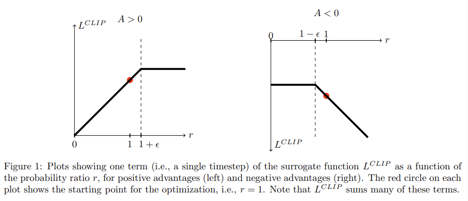
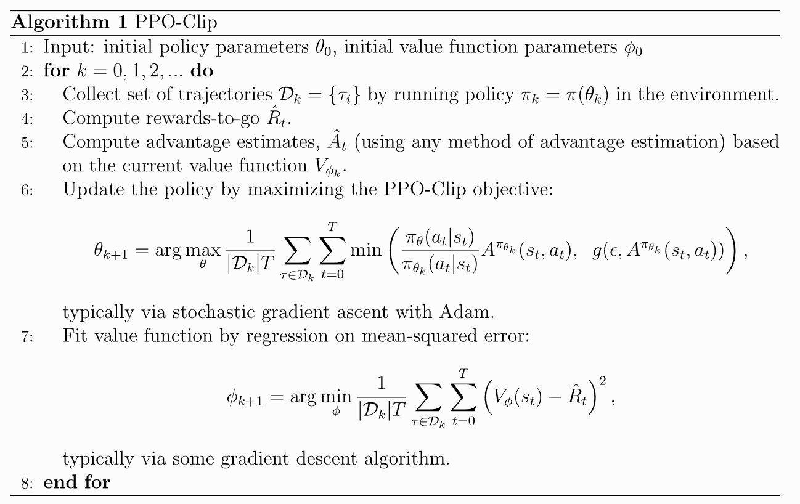

# Day 4 强化学习（上）：强化学习基本理论

[TOC]

<br>

在之前我们已经对后训练的几个过程进行了相对系统的学习，对于一些简单的场景SFT+DPO已经可以高效解决80%的问题，。然而，对于特别强调安全和准确的领域（比如医疗，教育等），我们还需要引入强化学习（Reinforcement Learning）来进一步对齐人类的要求。

## 0. 强化学习基础

简单来说，强化学习（Reinforcement Learning， RL）就是是一个 **智能体（agent）** 通过与 **环境（environment）** 的交互，学习一个能最大化长期累积奖励的策略的过程。以下是RL的一些基础概念：

| 组成部分                   | 含义                                      |
| -------------------------- | ----------------------------------------- |
| **Agent**                  | 执行动作并根据反馈更新策略的学习者        |
| **Environment**            | 提供状态、接受动作并反馈奖励的系统        |
| **State (s)**              | 当前环境的观测或描述                      |
| **Action (a)**             | 智能体在状态下可执行的动作                |
| **Reward (r)**             | 动作执行后即时得到的反馈信号              |
| **Policy (π)**             | 从状态映射到动作的策略函数                |
| **Value Function (V / Q)** | 估计在某状态或状态-动作对下的长期期望回报 |
| **Model (P)**              | 环境动态模型，即状态转移概率 ( P(s'       |

这里简单提一句：***为什么说 RL 是“最优控制”问题？*** 在经典最优控制里，我们给定系统动力学 $x_{t+1}=f(x_t,u_t)$ 与代价 $c(x_t,u_t)$，目标是选择控制序列 $\{u_t\}$ 使累计代价最小（或回报最大）。在 **RL** 中，系统动力学一般**未知**且**随机**，用 **MDP** 近似；控制律就是**策略** $\pi(a|s)$。RL 的核心就是通过交互**求解最优控制律**，而它与动态规划（DP）的数学纽带就是**贝尔曼（Bellman）最优性原则**：最优策略满足一个自洽的最优子结构，进而导出**贝尔曼方程**与相应的改进/评估算子。所以说，要学习强化学习，首先要对控制问题有所了解。

接下来让我们从数学角度, 并且尽量用简单的数学语言从控制角度来理解这一过程。当然如果我们对数学原理不太感兴趣，也可以直接跳过这一节，到后面不太理解的部分再返回来查看。很多的数学原理，都来自于现代RL之父Richard S. Sutton（老爷子正好在笔者所在的大学任教 lol）的RL圣经 [1], 推荐拜读。

-----

### 0.1 马尔可夫过程 Markov Decision Process (MDP)

一个 RL 问题通常被建模为 **马尔可夫决策过程 (MDP)**：

$$
\mathcal{M} = (\mathcal{S}, \mathcal{A}, P, R, \gamma)
$$

- 他们分别代表： 状态空间 $\mathcal{S}$， 动作空间 $\mathcal{A}$， 状态转移概率 $P(s'|s, a)$， 奖励函数 $R(s, a)$， 折扣因子 $\gamma \in [0,1]$ 
- 目标：最大化**折扣回报**期望

$$
J(\pi)=\mathbb{E}_{\pi}\Big[\sum_{t=0}^{\infty}\gamma^t\, r_t\Big].
$$

马尔可夫性（Markov Property）指出：在一个随机过程中，**给定当前状态和当前动作后，下一步的结果与更久远的历史无关**。换句话说，系统的未来只依赖于现在，而与过去无关。由此可知，**存在一种仅依赖当前状态的最优策略（Markov policy）**。在完全可观测的马尔可夫决策过程（MDP）中，**最优策略无需记忆历史信息**。对于一阶马尔可夫过程而言，**环境动力学满足这样的条件**：下一步的状态只取决于当前的状态与动作，这正对应于前面提到的**转移概率**：

$$
P(s_{t+1}\mid s_{0:t}, a_{0:t})=P(s_{t+1}\mid s_t, a_t)
$$

-----

### 0.2 最优控制和Bellman方程

#### 0.2.1 最优控制到底在解决什么问题？

最优控制/决策的本质问题是：

> “在任意起点，我接下来该怎么做，才能让**从现在开始到未来**的总收益最大？”

这里的难点是“未来”往往是一个很长、甚至无限的过程。如果我们希望量化这一长期收益，**Bellman 的核心思想**是：
 将“很长的未来”拆解为“**当下这一步的收益**”与“**从下一时刻开始的最优未来收益**”之和——这便是著名的**最优性原理（Principle of Optimality）**。

> *一个最优策略的任意后续部分，仍然必须是从当前时刻起的最优策略。*

因此，**一个状态的价值（好坏）**可以分解为两部分：

- 当前采取某个动作所获得的**即时回报**；
- 执行该动作后，进入下一状态所能获得的**最优未来回报**。

让我们看一个直观的“最短路径”例子来理解 Bellman 方程。

假设有 4 个位置：`0—1—2—3`，目标是到达位置 `3`。每走一步的**代价**是 1（也可以理解为奖励 = −1），到达目标后奖励为 0（游戏结束）。显然，**最优策略**就是每次都向右走。现在，用“分解未来”的思路来看：

- 在位置 `2`：从 `2` 到目标只需 1 步，因此最小代价 $V(2) = 1$。
- 在位置 `1`：先走一步到 `2`（代价 1），再加上从 `2` 到终点的最优代价 $1$，所以 $V(1) = 1 + V(2) = 2$。
- 在位置 `0`：同理，$V(0) = 1 + V(1) = 3$。

我们实际上在做一种**向后推导（backward induction）**：

$$
V(s) = c(s, a) + V(s')
$$

这表示**当前位置的最优代价**等于“执行当前动作的代价”加上“下一状态的最优代价”。这就是 **Bellman 最优性方程在确定性环境下的形式**。

<br>

#### 0.2.2 变成随机情况（General MDP）

然而现实世界中的动作往往是**不确定的**。例如，我们尝试“向右”移动，可能只有 80% 的成功率，还有 20% 的概率原地不动。因此，下一步的“最优未来”就不再是一个固定值，而是一个**期望值**。换句话说：

> **当前价值 = 即时回报 + 折扣因子 × 下一状态价值的期望**

也就是 Bellman 方程在随机环境下的形式：

$$
V(s) = \mathbb{E}_{a, s'} [r(s,a) + \gamma V(s')]
$$

这意味着，状态的价值要综合考虑每个可能动作、每个可能转移结果的“加权未来”。我们来看一个直观例子：**带折扣奖励的线性格子。**设想一条简单的路径：`0—1—2—3(终点)`

- 到达终点 `3` 时奖励为 **+10**；
- 其他位置的奖励为 **0**；
- 折扣因子 $\gamma = 0.9$；
- 动作“向右”总能成功。

我们从终点向前推导（backward induction）：

$$
\begin{aligned}
V(3) &= 10 \quad\text{(终点的价值就是奖励)}\\
V(2) &= 0 + 0.9 \times V(3) = 9\\
V(1) &= 0 + 0.9 \times V(2) = 8.1\\
V(0) &= 0 + 0.9 \times V(1) = 7.29
\end{aligned}
$$

这一步步的“用下一状态价值更新当前状态价值”，就是一次 **Bellman 备份（Bellman Backup）**。也可以理解为在做**策略评估 / 价值迭代（Value Iteration）**。 这个“用自己的一部分估计来更新自己”的过程，正是所谓的 **自举（Bootstrapping）**。如果有多个动作可选，我们会选择让 `即时回报 + γ * 下一状态价值` **最大的动作**，这就是**控制**。我们发现，马尔可夫性保证“**给定现在，就能把未来写成条件期望**”，Bellman 正是把“总价值”拆成“当前收益 + 折扣后的**下一状态价值**”， 二者不谋而合。不过，这里可能有一个疑问：

> “Bellman 方程里写的都是‘未来的价值’。那我们站在现在，根本看不到未来，怎么知道它的值？ 又怎么能在不知道未来的情况下，用它来更新或学习呢？”

这是因为，Bellman 方程并不是一个“可以直接算”的公式，而是一个**自洽条件**（self-consistency condition）：

> 当前状态的价值 = 即时奖励 + 折扣 × 未来状态的价值期望

也就是说，它告诉我们：

- 真正的最优价值函数 $V^*$ 必须满足这个关系；
- 但在学习过程中我们并不知道 $V^*$，所以要**假设一个近似的 $V$**，然后
- 不断用这个关系去“逼近”它，直到更新不再变化。

这就是所谓的 **fixed-point learning（固定点学习）**。我们的目标即是在这个过程中不断修正价值函数。举个例子：想象我们在玩一款游戏，目标是拿到尽量多的金币。虽然游戏进行我们发现：

- 一开始在玩的过程中，我们不知道未来能拿多少金币。
- 但我们每玩一局，就能知道：“当前这一步 + 后面那几步一共拿了多少”金币。

如果我们反复玩很多次（这实际上就是采样轨迹），我们就能**估计**：

> “我在状态 S 下，平均能拿到多少金币。”

于是我们对每个状态都有一个估计值 $V(s)$。下一次玩到同样的状态，我们又获得了一个新的“实际回报”，用多次类似的反馈我们就可以**修正我们的估计**：

> 如果现实比我估的好，就把 $V(s)$ 调高；如果现实比我估的差，就把 $V(s)$ 调低。

久而久之，这个估计会越来越接近真实的期望值。

<br>

#### 0.2.3 Bellman 方程如何“落地”为算法？

好了，现在我们知道Bellman 给了我们一个**自洽的目标**：

> “最终学到的价值函数，往它套一次‘一步+未来’的更新，应该不再改变（达到固定点）。”

我们之前只是笼统地从语言角度简单了解了Bellman。从数学角度出发，我们规定**价值函数为$V^\pi(s)$（也可以说是给定策略 $\pi$）**。结合上面的内容，在一般的MDP假设下，期望 Bellman（给定策略的自洽条件）方程：

$$
\boxed{
V^\pi(s)=\mathbb E_{a\sim\pi(\cdot|s)}\Big[\ \mathbb E_{s'\sim P(\cdot|s,a)}\big[r(s,a)+\gamma V^\pi(s')\big]\ \Big]
}
$$

而我们的目标，也就是最优性 Bellman（实际控制问题的自洽条件）方程：

$$
\boxed{
V^*(s)=\max_{a}\ \mathbb E_{s'\sim P}\big[r(s,a)+\gamma V^*(s')\big]
}
$$

> 再次强调含义：**现在的最佳 = 这一步的期望收益 + 折扣后的“下一刻起的最佳”**。这就是“一步 + 未来”的最优性原理。

有了这个目标，出现了三条经典算法路来修正我们的价值函数：

**1）动态规划（Dynamic Programming，DP，需要知道环境模型，非RL）**

- **策略评估**：在已知转移概率的前提下，反复做“备份”，直到价值函数在 Bellman 期望方程下**不再变化**。
- **策略改进**：根据最新的价值函数，**对每个状态选能让‘一步+未来’最大/最小的动作**，得到更好的策略。
- 交替评估与改进 → **策略迭代**；或直接对价值做最大化备份 → **价值迭代**。

**2） Value-based RL（不知道模型，只用样本）**

- 把**贝尔曼最优性方程**当作固定点方程，用 TD/最小二乘逼近其解
- **TD(0)**、**SARSA**（on-policy）、**Q-Learning**（off-policy）都在逼近某种 Bellman 方程：
  - SARSA 逼近**期望方程**（给定策略）；
  - Q-Learning 逼近**最优性方程**（对下一步取 max）。

**3）  Policy-based RL（不知道模型，控制律直接优化）**

- 把 $J(\pi)$ 当作目标，利用**策略梯度定理**优化，优势/GAE 降方差；是“用 Bellman 残差当**方向信号**去调策略”。

<br>

#### 0.2.4 分支一： Value-based

现在让我们具体看看上面提到的两个RL分支之一

**1）出发点：最优性 Bellman 与“解方程”的思路。**

目标是在未知模型的情况下逼近一个 $Q^*(s,a)$，它满足最优性 Bellman：

$$
Q^*(s,a)=\mathbb E_{s'\sim P}\big[r(s,a)+\gamma\max_{a'}Q^*(s',a')\big].
$$

思路：把右侧的**期望**用**样本一次抽样**近似，用迭代把 $Q$ 推向该固定点。

**2） 核心：时序差分（TD）误差，这不是Value-based独有，但是需要先了解**

我们使用agent与环境交互拿到样本 `s, a, r, s'`，就用`新的估计 ≈ r + γ * 旧的下一状态估计`。这一步就是把“数学期望”换成了“**一次抽样**”——**样本版的 Bellman 备份**。在数学原理上，我们用一个更精确的说法描述上面的“修正”：

- 在时间 $t$，我们执行了动作 $a_t$，获得奖励 $r_t$，到达新状态 $s_{t+1}$。我们当前对状态的估计是 $V(s_t)$，但根据刚刚的经验，我们“看到”的更真实的回报是

$$
r_t + \gamma V(s_{t+1})
$$

- 两者差的部分：

$$
\delta_t = r_t + \gamma V(s_{t+1}) - V(s_t)
$$

​	就是**“预测误差”（TD 误差）**。我们用它去修正估计：

$$
V(s_t) \leftarrow V(s_t) + \alpha\, \delta_t
$$

​	这里的 α 是学习率。

- 于是，虽然我们根本不知道未来的“真值”，但我们可以用**一次次的经验样本**，一点点地把自己往那个“自洽点”上推过去。直觉上，$\delta_t>0$ 说明“现实比我估得好”，就上调；反之下调。
  

**3）代表算法：Q-Learning（off-policy，逼近最优性 Bellman）**

Q-learning是典型的value-based的RL算法，它旨在训练一个动作回报函数Q来评估当前动作的优劣。可能我们会纳闷：为什么变成Q了，不是价值函数V吗？简单地讲：

- **V(s)** 价值回报函数：只告诉我们“在状态 s 下，按当前/最优策略继续走的期望回报有多大”；
- **Q(s,a)** 动作回报函数：直接告诉我们“在状态 s 里，**立刻选动作 a** 会有多大期望回报”。

**V(s)** 只告诉“这个状态总体有多好”，但**不区分不同动作**。若用 $V$ 来选动作，我们需要再算 $\mathbb E_{s'|s,a}[\,r+\gamma V(s')\,]$ 去比较各 $a$，这在没有模型，**不知道转移概率 $P$** 时很别扭——要么建模 $P$，要么为每个 $a$ 额外采样估计。**Q(s,a)** 则把“动作优劣”编码在函数里，而这正是无模型环境里**做动作决策**所必需的信号：

$$
\text{选动作} \;\Rightarrow\; a = \arg\max_a Q(s,a)
$$

接下来我们介绍Q Learning[2]的算法，它的伪代码是：

```
Initialize Q(s, a) arbitrarily
for each episode:
    s ← s0
    repeat:
        a ← ε-greedy(Q(· | s))           # 行为策略，可与目标策略不同
        take a, observe r, s'
        y ← r + γ * max_{a'} Q(s', a')   # 目标里是“下一步贪心”——目标策略
        Q(s, a) ← Q(s, a) + α * (y - Q(s, a))
        s ← s'
    until s is terminal

# 部署时：π(s) = argmax_a Q(s, a)        # 用目标策略（贪心）执行
```

*a) 基本原理*：具体来看，这里我们知道在value-based RL中最优动作价值满足：

$$
Q^*(s,a)=\mathbb E\big[r+\gamma\max_{a'} Q^*(s',a')\mid s,a\big].
$$

将右侧的期望用一次采样近似，构造 TD 目标：

$$
y_t = r_t + \gamma \max_{a'} Q(s_{t+1},a').
$$

用 TD 误差更新：

$$
\delta_t = y_t - Q(s_t,a_t),\qquad
Q(s_t,a_t)\leftarrow Q(s_t,a_t) + \alpha\,\delta_t.
$$

这就是 **样本版最优性 Bellman 备份**。这就是Q-learning最经典的算法基础，也是Value-based RL的基础。

*b）Exploration vs Exploitation* ：那么Q-learning的策略具体是怎么产生的呢？这里就要提到非常经典的RL本质：***Exploration vs Exploitation （探索加利用）***。

- **利用**：根据现有经验选择当前看起来**最优**的动作，以获得**立即更高**的回报（如选 $\arg\max_a Q(s,a)$）。
- **探索**：选择**不那么确定/少尝试**的动作，以**获取信息**、修正估计，从而**长期更优**。

在Q-learning中，我们的目标策略选择是***贪心算法***：

$$
\pi_{\text{greedy}}(s)=\arg\max_{a} Q(s,a).
$$

也就是说，模型在推理阶段总是会选择当前回报最大的动作。但是，在和***环境互动采样训练***的时候，我们通常采用不同的行为策略—**ϵ-greedy**， 对应的分布写成“以动作为主体”：

$$
a_t =
\begin{cases}
\arg\max_a Q_t(s_t,a), & \text{with prob } 1-\varepsilon\\[4pt]
\text{any } a\in\mathcal A, & \text{with prob } \varepsilon
\end{cases}
$$

代码：

```python
import numpy as np
u = np.random.rand()
if u < epsilon:                       # with probability ε → any action
    a = np.random.choice(Actions)
else:                                 # with probability 1-ε → greedy
    a = np.argmax(Q[s])  
```

我们定义一个概率指标ϵ，在每次采样时，如果概率降落（1-ϵ）以内，我们就适用贪心算法；如果落在它以外，我们就使用随即探索策略。在这样既能**近似利用**当前最优，又能**保持探索**。通俗地说，我们们循环采样 $a_t\sim \pi_{\text{beh}}(\cdot|s_t)$ → 环境给 $r_t,s_{t+1}$ → 用上面的 **TD 目标 & 更新** 改进 $Q$ → **用更新后的 $Q$ 重新定义更贪心的目标策略**。这就是**广义的策略改进**过程。

注意：在推理和测试的过程中，我们**只贪心不探索**。

*c) Off-Policy*: 我们前面提到了Q-Learning是Off-Policy RL算法。那么什么是 off-policy？在强化学习里，我们通常区分两套策略：

- **行为策略（behavior policy，记作 $\mu$**）：用来与环境交互、**收集数据**的策略。
- **目标策略（target policy，记作 $\pi$**）：我们真正**想评估/想优化**的策略。

**off-policy 学习**：允许 $\mu \neq \pi$。也就是说，数据可以由一套策略产生（方便探索、复用旧日志），而学习/评估的对象是**另一套**策略（常是“更贪心”的目标策略）。正如在(b)小节提到的那样， Q-learning在学习阶段的目标策略是$\pi_{\text{greedy}}$，但是行为策略却是ϵ-greedy。但是要记住，无论 $a_{t+1}$ 实际上是怎么选的，Q-learning 的**目标**始终用 **$\max_{a'}$**（即目标策略）来“对齐未来”，更新式和上面相同：

$$
Q(s_t,a_t)\leftarrow Q(s_t,a_t)\;+\;\alpha\,\big[\,r_t+\gamma\max_{a'}Q(s_{t+1},a')-Q(s_t,a_t)\big].
$$

这里的$a'$不是实际动作，而是策略假设的当前时刻的最有动作，然而行为上可能还在探索（随机选取动作）。这正是 **off-policy**，**行为**由 $\mu$ 决定，**学习指向** $\pi_{\text{greedy}}$。与之相对，**on-policy** 要求 $\mu=\pi$​：采样和优化的是同一策略（如 SARSA、REINFORCE、PPO等）。比如SARSA算法，它是学习**当前行为策略**的价值，更新目标用**实际采样到的下一个动作** $a_{t+1}$：

$$
y_t^{\text{SARSA}}=r_t+\gamma\,Q(s_{t+1},a_{t+1})\\
Q(s_t,a_t)←Q(s_t,a_t)+α[y_t^{\text{SARSA}}−Q(s_t,a_t)]
$$

**行为差异**

- **SARSA 更“保守”**：目标包含实际的探索动作 $a_{t+1}$，遇到风险高的区域会学到“别太激进”，在如 Cliff-Walking 等任务上更安全。
- **Q-learning 更“乐观”**：总假设下一步会选最优动作（$\max$），即使行为在探索；收敛到最优解更直接，但在函数逼近/高探索下可能更不稳。

Q-learning 的核心代码可以表示为

```python
def update_q_value(self, state, action: int, reward: float, next_state, done: bool):
    """
    Update Q-value using Q-learning update rule.

    Args:
        state: Current state
        action: Action taken
        reward: Reward received
        next_state: Next state
        done: Whether episode is finished
    """
    state_idx = self.get_state_index(state)
    next_state_idx = self.get_state_index(next_state)

    # Current Q-value
    # q_table.size = (state_space_size, action_space_size)
    current_q = self.q_table[state_idx, action]

    if done:
        # Terminal state: no future rewards
        target_q = reward
    else:
        # Non-terminal state: add discounted future reward
        max_next_q = np.max(self.q_table[next_state_idx])
        target_q = reward + self.discount_factor * max_next_q

    # Q-learning update
    q_change = self.learning_rate * (target_q - current_q)
    self.q_table[state_idx, action] += q_change

    # Track Q-value changes for analysis
    self.q_value_changes.append(abs(q_change))
```

我们设计了一个非常简单的走迷宫游戏来展示如何从0构建Q-learning算法。请运行在`rlhf/Qlearning`下的`train_qlearning.py`来查看结果。

**4）DQN： Deep Q Network** [3]

**DQN = 用深度神经网络实现的 Q-learning**（Deep Q-Learning），是一种结合了深度学习和Q学习的深度强化学习算法，它使用深度神经网络来逼近高维状态空间中的Q值函数，从而解决传统Q学习中状态空间过大的问题。DQN的出现极大地推动了深度强化学习的发展，能够处理复杂的任务，如玩Atari游戏、图像处理等。 

- **算法本质**：仍是 **off-policy** 的时序差分，最优性 Bellman 目标不变

  $$
  y=r+\gamma \max_{a'} Q_{\bar\theta}(s',a'),\quad 
  \mathcal{L}(\theta)=\big(Q_\theta(s,a)-y\big)^2
  $$

  只是用 **神经网络** $Q_\theta(s,a)$ 近似动作价值。

- **动作选择**：训练时常用 $\epsilon$-greedy；部署时用 $\arg\max_a Q_\theta(s,a)$。

但是它的核心改动处是，用一套“缓慢变化”的 Q 函数来算 TD 目标，稳定训练。具体来说，DQN 维护两套参数：

- **在线网络** $Q_\theta(s,a)$：被梯度更新的网络（预测当前 Q）。
- **目标网络** $Q_{\bar\theta}(s,a)$：**冻结/缓慢更新**的副本（只用于构造目标）。

训练时，用目标网络计算 TD 目标，减少“自举”带来的目标漂移与发散。而目标网络则缓慢（延迟于策略网络）更新，更新时直接将策略网络参数拷贝到目标网络上。

总结DQN 相比“经典 Q-learning”的关键改进有：

1. **经验回放（Replay Buffer）**：打乱序列相关性、提升样本效率。
2. **目标网络（Target Network）**：用冻结参数 $\bar\theta$ 计算 $y$，周期性/软更新，稳定训练。
3. **深度特征**：高维输入（如图像）用 CNN/MLP 提取特征，替代表格/手工特征。

<br>

#### 0.2.5 分支二： Policy Based/Actor-Critic

我们还是从Bellman方程入手，

**1）从 Bellman 到策略优化**：给定策略 $\pi$，以及其参数$\theta$，那么价值函数可以写成

$$
V^\pi(s)=\mathbb E_{a\sim\pi,\,s'\sim P}\!\big[r(s,a)+\gamma V^\pi(s')\big].
$$

同时，因为我们之前定义了优化问题的目标是 $J(\pi_\theta)=\mathbb E_\pi[\sum \gamma^t r_t]$​ ，其中隐含的轨迹分布

$$
p_\theta(\tau)=p(s_0)\prod_{t=0}^{T-1} \underbrace{P(s_{t+1}\mid s_t,a_t)}_{\text{环境转移，不依赖 }\theta}\,\underbrace{\pi_\theta(a_t\mid s_t)}_{\text{策略}}
$$

对于概率求解， 我们使用**对数导数技巧（score function trick）**求目标函数的梯度（可以点击[这篇博文](https://zhuanlan.zhihu.com/p/614115887)看比较详细的推理过程），来优化该问题：

$$
\nabla_\theta J
= \mathbb{E}_{\tau}\!\Big[R(\tau)\,\nabla_\theta \log p_\theta(\tau)\Big]
= \mathbb{E}_{\tau}\!\Big[R(\tau)\sum_{t=0}^{T-1}\nabla_\theta \log \pi_\theta(a_t\mid s_t)\Big]
$$

因为 $P(s_{t+1}\!\mid s_t,a_t)$ 与 $\theta$ 无关，故 $\nabla_\theta \log P=0$。把回报“按时间分摊”到每个时刻，得到常用形态 [4]：

$$
\nabla_\theta J(\pi_\theta)
=\mathbb{E}_{s\sim d^\pi,\ a\sim\pi_\theta}\!\Big[\nabla_\theta \log \pi_\theta(a|s)\,\underbrace{Q^\pi(s,a)}_{\text{动作价值}}\Big].
\tag 1
$$

这说明：Policy based RL也**不需要显式环境模型**，就像上面估计Q一样，只要能采样轨迹就能估计梯度。而事实上，从数学角度看，我们可以**减去任意只依赖状态的函数** $b(s)$（称为**基线**）而不改变梯度的**期望**：

$$
\nabla_\theta J
=\mathbb{E}\!\Big[\nabla_\theta \log \pi_\theta(a|s)\,\big(Q^\pi(s,a)-b(s)\big)\Big].
$$

**为什么这样做是无偏的？** 因为对任意 $b(s)$：

$$
\mathbb{E}_{a\sim\pi_\theta}\!\big[\nabla_\theta \log \pi_\theta(a|s)\,b(s)\big]
= b(s)\,\nabla_\theta \sum_a \pi_\theta(a|s)
= b(s)\,\nabla_\theta 1
= 0.
$$

也就是说基线是“与动作无关的常数项”。到这一步，经典的策略梯度算法就可以被提出了。

**2）Policy-gradient： REINFORCE**

a） 蒙特卡罗回报（Monte Carlo return）：在纯采样（无模型）下，**用经验回报近似 $Q^\pi$**。我们定义return（$G_t$）：

$$
G_t \;\triangleq\; \sum_{k=0}^{T-t-1}\gamma^k r_{t+k} \;\approx\; Q^\pi(s_t,a_t)
$$

- **无偏但方差大**：$G_t$ 只靠采样，没有 bootstrapping [4]。

b) REINFORCE 刚被提出来的时候，其表达是

$$
\theta \leftarrow \theta + \alpha\,\nabla_\theta\log\pi_\theta(a_t\mid s_t)\,G_t
$$

然后当我们把基线（如按 batch 平均）加入，就变成了**REINFORCE with baseline**

$$
\theta \leftarrow \theta + \alpha\,\nabla_\theta\log\pi_\theta(a_t\mid s_t)\,\big(G_t - b(s_t)\big)
$$

该方法可以用来缓解方差问题。


**3）Actor–Critic（AC）架构**

在 **REINFORCE** 里我们用 **蒙特卡罗回报** $G_t$ 近似 $Q^\pi$，梯度无偏但**方差大**(因为在理论上，如果我们能获得**真实的动作价值函数** Q_pi,那么梯度估计就是无偏的；但是$G_t$ 是一个**随机变量的累加和**，每个随机变量都受到多种不确定性因素的影响（比如环境的状态转移概率的误差，策略的概率分布也有一定的随机性），所以方差比较大)。为了解决这个问题，我们把“**一步 + 未来**”的Bellman范式写成它的**优势**（Advantage, 这一步也被称为Bellman 残差）：

$$
A^\pi(s,a)\ \triangleq\ Q^\pi(s,a)-V^\pi(s)
\ =\ r+\gamma V^\pi(s')-V^\pi(s).
\tag 2
$$

也就是说，若 $A^\pi>0$，说明“**这一步比 Bellman 预测更好**”，应增加其概率；反之减少。我们会发现，这Bellman 残差不就是之前的TD error吗？没错，而且这就是**策略更新的方向信号**。于是，当我们设定基线为只与状态有关的价值函数的时候，引入(2)式，（1）可以写成：

$$
\boxed{\ \nabla_\theta J
=\mathbb{E}\!\big[\nabla_\theta \log \pi_\theta(a|s)\,A^\pi(s,a)\big]\ }
\tag 3
$$

在实现里，我们用一个参数化的 **Critic** $V_\phi(s)$ 网络去近似 $V^\pi(s)$，于是

$$
\underbrace{\delta_t}_{\text{TD 误差}}
\;=\; r_t+\gamma\,V_\phi(s_{t+1})-V_\phi(s_t)
\;\approx\; A^\pi(s_t,a_t).
$$

这就把“理论上的优势”变成了“**一次交互就能算**”的量：$\delta_t$。再加上用 **Actor** $\pi_\theta$ 做策略更新 ，我们就得到了Actor–Critic架构的RL算法。


**4）AC的基本构件与更新**

a）***Critic：价值评估（逼近期望 Bellman）***

- 学 $V_\phi(s)$ 或 $Q_\phi(s,a)$。

- 以状态价值为例，其参数更新遵循：

  $$
  \delta_t = r_t+\gamma V_\phi(s_{t+1})-V_\phi(s_t),\qquad
  \phi \leftarrow \phi - \eta \nabla_\phi\,(\delta_t)^2.
  $$

- 价值函数 $V_\phi$ 的目标是估计状态的长期期望回报（即状态价值），可以被看作是真实价值的近似值。然而，真实的状态价值是未知的，因此我们需要一个目标值来训练价值函数。这个目标值通常使用GAE或类似估计值，它结合了蒙特卡洛（MC）回报和时间差分（TD）学习的优点，以在偏差和方差之间取得平衡。：

  $$
  \hat A_t=\sum_{l=0}^{\infty}(\gamma\lambda)^l\,\delta_{t+l},\quad
  \hat V_t = \hat A_t + V_{\phi_{old}}(s_t).
  $$

   $\hat{A}_t$​是通过GAE(*λ*)计算的优势估计值。λ∈[0,1] 越大越接近 MC（低偏高方差），越小越接近 TD（高偏低方差）。然而这看起来像是在估计动作Q值的回报（见2式），为什么呢？

  让我们重新审视GAE的概念，GAE 实际近似的是：$\hat A_t \approx G_t^\lambda - V_{\text{old}}(s_t)$ ，其中 $G_t^\lambda$ 是 **$\lambda$-return**（介于 TD 与 MC 之间的折中回报），而 $V_{\text{old}}$​ 指 模型未被更新前上一轮的值函数输出。把上式移项就得到：

  $$
  G_t^\lambda \;\approx\; \hat A_t + V_{\text{old}}(s_t)\ \stackrel{\Delta}{=}\ \hat V_t
  $$

  也就是说，$\hat V_t$ 并不是“又把被减掉的 $V$ 加回来”这么简单——它**等价于对真实回报 $G_t$** 的一个更稳的估计 $G_t^\lambda$。这一步结束后，$\hat V_t$ 就可以被detach了。
  
  注： $\hat V_t$ 有的时候也写作return $\hat R_t$ 
  
- 我们希望 $V_\phi(s_t)$ 学到 **状态的期望回报**, 于是就用$V_\phi(s_t)$来拟合$\hat V_t$：

  $$
  L_{\text{value}}=\mathbb{E}\big[(V_\phi(s_t)-\underbrace{\hat V_t}_{\approx G_t^\lambda})^2\big]
  $$

  从表面上看，这似乎是在最小化优势估计的平方（数学上带入等于求优势平方的期望），但这里有一个关键细节：**在计算 $\hat V_t$ 时，我们使用了当前价值函数  $V_\phi(s_t)$  的值，但在优化损失函数时，$\hat V_t$  被视为常数（即梯度被阻止流向 $\hat V_t$ ）**。在实践中，当我们计算 $\hat V_t$ 时，我们使用当前价值网络的参数的当前值（记作 $ϕ_{old}$），但随后在损失函数中，我们固定 $\hat V_t$ （通过 `detach()` 或类似操作），只更新 $V_\phi(s_t)$。
  
  当然，在数值上直观一点说，在本轮优化阶段做了第一次参数更新之前，他们在数值上是等价的。其余时刻都是不同的。

 

b）***Actor：策略更新（优势驱动）***

- 策略梯度：

  $$
  \nabla_\theta J \;=\; \mathbb E\big[\,\nabla_\theta \log \pi_\theta(a_t|s_t)\ \hat A_t\,\big].
  $$

- 参数更新（单步写法）：

  $$
  \theta \leftarrow \theta + \alpha\,\nabla_\theta \log \pi_\theta(a_t|s_t)\ \hat A_t.
  $$

- 常配 **熵正则** 提升探索与多样性：$+\beta\,\mathbb E[\mathcal H(\pi_\theta(\cdot|s))]$。

- 实现时常用 **负损失** 写法（做最小化）并加**熵正则**稳探索：

  $$
  \mathcal L_{\text{actor}}
  = -\,\mathbb{E}\big[ \log \pi_\theta(a_t|s_t)\;\hat A_t \big]
  \;-\;\beta\,\mathbb{E}\big[\mathcal H(\pi_\theta(\cdot|s_t))\big].
  $$


#### 0.2.6 PPO概念概述 [5]

**1）动机与直觉**

- **问题**：纯 Actor–Critic 用 $\nabla_\theta \log\pi_\theta(a|s)\hat A$ 更新，若一步走太大，策略会“崩”（分布漂移、性能回退）。
- **TRPO**：用“信任域”（约束平均 KL）保证每步不走太大，但实现复杂（需二阶近似/共轭梯度）。
- **PPO**：保留信任域思想，用**一阶优化 + 简单目标**近似约束步长，达到“**稳定又好调**”的效果。

**2）PPO 的核心目标**

a）几率比

$$
r_t(\theta)=\frac{\pi_\theta(a_t\mid s_t)}{\pi_{\theta_{\text{old}}}(a_t\mid s_t)}
$$

用旧策略 $\pi_{\theta_{\text{old}}}$ 采样，再用 $r_t$ 做重要性加权，避免分布错配。

b）Clip 目标（最常用）

$$
\boxed{\;
\mathcal L_{\text{clip}}(\theta)=
\mathbb E_t\Big[\min\big(\,r_t(\theta)\,\hat A_t, \ \mathrm{clip}(r_t(\theta),\,1-\epsilon,\,1+\epsilon)\,\hat A_t \big)\Big]
\;}
$$

- 当 $r_t$ 超出 $[1-\epsilon,1+\epsilon]$ 区间，会被截断，**抑制过大更新**。
- $\hat A_t$ 为优势（通常用 **GAE** 估计，见下）。

c）KL 惩罚/约束（另一常见变体）

$$
\mathcal L_{\text{kl}}(\theta)=
\mathbb E_t\!\big[r_t(\theta)\hat A_t\big]-\beta\,\mathbb E_t\!\big[\mathrm{KL}\big(\pi_{\theta_{\text{old}}}(\cdot|s_t)\,\|\,\pi_\theta(\cdot|s_t)\big)\big]
$$

- $\beta$ 可**自适应**调节，使实际 KL 逼近目标 $d_{\text{target}}$（KL 太大就增大 $\beta$，太小就减小）。

d）全损失（加上值函数与熵）

$$
\boxed{\;
\max_\theta \ \mathcal L_{\text{policy}}
\;-\; c_v \,\mathbb E_t(V_\phi(s_t)-\hat V_t)^2
\;+\; c_e \,\mathbb E_t[\,\mathcal H(\pi_\theta(\cdot|s_t))\,]
\;}
$$

- $\mathcal L_{\text{policy}}$ 一般取 $\mathcal L_{\text{clip}}$（或 KL 版）。
- 值函数损失稳定 Critic；熵正则维持探索。

我们在最后一节具体分析PPO算法

-----

## 1. 强化学习一般范式

### 1.1 为什么选择 RL？

- **需要“序列决策”**：当前动作会影响后续可见状态与长期结果（游戏、推荐、机器人、对话系统、流量控制等）。
- **奖励可能“延迟/稀疏”**：不是每步都有明确监督信号，得靠长期回报来引导学习。
- **没有模型，但是环境可交互**：可以不断试错，边探索边改进策略，而不是一次性从固定数据里学完。
- **目标是“策略”而非单步预测**：我们最终要的是一个在任意状态下都能选动作的控制律 $\pi(a|s)$。

### 1.2 RL 普遍做了什么？

- **State（状态）**
  - 含义：对当前环境的“足够信息”的表示，用来决策下一步做什么。
  - 形式：数值向量、图像帧、文本上下文、传感器读数等。
  - 实践要点：状态要**可感知、可计算、与任务相关**；常做归一化、去噪、特征提取。
- **Action（动作）**
  - 含义：智能体对当前状态的决策输出。
  - 形式：离散（上/下/左/右、推荐哪个 item）、连续（转角/油门/价格）、或结构化（文本token、API 调用）。
  - 实践要点：动作空间设计影响学习难度；离散→易于 value-based；连续→多用 policy-based/AC（如 PPO/SAC）。
- **Reward（奖励）**
  - 含义：对“这一步后果”的即时打分，用于塑造长期目标（最大化累计奖励）。这是RL中最重要的一部分，rewards的设计几乎决定了强化学习可以学习到的策略的最终边界。
  - 设计：
    - 直接指标：得分、收益、完成率、成功/失败；
    - 代理信号：时延、能耗、点击/停留时长；
    - 约束/惩罚：安全违规、越界、超预算、与参考策略的 KL 等。
  - 实践要点：**奖励塑形**很关键——过于稀疏→引入中间奖励/内在动机；错配→容易被“投机”利用（reward hacking），需要正则与多目标加权。

### 1.3 如何判断 RL 的性能？

把“学得好不好”拆成三类指标 + 两类稳健性检查：

**1.3.1 任务绩效（是否达成目标）**

- **平均回报 / 成功率**：按回合或窗口统计（越高越好）。
- **关键业务指标**：完成率、收益、成本、时延、违规率、用户满意度等。
- **样例质量**（对话/生成类）：一致性、格式合法率、错误率、win-rate、RM/人工评审分。

**1.3.2 学习过程（学得稳不稳、快不快）**

- **收敛速度 / 样本效率**：达到某水平所需交互步数或样本量。
- **稳定性**：曲线是否抖动/崩塌；on-policy 看 KL、clip fraction、熵；off-policy 看 TD 误差、目标网络偏移。
- **探索状况**：熵/动作多样性、ε 退火曲线、覆盖率。
- **值函数质量**：value loss、explained variance（值函数能解释多少回报的方差）。

**1.3.3 资源与约束（成本是否可接受）**

- **计算/时延**：吞吐、训练/推理时延、并行效率。
- **样本/标注成本**：是否需要昂贵的在线交互或人类偏好标注。
- **合规/安全**：越界率、风险事件、约束违背次数（可做“约束奖励”或安全滤器）。

**1.3.4 稳健性与泛化（必须做的两类检查）**

- **鲁棒性**：不同随机种子、扰动/噪声、环境参数变化下的表现（均值±方差）。
- **泛化/迁移**：新场景、新用户群、新地图/分布上是否仍然有效。

------

## 2. Proximal policy optimization 近端策略优化算法（PPO）

### 2.1 KL散度 

在上面的理论实践中，我们已经了解了PG和AC的基本原理，也简单地谈了一下PPO算法。现在让我们由浅入深探究一下PPO的原理。

首先我们要知道，在之前谈到的强化学习范式里，所谓的**策略实际上就是概率**，即$\pi_{\text{old}}(\cdot\mid s)$、$\pi(\cdot\mid s)$ 分别是旧/新策略在状态 $s$ 上对动作的**概率分布**（注意，离散环境我们谈概率，连续空间中则是**概率密度**）。在上一节探究DPO的过程中，我们学习了KL散度，并且提到了PPO。KL散度实际上是描述了一种衡量策略之间差异的方法（因此也常被称为相对熵）。在实际施加它训练的时候，如果我们希望限制的是“**策略分布改了多少**”（策略分布的概率差异，或者说概率距离），就需要用到 KL 散度来测量这一差异：

$$
\mathrm{KL}\!\left(\pi_{\text{old}}(\cdot|s)\ \big\|\ \pi_\theta(\cdot|s)\right)
= \mathbb E_{a\sim \pi_{\text{old}}}\!\left[
\log \frac{\pi_{\text{old}}(a|s)}{\pi_\theta(a|s)}\right].
$$

结合公式，因为对数函数是单调递增的，那么直觉告诉我们，新旧策略在所有动作概率上的**相对变化**越小，KL散度也就越小；反之则越大。这给出“**信任域**（Trust Region）”思想：只允许策略在 KL 小于阈值的区域内更新，保证性能不劣化。合理调配KL阈值可以有效抑制以下两种情况：

- **过冲（Overshooting）：**更新错过了奖励峰值并落入了次优策略区域
- **下冲（Undershooting）：**在梯度方向上采取过小的更新步长会导致收敛缓慢

### 2.2 信赖域策略优化算法TRPO （简述）

基于KL散度的思想，Trust region policy optimization（TPRO）[7] 算法被提出。具体来说，TRPO从策略梯度定理出发，提出了一种量化策略的办法——把目标写成在旧策略分布上的期望：

$$
L_{\pi_{\text{old}}}(\theta)
= \mathbb E_{s\sim d^{\pi_{\text{old}}},\, a\sim \pi_{\text{old}}}\!\bigg[
\frac{\pi_\theta(a|s)}{\pi_{\text{old}}(a|s)}\, A^{\pi_{\text{old}}}(s,a)
\bigg]
= \mathbb E\big[r_\theta(s,a)\,A^{\text{old}}(s,a)\big],
$$

其中几率比 $r_\theta=\pi_\theta/\pi_{\text{old}}$，也称为**重要性采样**；优势的估计仍旧采用了GAE的计算方法。如果我们仔细去思考这个目标函数，会发现这是一种“**替代目标**（surrogate objective）”：用旧分布下估计到的优势，衡量新策略的改进趋势。真实性能改进可用一个单调改进下界界定：若替代目标增大，则真实回报提升。

基于此，TRPO提出了受限优化（Constrained Optimization）和信任域（Trust Region）的概念，

#### 2.2.1 受限优化（Constrained Optimization）

- 要干嘛：我们想让策略往“更好”的方向走，但同时不允许它一下子改太多。

- 像什么：在山路上开车，路边有护栏（约束）。油门能踩，但不能撞倒护栏，更不能越过护栏。

- 在 RL 里：目标是“提升策略表现”，约束是“策略新旧之间的差别不能太大”（否则之前收集的数据就不再代表现在的策略，学到的东西不靠谱）。

#### 2.2.2 信任域（Trust Region）

- 要干嘛：给“能信得过的小范围”起个名字：只要每次更新让策略留在这个小范围里，我们就信任它的性能不会恶化。

- 像什么：走台阶时只跨半步（小而稳），不跳两阶（容易摔跤）。这里的“一步多大”的概念就是信任域半径。

- 在 RL 里：用一个“分布差异的尺子”量新旧策略有多远。常用的尺子是 KL 散度：数值小，说明新旧动作概率分布很接近，还在“信任域”里。

TRPO可以说是策略梯度算法的里程碑之一，其开拓的重要性采样和信任域等概念成为PPO算法的基石。我们了解到这里就好，要想掌握TRPO的真正的数学原理，需要了解自然梯度(Natural Gradient)算法，以及共轭梯度的数学概念，较为复杂。感兴趣可以自行查找，或者点击上面提到的博文来学习。

### 2.3 近端策略优化算法（PPO）

正如上一小节最后说的，TRPO算法从原理上理解比较复杂，很难解释和推广；且需要大量遍历KL阈值，尽管作者提出了线搜索等方法，依然需要大量昂贵的代价以及很慢的更新过程。2017年，基于TRPO的想法，由OpenAI Schulman等人推动提出了PPO算法[5]。PPO 的核心是两个点：

1. **重要性采样（IS）几率比** $r_t(\theta)=\pi_\theta(a_t|s_t)/\pi_{\text{old}}(a_t|s_t)$，让同一批 on-policy 数据可**多轮复用**（每次当作“校正权重”）。
2. 用 **Clip 或 KL-penalty** 给更新“护栏”，近似信任域，而不做二阶与线搜索。

#### 2.3.1 重要性采样 (Importance Sampling)

重要性采样并不是PPO提出的。然而，当我们把 AC 的策略损失(3)式 $-\mathbb E[\log\pi_\theta\,\hat A]$ 换成 IS 形式（这等价于在旧分布下求期望），

$$
\mathcal L_{\text{PG}}(\theta) = \mathbb E_t\big[r_t(\theta)\,\hat A_t\big],
\quad 
r_t(\theta)=\frac{\pi_\theta(a_t|s_t)}{\pi_{\text{old}}(a_t|s_t)}.
$$

**这一步让我们可以对同一批 $(s_t,a_t)$** 进行 **多 epoch 小批训练**，而不严重偏离 on-policy（$\pi_{\text{old}}$ 冻结；$r_t$ 做校正）。

#### 2.3.2 PPO 基于KL-penalty

我们之前说过，KL散度是在给策略加“围栏”，设置信任域。然而如何正确地设置信任域是一个好问题，加入KL散度的公式如下：

$$
\mathcal L_{\text{kl}}(\theta)
=\mathbb E_t\big[r_t(\theta)\hat A_t\big] - \beta \, \mathbb E_t\Big[\mathrm{KL}\big(\pi_{\text{old}}(\cdot|s_t)\,\|\,\pi_\theta(\cdot|s_t)\big)\Big].
$$

我们既不希望 β 过大，与TRPO一样只产生较小的更新，也不希望 β 过大，容易出现overshooting问题（引自[6]）。PPO给出的方法是，用基于启发式的，自适应方式调 $\beta$​：PPO 通过设置**目标散度**（目标 KL）$d_{\text{target}}$ 来约束更新步长。我们希望每次策略更新后的实际 KL 落在 $d_{\text{target}}$ 附近——**足够大**以显著改善策略，**又足够小**以保持训练稳定。训练中采用自适应惩罚，即每次更新后都计算实际 KL：

- 若 $\mathrm{KL} > 1.5\,d_{\text{target}}$，说明步子偏大，则**加倍**惩罚系数 $\beta \leftarrow 2\beta$；
- 若 $\mathrm{KL} < d_{\text{target}}/1.5$，说明步子偏小，则**减半**惩罚系数 $\beta \leftarrow \beta/2$，相当于**放宽**信任域；
- 否则保持 $\beta$ 不变。

这里的“1.5”并没有理论验证，可能是作者通过实验得出的结论。这种“双向自适应”的调节思路与 TRPO 的线搜索相似，但 TRPO 只在**单向缩步**上搜索，而 PPO 在“步子过大/过小”两个方向都能自动纠偏。


#### 2.3.3 PPO基于Clip（主流）

PPO的另外一种变体是Clip版本，实验证明其效果优于PPO KL-penalty。在这一变体中，我们不在启发式地探索限制KL散度大小的β ，而是直接限制策略可以变化的范围。具体来说，Clip对每个样本都做“剪切”：

$$
\boxed{
\mathcal L_{\text{clip}}(\theta)
=\mathbb E_t\left[
\min\!\left(r_t(\theta)\hat A_t,\ 
\mathrm{clip}\big(r_t(\theta),1-\epsilon,1+\epsilon\big)\,\hat A_t
\right]
\right].
}
$$

解释：

- 若期望优势 $\hat A_t>0$，我们希望 $r_t\!\uparrow$（增大该动作概率），但超出 $1+\epsilon$ 后**收益不再增长**；
- 若 $\hat A_t<0$，希望 $r_t\!\downarrow$，但低于 $1-\epsilon$ 后**收益不再下降**；
- 这样就像给每个样本加了“**步长护栏**”，限制策略更新的局部强度，抑制崩塌与过拟合。



*Fig 1. PPO Clip的更新原理，取自原论文 [5].*

由图1可以看出，在Clip范围外的重要性采样结果都会被裁减从而不计入梯度计算。那么这里的超参数$\epsilon$就非常重要。在实际的过程中，我们一般取$\epsilon = 1~\text{or}~2$（也是经验之谈，没有理论验证，可见优秀的算法也不是每一步都非常严谨的）。

#### 2.3.4 完整目标/损失

$$
\max_\theta\quad 
\underbrace{\mathcal L_{\text{policy}}(\theta)}_{\text{clip loss 或 kl loss}}
\;-\; c_v\,\mathbb E_t\big(V_\phi(s_t)-\hat V_t\big)^2
\;+\; c_e\,\mathbb E_t\big[\mathcal H(\pi_\theta(\cdot|s_t))\big].
$$

可以看到除了上面提到的loss函数，作者还添加了价值汉书的误差（第二项）和熵正则项（第三项）。为什么呢？

**1) 为什么加价值函数的误差项？**

PPO 用的是 **优势 $\hat A_t$** 做策略更新，而 $\hat A_t$ 是由 **Critic 的 $V_\phi(s)$** 通过 TD/GAE 算出来的：

$$
\delta_t=r_t+\gamma V_\phi(s_{t+1})-V_\phi(s_t),\quad
\hat A_t=\text{GAE}(\{\delta\})
$$

如果 $V_\phi$ 估得偏、抖动大，$\hat A_t$ 就**噪声大且带偏**，Actor 会朝“错的方向”迈步，训练不稳。因此要**同步训练 Critic**，让它逼近更好的目标（折扣回报或 $\hat V_t=\hat A_t+V_\phi(s_t)$）：

$$
\mathcal L_{\text{value}}=\mathbb E\big[(V_\phi(s_t)-\hat V_t)^2\big]
$$

把它乘权重并**减掉**进入总目标（因为我们最大化总目标）：

$$
\max_\theta\;\underbrace{\mathcal L_{\text{policy}}}_{\text{PPO-Clip/KL}}
\;-\;c_v\,\mathcal L_{\text{value}}
$$

> 要点：**好 Critic ⇒ 好优势 ⇒ 稳定、低方差的策略更新。** 实践里有时也配“**值函数裁剪**”以防 $V_\phi$ 也迈太大步。

**2) 为什么加熵正则？**

若只追逐当前优势，策略会很快把概率**压到单一动作**（分布塌缩），探索减少、易陷局部最优。**熵正则**鼓励策略保持一定**随机性/多样性**：

$$
\mathcal L_{\text{entropy}}=\mathbb E\big[\mathcal H(\pi_\theta(\cdot|s_t))\big]
$$

一般的熵的计算方法是：

$$
\mathcal H(P) = - \sum_{i=1}^{V} P(x_i) \cdot \log P(x_i)
$$

这里的是P选择第 \( i \) 个动作( x_i \) 的概率。举个例子：假设在一个极其简化的词汇表（只有3个token：A, B, C）上，模型给出的概率分布为：

- P(A) = 0.2，P(B) = 0.3，P(C) = 0.5

那么该分布的熵为：

$$
\mathcal H(P) = - [0.2 * \log(0.2) + 0.3 * \log(0.3) + 0.5 * \log(0.5)] \approx -[-0.322 -0.361 -0.347] \approx 1.03
$$

知道了以后，我们就把它并以权重加入总目标：

$$
\max_\theta\;\mathcal L_{\text{policy}}
\;-\;c_v\,\mathcal L_{\text{value}}
\;+\;c_e\,\mathcal L_{\text{entropy}}
$$

直觉：给“更均匀”的策略一点奖励，**防早收敛**、**提升探索**，在连续动作里还能防止协方差“收缩成零”。更加细节的熵的计算方法，请见Appendix。

总结一下算法流程：



*Fig. 2 PPO algorithm pseudocode, from [OpenAI Spinning UP Docs](https://spinningup.openai.com/en/latest/algorithms/ppo.html).*

#### 2.3.5 PPO的RL性质： Near-on-policy?

PPO是 On-policy 的吗？没错，而且这就是它的本质。人们对PPO的性质有些混淆，是因为 PPO 在 **“纯粹的On-policy”** 基础上做了优化，让它能更充分地利用数据。

- **纯粹的On-policy（如原始REINFORCE）**：策略每更新一次参数，就必须扔掉旧数据，立刻重新收集新数据。**数据效率低**。
- **PPO的改进**：PPO 通过**裁剪（Clipping）** 等技术，允许在**不显著偏离旧策略 π_θ_old** 的前提下，用同一批数据对当前策略 π_θ 进行**多次更新**（例如，用一批数据更新10次，我们可以自行规定次数）。
  - 具体来看：
    - a. 用**当前的策略 π_θ_old** 与环境交互，收集一批数据。
    - b. 用这批数据对**当前策略 π_θ** 进行多次小批量更新。

这样做：

- 是在一个**信任域** 内，尽可能地榨干一批数据的价值。
- 因此，PPO 常被称为 **“更样本高效”的On-policy算法**。它没有改变其On-policy的本质，只是让这个本质过程变得更高效。


#### 2.3.6 总结

以上就是PPO的大部分内容。这一节理论知识很多，下一节我们进行工程方面的代码复现。总体来说PPO能成为强化学习领域的最主流算法，离不开之前提到的自然梯度和TRPO算法提出的先置概念（KL散度，重要新采样，信任域等）。在他们的基础上，PPO进行了迭代，优化了参数调整的策略，并提升了工程上的可行性（尽管这样做确实不太严谨）。可见的是，这一改变非常有用，从日常的RL任务，到最开始火爆的ChatGPT也大都离不开PPO算法。下一节，我们将重点谈谈PPO等一系列强化学习算法对LLM的影响，区别，以及具体操作。

<br>

## Reference

[1] Richard S. Sutton and Andrew G. Barto. 2018. Reinforcement Learning: An Introduction. A Bradford Book, Cambridge, MA, USA.

[2] Watkins, C. J. C. H. & Dayan, P. (1992). Q-learning. *Machine Learning*, 8, 279--292. doi: 10.1007/BF00992698

[3] Mnih, Volodymyr, et al. "Playing atari with deep reinforcement learning." *arXiv preprint arXiv:1312.5602* (2013).

[4] Williams, R.J. (1992) Simple Statistical Gradient-Following Algorithms for Connectionist Reinforcement Learning. Machine Learning, 8, 229-256.

[5] Schulman, John, et al. "Proximal policy optimization algorithms." *arXiv preprint arXiv:1707.06347* (2017).

[6] 知乎博文：https://zhuanlan.zhihu.com/p/614115887

[7] Schulman, J., Levine, S., Abbeel, P., Jordan, M.I., & Moritz, P. (2015). Trust Region Policy Optimization. *ArXiv, abs/1502.05477*.

<br>

## Appendix

### 常见策略熵计算

#### 1) 离散动作（Categorical / Softmax）

策略给出每个动作的概率 $p_i=\pi_\theta(a_i\mid s)$，**给每个动作 $a_i$** 一个打分/偏好（logit）$z_i = f_\theta(s, a_i)$，则

$$
\pi_\theta(a_i\mid s)
=\frac{\exp(z_i)}{\sum_{j=1}^{|\mathcal A|}\exp(z_j)}.
$$

这就是**Softmax 策略**的标准公式。我们接下来定义其策略熵（以自然对数为底，单位 *nats*）：

$$
\mathcal H(\pi_\theta(\cdot\mid s))
= -\sum_{i=1}^{|\mathcal A|} \pi_\theta(\cdot\mid s) \,\log \pi_\theta(\cdot\mid s) .
$$

这里数值稳定的实现要点为：

- 先算 `logp = log_softmax(logits)`，再 `p = exp(logp)`；
- 逐状态熵：`H = -(p * logp).sum(dim=-1)`；
- 无效动作：对不允许的动作把 logit 设为 $-\infty$（或大负数），等价于概率 0，不参与熵。

#### 2) 连续动作（高斯策略，常见：独立对角协方差）

策略输出均值和对数标准差：$\mu_\theta(s)\in\mathbb R^k,\ \log\sigma_\theta(s)\in\mathbb R^k$。若动作 $a\sim \mathcal N(\mu, \mathrm{diag}(\sigma^2))$，**多元高斯熵**有闭式：

$$
\mathcal H(\pi_\theta(\cdot\mid s))
= \tfrac{1}{2}\,\log\!\big((2\pi e)^k\,|\Sigma|\big)
= \sum_{j=1}^{k} \log\sigma_j \;+\; \tfrac{k}{2}\,\log(2\pi e).
$$

> 实现：`H = log_std.sum(-1) + 0.5 * k * (1 + log(2π))`（因为 $\log(2\pi e)=1+\log(2\pi)$）。

**Tanh-squash（动作域 $[-1,1]$）**

- 若实际采取 $a=\tanh(u)$，其中 $u\sim \mathcal N(\mu,\Sigma)$，需做**变量变换修正**：
   $\log\pi(a)=\log\pi_U(u) - \sum_j \log(1-\tanh(u_j)^2)$。
- **熵**可用库的 `TransformedDistribution` 的 `entropy()` 或用**采样估计**：对 $u$ 采样，计算上式中的修正项的期望再加高斯熵。