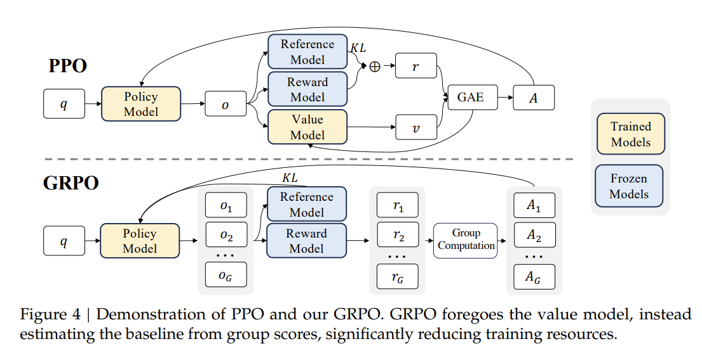

# Day 4 强化学习（下）：LLM中的强化学习

[TOC]


我们昨天了解了强化学习的概念以及最流行的算法PPO，今天我们了解一下强化学习再LLM当中的应用。

## 1. 为什么LLM需要强化学习？

事实上，当我们真的去开发一个大语言模型，我们不只想让它“像人类那样说话”，**而是更想要让它“把事办成”**。比如说，让LLM按约定格式产出 JSON、正确地调用工具、在该拒答时可靠拒答、写出的代码能通过单元测试、在 RAG 里既快又省、是否在敏感场景里稳定拒答等等问题。这类目标往往不可微，或只在整段输出结束时才能判定成败。接下来让我们衔接SFT，具体来看看为什么

### 1.1 监督微调的局限性

我们回顾一下，SFT是在高质量的（提示，回答）数据集上，用标准的“下一个词预测”任务来微调模型。比如，给定提示“法国的首都是”，模型被训练输出“巴黎”。

- **它的优点**：能有效地教会模型遵循指令的格式和风格，并注入特定领域的知识。
- **它的核心问题**：
  - **“一个提示，多个正确答案”困境**：对于很多主观性问题，不存在唯一的标准答案。例如，“用一首诗赞美秋天”，可以有无数种优美且正确的写法。SFT模型只会模仿训练数据中的那一种，缺乏创造性，并且如果遇到多个不同风格的优秀答案，它可能会学得“精神分裂”。
  - **无法优化复杂、抽象的目标**：我们希望模型不仅“正确”，更要“有帮助”、“无害”、“诚实”、“说话得体”。这些目标非常复杂，无法为每一个训练样本标注一个绝对的“好/坏”标签。SFT只能学习到数据中表面的模式，无法直接针对这些更高层次的、基于**结果**的质量进行优化。

**总而言之，SFT教会模型“如何说话”，但无法教会模型“什么话更好”。**

<br>

### 1.2 强化学习的角色：从“模仿”到“优化”

RL的引入，正是为了解决SFT的上述局限。它的核心思想是：我们不告诉模型唯一正确的答案是什么，而是让模型生成多个答案，然后我们用一个“裁判”来评判这些答案的优劣，最后引导模型更多地生成能获得高分的答案。这个“裁判”就是**人类偏好**的量化体现。

在经典的RLHF中，这个“裁判”是一个独立训练出来的**奖励模型**。

- **流程**：SFT -> 训练奖励模型 -> 使用PPO等RL算法优化SFT模型。
- **目标**：最大化从奖励模型获得的期望奖励，同时防止模型变得“太奇怪”（通过KL散度约束）。

<br>

### 1.3 RL可以把事办好

在最上面的介绍中，所有的例子都是基于最终结果的、全局的、不可微的评估标准。

1. **结果导向，而非过程导向**：
   - SFT 关心的是生成过程中的**每一个token**是否与参考答案相似。
   - RL 关心的是**整个行动序列的最终结果**是否成功。模型生成 `"import json\n\nresult = {\\\"key\\\": \\\"value\\\"}"` 的过程可以有无数种，但只要最终代码能通过单元测试，或者输出的JSON能被正确解析，它就是成功的。
2. **奖励信号是稀疏且延迟的**：
   - 在“写出的代码能通过单元测试”这个任务中，在生成最后一个字符之前，我们几乎无法判断模型做得好不好。奖励（测试通过/失败）只在序列结束时出现。
   - RL，特别是策略梯度方法，就是专门设计用来处理这种**稀疏和延迟奖励**问题的。它通过估计每个动作（生成的token）对最终结果的“贡献度”来分配信用。
3. **目标函数不可微**：
   - “JSON是否可解析”、“代码是否通过测试”、“回答是否在安全范围内”——这些都无法通过简单的交叉熵损失函数来求导。我们无法通过梯度下降直接告诉模型“如何微调参数才能让JSON从不可解析变成可解析”。
   - RL提供了一种**优化不可微目标**的框架。我们通过采样（生成多个候选）、评估（用外部函数检查结果）、然后调整策略（模型参数）以增加高奖励序列的概率，来间接地优化这个目标。

<br>

### 1.4 RL和DPO的关系

在大多数现代LLM的训练流程中，我们通常会**二选一**：

- **路径 A：SFT -> RLHF**：使用PPO等RL算法，配合一个独立训练的奖励模型。
- **路径 B：SFT -> DPO**：直接使用偏好数据对SFT模型进行DPO训练。

**DPO因其简单性和稳定性，正逐渐成为RLHF的主流替代方案。** 它省去了聘请专业评委和复杂教练的环节，更直接高效便宜。许多模型（如Zephyr, Llama 3）都采用了DPO或其变体，而不是经典的由OpenAI提出的PPO-RL。但是在把事情办好的结果导向性问题方面，RL仍然具有优势；除此之外，RL相关算法的升级（GRPO/GSPO/DAPO）也进一步降低了RL的成本；而且RL还有可以和环境保持互动，所以RL范式天然地适合解决持续学习中的许多核心挑战，尤其是在**对齐**方面。

我们总结一下LLM后训练的过程，无非就是

- **SFT**：打下基础。教会模型“编程语言的语法”、“JSON的大致结构”、“如何调用一个函数”的**基本能力**。它让模型具备完成任务的**可能性**。
- **RL/DPO**：追求卓越。教会模型“如何**可靠地、正确地**”运用这些能力来**达成目标**。它将模型从一个“知识丰富的学生”转变为一个“可靠的执行者”。

直观地说，这像开自动驾驶：SFT 让车会开，DPO让它开得更合人意；RL 则把“是否按路线抵达、是否不超速、是否节能”变成可优化的分数，同时加一根“弹力绳”（比如KL）防止猛打方向。这样的设计同时与最优控制的直觉一致：策略是控制律，回报是任务目标，KL 正则类似控制能量/信任域，限制每次偏航的幅度，使优化稳定可控。

-----

## 2.LLM训练问题建模

那么，如何将LLM训练的问题建模以适应强互相阿学习的一般范式呢？

### 1.1 基本MDP建模

1）观测/状态 $o$ / $s$：主要是状态是模型当前的输入上下文（已经生成的token系列）。具体来说，它主要是由 **prompt**和（可含系统指令、对话历史、约束）和已生成的token前缀构成的。

2）动作 $a_t$：在词表上的 **下一个 token**（或 top-k 采样的一个索引）。动作空间是语言模型的**词表**（Vocabulary），这个词表的范围非常大，而且可能涵盖多种语言，符号，表情等等。

3）策略 $\pi_\theta(a_t|s_t)$：**语言模型的条件分布**（softmax(logits)），也可以笼统的理解为要训练的参数。

4）转移 $P(s_{t+1}|s_t,a_t)$：**拼接 token** 得到新前缀；无外部物理动力学，转移是“前缀增长”。

5）回报/奖励 $r$：**由奖励模型计算出的标量值**。奖励通常不是在每个 token 后给出，而是在**整个序列生成完毕**后，由一个独立的**奖励模型** 根据生成的整体质量（如：是否符合人类偏好、是否无害、是否解决了问题或对解决问题有帮助）给出一个总的奖励分数 `R`。

但是目标实际上还是保持不变，仍然是最大化 $\mathbb{E}_{\pi_\theta}[\sum_t r_t]$。由目标可见，奖励是最关键也最不同的部分。

### 1.2 具体操作实例

假设我们的提示（Prompt）是：“请用一句话解释人工智能。”

1. **初始状态 `s_0`**：提示 `P = “请用一句话解释人工智能。”`
2. **动作 `a_1`**：模型根据策略 `π(a|s_0)` 选择第一个 token，比如 “人工”。
3. **新状态 `s_1`**：上下文变为 `[P, “人工”]`。
4. **动作 `a_2`**：模型根据 `π(a|s_1)` 选择下一个 token，比如 “智能”。
5. ... 此过程继续 ...
6. **终止**：模型生成结束符 `<eos>`，序列完成。最终的生成结果为 `y = “人工智能是研究、开发用于模拟、延伸和扩展人的智能的理论、方法、技术及应用系统的一门新的技术科学。”`
7. **奖励 `R`**：这个完整的序列 `y` 被送入**奖励模型**，模型可能会给出一个高分，比如 `+2.5`，因为这个回答准确且清晰。

这里的关键点是奖励是**稀疏的**，只在序列结束时给出。我们需要将这个最终的总奖励合理地分配给生成序列中的每一个 token 动作。这是通过 RL 中的**价值函数** 和**优势函数** 等技术来解决的。

-----

## 3. LLM RL的使用分类以及场景

我们系统性地梳理一下强化学习在大型语言模型中的使用分类、具体作用和典型场景。

### 3.1 类别一：对齐与安全

这是RL在LLM领域最知名、最成熟的应用，核心目标是让模型的输出更符合人类的价值观（有用、诚实、无害）。

#### 1. 核心方法：RLHF

- **做什么**：通过人类反馈进行强化学习。它是一个**流程**，通常包含三个步骤：
  1. **监督微调**：在高质量的（指令，回答）数据上微调预训练模型，获得一个初始策略。
  2. **奖励模型训练**：收集人类对多个模型输出的排序数据，训练一个模型来预测人类偏好，该模型作为奖励函数。
  3. **RL优化**：使用PPO等算法，优化SFT模型，使其最大化从奖励模型获得的奖励，同时通过KL散度惩罚防止模型偏离SFT模型太远。
- **典型场景**：
  - **让对话更友好、更有帮助**：例如，训练ChatGPT这样的对话助手，使其拒绝回答有害问题，并以清晰、详尽的方式解答用户疑问。
  - **内容安全与合规**：确保模型不生成仇恨言论、歧视性内容、暴力或色情文本。
  - **风格塑造**：让模型的输出风格更符合特定要求，如更正式、更幽默或更简洁。

#### 2. 进化方法：RLAIF

- **做什么**：基于AI反馈的强化学习。它与RLHF流程完全相同，但关键区别在于：**提供偏好反馈的不是人类，而是另一个AI（通常是一个更强大的LLM，如QWEN MAX或GPT-5）**。
- **典型场景**：
  - **规模化对齐**：当需要海量的偏好数据时，人工标注成本极高且缓慢。RLAIF可以利用强大的AI模型自动生成偏好对，实现大规模、低成本的对齐。
  - **一致性**：AI评判员可以保持绝对客观和标准统一，避免了人类标注者主观性带来的噪音。

<br>

### 3.2 类别二：执行与交互

这类应用将LLM视为一个能够执行动作、与环境交互的**智能体**，RL的目标是教会它如何正确地完成任务。

#### 1. 代码生成与执行

- **做什么**：将“代码能否正确运行”作为核心奖励信号。
- **典型场景**：
  - **通过单元测试**：模型生成代码后，自动运行一组单元测试。通过测试的数量或比例作为奖励，驱动模型生成逻辑正确、功能完备的代码。
  - **代码竞赛**：在LeetCode等编程题目上，以“代码通过所有测试用例”为最终奖励，训练模型解决复杂的算法问题。

#### 2. 工具使用与API调用

- **做什么**：教会LLM在需要时正确调用外部工具（如计算器、搜索引擎、数据库API），并利用返回结果来完善其回答。
- **典型场景**：
  - **准确计算**：当用户问“2的128次方是多少？”，奖励模型成功调用计算器并返回正确结果的行为，而不是尝试自己（可能出错地）计算。
  - **获取实时信息**：训练模型在回答关于新闻、股价等问题时，优先调用搜索API，并以检索到的信息为基础生成回答，奖励其信息的准确性和时效性。

#### 3. 游戏与模拟环境

- **做什么**：将LLM作为游戏智能体的大脑，在文本型游戏（如《NetHack》）或复杂模拟器中学习策略。
- **典型场景**：
  - **文本冒险游戏**：LLM需要理解复杂的自然语言环境描述，并生成有效的游戏指令（如“拿起剑”、“向东走”、“攻击兽人”）。游戏得分或任务完成情况作为奖励。
  - **科学研究**：在科学模拟环境中（如蛋白质折叠、材料发现），LLM提出假设或设计实验，模拟结果的成功度作为奖励。

<br>

### 3.3 类别三：推理与探索

这是最前沿的方向，旨在提升LLM的深层认知能力，如推理、规划和探索。

#### 1. 思维链与推理

- **做什么**：不仅奖励最终答案的正确性，也奖励推理过程的质量。
- **典型场景**：
  - **数学问题**：对于一道数学应用题，奖励模型生成清晰、正确的解题步骤（思维链），而不仅仅是最终答案。
  - **逻辑谜题**：训练模型进行多步推理，奖励其在每一步做出合理推断的能力。

#### 2. 搜索与探索

- **做什么**：当一个问题没有显而易见的最佳答案时，训练模型进行战略性的“思考”，例如生成多个可能的推理路径，并选择最有希望的一条。
- **典型场景**：
  - **自研**：模型在内部生成多个候选答案或思维链，用一个“价值函数”或“验证器”来评判它们，然后选择最好的一个输出。RL可以训练这个生成和选择的过程。
  - **AlphaCode-like 系统**：在编程竞赛中，模型生成大量不同的代码解决方案，然后通过运行测试来筛选。RL可以优化其生成多样化、高质量候选方案的能力。

### 3.4 总结与关系

这些类别并非完全割裂，而是一个递进的关系：

| 类别               | 核心目标   | RL在当前任务下的作用     | 典型方法           |
| :----------------- | :--------- | :----------------------- | :----------------- |
| **一、对齐与安全** | **说得好** | 一个需要引导的**对话者** | RLHF, RLAIF, DPO   |
| **二、执行与交互** | **做得对** | 一个可以行动的**智能体** | PPO, A2C，环境奖励 |
| **三、推理与探索** | **想得深** | 一个能够规划的**思考者** | 搜索增强RL， 自研  |

-----

## 4. 奖励设置

我们之前提到过奖励设置对RL的影响几乎是决定性的，这在训练LLM之中也同样适用。一般的RL的奖励设置是确定性（由既定的规则产生）且密集的（几乎每个动作都有）。但是在LLM的RL训练（如RLHF）中，我们所说的“奖励”通常不是一个单一的信号，而是一个**精心设计的复合函数**。我们这里主要探讨RLHF的奖励，可能之后会针对其他任务再做探索。它主要由以下几部分组成：

### 4.1 核心奖励：来自奖励模型（Reward Model, RM）

这是最主要的奖励信号，用于刻画“人类偏好”。

- **它是什么？** 一个专门训练的神经网络，输入是**提示和对应的完整回答**，输出是一个**标量分数**，预测人类对这个回答的喜好程度。
- **它是怎么来的？**
  1. 收集数据：让模型对一批提示生成多个回答。
  2. 人工标注：让人类标注员对这些回答进行**排序**（例如，回答A > 回答B > 回答C）。
  3. 训练模型：用一个模型（如Bradley-Terry模型/Listwise：Plackett–Luce（PL））去学习这些排序关系。训练完成后，这个模型就可以为任何（提示，回答）对打分了。
     - InstructGPT [1] 的 **RM 训练集包含约 3.3 万条提示**，每个提示对 **4–9** 个候选做排序，作者强调“**最终用于训练的成对比较数量比提示数**高一个数量级”（即达 **数十万对**），并且 **只训练 1 个 epoch 再多就过拟合**，这给了“量级+训练早停”的实操信号。
     - Anthropic 的 HH-RLHF 开源数据给到 ~16 万偏好样本（helpful+harmless），社区常据此训练 RM 作为通用对齐基座。[2]
- **直观理解**：**奖励模型就是一个“AI评委”，它学会了人类的审美标准。** RL阶段的目标就是让LLM（演员）生成能让这个“AI评委”打高分的回答。

### 4.2 关键约束：KL散度惩罚

我们在之前介绍DPO和PPO的时候已经详细阐述过KL散度。在这里，KL也是LLM-RL中最独特也最重要的组成部分之一，它告诉模型：“你可以优化奖励，但不能丢掉你最开始学到的、流畅自然的说话方式。”

- 一个数学项，用于衡量当前模型和原始SFT模型在行为上的“差异度”。
- 如果没有这个约束，模型会极度“钻营”奖励模型，可能生成一堆无意义但能骗过高分的乱码（所谓的“奖励黑客”）。KL惩罚就像一根**橡皮筋**，把模型拽住，防止它为了高分而变得“面目全非”，忘记自己作为语言模型的基本能力。
- **直观理解**：**KL惩罚是“不忘初心”的约束。** 它告诉模型：“你可以优化奖励，但不能丢掉你最开始学到的、流畅自然的说话方式。”

### 4.3 其他可能的奖励组件

根据任务需要，还可以融入其他奖励：

- **编程任务**：`+1 if code passes unit tests, else -1`
- **安全目标**：`-γ if output is toxic, else 0`
- **效率目标**：`-β * (response_length)` 鼓励简洁

### 4.4 RM数学角度分析

我们从InstructGPT的建模方法阐述应该如何理解RM的训练过程。首先回忆一下在学习DPO的时候，我们初步了解了**Bradley–Terry**(BT)模型，即给定数据三元组 $(x, y^+, y^-)$：同一提示 $x$ 下，$y^+$ 被人类标为优于 $y^-$。我们令 $f_\phi(x,y)\in\mathbb{R}$ 为 RM 的标量打分，则 RM 的单个样本对比学习目标为
$$
\min_{\phi}\; \mathcal{L}_{\text{RM}}(\phi)
= \mathbb{E}_{(x,y^+,y^-)}\Big[-\log \sigma\big(f_\phi(x,y^+) - f_\phi(x,y^-)\big)\Big],
$$
其中 $\sigma(\cdot)$ 是 Sigmoid。在OpenAI RLHF的论文中，作者团队基于给定提示 $x$，一次性采 $K\in[4,9]$ 个候选响应 $\{y_1,\dots,y_K\}$；同时为避免全是“差不多”的答案，常用**温度分层 + 解码多样化**（温度/Top-p 网格、少量随机种子）采样；再让人类标注员对这 $K$ 个候选给出**总排序**（允许并列时做“部分序”）。

可能你也注意到了，BT模型本质上是一个二元的偏好模型（Pairwise Model），如何去建模多K个回答呢？原文中提到，他们虽然给标注员看K候选做排序，但训练时把这一组排序**拆成所有成对比较**（共有 $\binom{K}{2}$ 对），并用**对比式 logistic 损失**来拟合奖励模型分数差 $r_\theta(x,y_w)-r_\theta(x,y_l)$。他们还强调把同一提示的所有成对比较作为**一个 batch 元素**训练，以避免把所有对打散后出现的过拟合问题。

>we found that if we simply shuffle the comparisons into one dataset, a single pass over the dataset caused the reward model to overfit.5 Instead, we train on all K 2 comparisons from each prompt as a single batch element

这样一来，K=4–9 的排序→形成 $\binom{K}{2}$ 个 pair后，对单个提示 $x$ 的成对集合 $\mathcal{P}(x)$，负对数似然（加权）：
$$
\mathcal{L}_{\text{RM}}(\phi;x)
=\;-\sum_{(i,j)\in\mathcal{P}(x)}\; w_{ij}\;
\log \sigma\!\Big(f_\phi\!\big(x,y_{(i)}\big)-f_\phi\!\big(x,y_{(j)}\big)\Big).
$$
w_ij为给定的权重，或者也可以像原文一样，直接取平均（即期望为loss和的$\frac{1}{\binom{K}{2}}$,也就是每一对偏好的权重相同）。最后，我们在整个训练集 $\mathcal{D}$ 上做期望（或经验平均）：
$$
\boxed{\;
\mathcal{L}_{\text{RM}}(\phi)
=\mathbb{E}_{x\sim\mathcal{D}}\big[\mathcal{L}_{\text{RM}}(\phi;x)\big]
\;}
$$
你可能也发现了，这不就是DPO的损失函数吗？没错，**DPO确实借鉴了RM训练的核心思想**，但它做了一个根本性的改变，从而绕过了整个复杂的RL流程。具体来说，这里的$f_\phi(x,y)$依然是依赖于人类评判，而DPO则将$f_\phi(x,y)$直接换成了$\pi_{new}$和$\pi_{old}$的比较。

### 4.5 和之后RL算法的连接

我们定义根据上面的损失函数训练出的RM为初步$r_{\theta}(x,y)$，。进入RL流程后，它作为目标的一部分，并加入到**带 KL 正则**的策略优化中（参考策略 $\pi_{\text{ref}}$ 通常是 SFT/DPO 权重）：
$$
\max_\theta\;\mathbb{E}_{x,y\sim \pi_\theta}\!\Big[r_{\theta}(x,y)\Big]
-\beta\;\mathbb{E}\sum_t \mathrm{KL}\!\big(\pi_\theta(\cdot|s_t)\,\|\,\pi_{\text{ref}}(\cdot|s_t)\big).
\tag 1
$$

即奖励模型最终表达为，每次采样新的响应 $y$，用奖励 $r_\theta(x,y)$ 减去与参考模型（通常是 SFT 模型）的 KL 惩罚项：
$$
R(x,y) = r_\theta(x,y) - \beta D_{KL}(\pi_\phi^{RL}(y|x) || \pi^{SFT}(y|x))
$$
注意，这里只是RL中rewards的一种等价写法。实际上KL divergence并不会被拿来更新RM。

### 4.6 如何用训练一个奖励模型

我们提供了小的项目示例来展示如何使用qwen3小模型(0.6b~1.7b)和公开的RLHF开源数据集(e.g. Anthropic/hh-rlhf；yitingxie/rlhf-reward-datasets) 来本地训练一个reward model。数据集的样式有点类似于我们训练DPO的数据集，包括prompt， chosen和rejected。数据集的处理基本上也是仿照我们在偏好学习里那样，分割训练集和测试集，并分类。

需要注意的是，RM的输出会类似于

```python
# Input: ["Question 1...", "Question 2...", "Question 3..."]
output = {
    "rewards": tensor([2.3456, -0.1234, 1.7890])
}
```

所以我们会在基座的QWEN模型后加一个由linear层组成的rewards head，当然你也可以自定义它的形状

```python
# Reward head
self.reward_head = nn.Sequential(
    nn.Linear(hidden_size, hidden_size // 2),
    nn.ReLU(),
    nn.Dropout(0.1),
    nn.Linear(hidden_size // 2, 1)
)
```

在前向传播推断时，我们把base和head连接在一起（中间需要做池化以转换成相同的dim）

```python
# Get hidden states from base model
outputs = self.base_model(
    input_ids=input_ids,
    attention_mask=attention_mask,
    return_dict=True
)
# Use the last hidden state (CLS token or mean pooling)
hidden_states = outputs.last_hidden_state  # (batch_size, seq_len, hidden_size)
# Pool over sequence length (mean pooling)
pooled_output = hidden_states.mean(dim=1)  # (batch_size, hidden_size)
# Compute rewards
rewards = self.reward_head(pooled_output).squeeze(-1)  # (batch_size,)

result = {"rewards": rewards}
```

在反响更新计算loss时候，我们部署了多个loss类型（包括MSE，BCE作二分类），其中以下函数按照上面的RM loss部署的。需要注意为了防止模型错误将chosen/rejected的rewards输出方向搞反，我们也增加了正则项，来抑制模型这么做：

```python
# Pairwise ranking loss (recommended for RM)
# L_RM(φ; x) = -log σ(f_φ(x, y_chosen) - f_φ(x, y_rejected))
# rewards are model outputs
reward_diff = chosen_rewards - rejected_rewards
ranking_loss = -F.logsigmoid(reward_diff).mean()

# Regularization terms
chosen_penalty = F.relu(-chosen_rewards).mean()  # Penalty if chosen < 0
rejected_penalty = F.relu(rejected_rewards).mean()  # Penalty if rejected > 0
l2_penalty = 0.01 * (chosen_rewards.pow(2).mean() + rejected_rewards.pow(2).mean())
total_loss = ranking_loss + 0.1 * (chosen_penalty + rejected_penalty) + l2_penalty
```


### 4.7 奖励模型的局限性（选择性阅读）
#### 4.7.1 rewards hacking 奖励黑客/报酬操纵

多个研究表明，虽然训练得到的奖励模型能在很大程度上给与生成序列的正确反馈，但是时常会受到rewards hacking的问题。这里有一份非常好的[博客文](https://lilianweng.github.io/posts/2024-11-28-reward-hacking/)值的阅读。以下内容则摘取该博文内容以及部分来自于其他开源技术报告。

**Reward hacking**：模型在优化奖励模型时，找到能把得分推高的捷径，但这种捷径并不等同于实现设计者真实意图（即“看起来分高但实际上没做好”）。在更严重的情形，模型甚至会尝试直接**篡改奖励产生的通路**（reward tampering）。主要的场景可能有：

- **环境或目标指定错误**(Environment or goal misspecified)：模型通过入侵环境或优化与真实奖励目标不一致的奖励函数来学习不良行为以获得高奖励 - 例如当奖励指定错误或缺乏关键要求时。比如：
  - **长度 / 可读性投机（verbosity / template gaming）**：RM 学到“更长/更流畅/更礼貌”的文本通常得分高，模型于是生成冗长、模板化或啰嗦的回答来获得高分，而非提供真实有用的内容。这相当于模型学会了人情世故但是并非拥有真才实学（怎么不算学到职场的真东西了呢？）。
  - **迎合性 (sycophancy)**：模型为讨好评分者/偏好分布，生成“对评价者认为好的答案”而非客观/诚实答案（在对抗性提示或评审者偏好可被推断时尤为明显）。Anthropic 的工作举了这类例子(谄媚与托辞，Sycophancy to subterfuge)。[7]
- **奖励篡改**(Reward tampering)：模型学习干扰奖励机制本身。
  - 改写会被评估的文本或训练/评估管线中的日志/编码模型学习改变单元测试以通过编码问题 [7]
  - **推断并利用评价流程（inference-time hacking）**：模型在推理时通过结构化输出或隐写信息使 RM 给更高分（例如把有利信息以“隐含体”写入回答，或把答案写成 RM 更偏好的格式）。[8] [9]

**出现它的原因**？在博文中提出，它是多种原因造成的： *“当一个指标成为目标时，它就不再是一个好的指标”*；部分观察到的状态和目标不能完美地代表环境状态；系统本身过于复杂，导致模型只能走捷径学习次优解；奖励函数本身有问题，或者奖励可能涉及难以学习或制定的抽象概念...等。

目前可能存在的解决思路：

1）提升RL算法本身：在强化学习的设置中，人类反馈(比如RLHF)是通过对代理行为的认可（approval）而形成的。 DA-PG（DAPG（Decoupled Approval Policy Gradients）[10] 通过**学习时把“被评价的动作（query）”与“实际执行的动作”解耦（independently sample）——用对 query 的 approval 来更新策略，而不是直接用执行动作得到的（可能被篡改的）反馈**。这种“抽样解耦”使得采取篡改行为不会系统性地增加该行为被评估为高分的概率，从而去除了策略朝着篡改方向改进的局部/全局动力。

比如说：假如在某日志任务上，模型在回复末尾加上隐写 token `<<OK_LOG>>`（人类看不出影响），而训练的的自动评分脚本或日志解析器有 bug：一旦检测到 `<<OK_LOG>>` 就把该回复计为“高质量”，从而给出高分。DAPG则会将**评估用的样本（query）与实际发送的样本（taken）独立采样**。也就是说，训练时我们用一组独立抽样出来的候选回复去直接打分（approval），而不是用实际发送的那条的**观测结果**去更新。因此，即便模型在实际发送时把 `<<OK_LOG>>` 写进去（并可能篡改日志），这个行为只影响 taken-action 的观测环境，但**并不改变独立采样得到的 query 被打高分的概率**。

2）探测RH： 构建一个专门用于监测rewards hacking的分类器，来动态监测模型是否作弊得到了高的奖励，或者预测其篡改奖励的概率。[11]

3）DAPO中提出，使用简单的，确定性的奖励函数（而非模型）可以缓解这个问题。本质上也是降低了奖励模型的复杂度，类似于使用神谕（Oracle）来进行训练。

<br>

## 5. 算法

接下来我们重点观察集中RLHF的具体算法。在RLHF中，我们有三个关键角色：

- **策略模型**：我们要优化的LLM
- **参考模型**：SFT后的模型，用于KL约束
- **奖励模型**：提供主要奖励信号

### 5.1 PPO

我们还是要从PPO开始学习，因为PPO是首次被正式通过RLHF的方法提出的强化学习算法 [1]。

PPO的算法本身我们之前的介绍基本一致，其主要的区别大概有：

1. 奖励来源基于RM和KL散度并且是稀疏奖励（即只有当序列生成结束才会给予奖励）
2. PPO-ptx: 在模型的最终目标中加入预训练的梯度

接下来我们来看如何使用PPO进行RLHF流程。

#### 5.1.1 LLM训练中一般的RL的范式

| RL组件         | 在LLM生成中的具体定义                                        |
| :------------- | :----------------------------------------------------------- |
| **状态 (s_t)** | 当前上下文：`[prompt, y_1, y_2, ..., y_{t-1}]`               |
| **动作 (a_t)** | 从词汇表中选择下一个token `y_t`                              |
| **策略 (π)**   | LLM的概率分布                                                |
| **环境**       | 文本生成环境（确定性的状态转移）<br />environment is a bandit environment which presents a random customer prompt and expects a response to the prompt. [1] |
| **奖励 (r_t)** | 稀疏奖励：大部分步骤为0，结束时获得总奖励：<br />it produces a reward determined by the reward model and ends the episode.[1] |


#### 5.1.2 算法实现：目标与损失

我们在第4节中已知奖励函数模型，即要最大化(1)式。在InstructGPT（也就是首次提出RLHF概念的论文）里，作者把PPO的损失函数写成，并命名为PPO-ptx（pre-train mix）：
$$
\mathbb{E}_{(x,y)\sim D_{\pi}}\Big[ r_\theta(x,y)\;-\;\beta\,\log\frac{\pi^{\text{RL}}_\phi(y|x)}{\pi^{\text{SFT}}(y|x)}\Big]
\;+\;\gamma\,\mathbb{E}_{x\sim D_{\text{pretrain}}}\big[\log \pi^{\text{RL}}_\phi(x)\big].
$$

1. **第一项 $R_\theta(x,y)$**：RM（或混合程序化指标）给的**奖励**，推动策略朝“人更喜欢/任务更成功”的方向移动。
2. **第二项 $-\beta \log \frac{\pi^{\text{RL}}}{\pi^{\text{SFT}}}$**：**KL 惩罚到参考策略（SFT）**。把期望拿进去就是 $-\beta\,\mathbb{E}[\,\log \pi^{\text{RL}}-\log \pi^{\text{SFT}}\,]=-\beta\cdot \mathrm{KL}(\pi^{\text{RL}}\|\pi^{\text{SFT}})$。
3. **第三项 $+\gamma\,\mathbb{E}_{x\sim D_{\text{pretrain}}}[\log \pi^{\text{RL}}(x)]$**：这就是 **ptx**（pretraining mix）项——在**预训练分布**上做一点点**语言建模极大似然**（maximize log-likelihood）。它直接给策略网络一个“像预训练那样会写自然语言”的**辅助梯度**，抵消 RLHF 里常见的退化（困惑度上升、语法变怪、知识回忆变差等）。

> 所以这里的超参数$\beta$ 管理 **KL 收紧强度**，$\gamma$ 管理 **预训练梯度的注入强度**。InstructGPT 里“PPO-ptx”指 $\gamma>0$，而普通“PPO”就是 $\gamma=0$。

这里可能有两个细节需要注意：

1）与PPO算法的等价性：

我们在上一章节中重点学习PPO的两种形式——Clip和KL，他们在数学上是等价的。但是我们发现，为什么这个目标函数中既没有重要性采样的ratio也没有之前强调的优势advantage呢？实际上，InstructGPT在实现PPO时，也使用了广义优势估计（GAE）来计算优势函数，并且使用了重要性采样。但是，在目标函数的表述中，他们将其写成了上面的期望的形式，而将PPO算法中的重要性采样和优势函数隐含在了优化过程中。

也就是说，我们实际上也是把PPO的实际loss写成

**版本 A：PPO-KL**

$$
\boxed{
\mathcal{L}_{\text{total}}= L_{\text{policy}}^{\text{KL-embed}} +c_v\,L_V +c_{\text{ent}}\,L_{\text{ent}}+\gamma\,L_{\text{ptx}}
}
$$

**版本 B：PPO-Clip**

$$
\boxed{\mathcal{L}_{\text{total}}= L_{\text{policy}}^{\text{clip}} +c_v\,L_V +c_{\text{ent}}\,L_{\text{ent}} +\gamma\,L_{\text{ptx}}
}
$$

在构建L_KL或者L_clip的时候，也都同时用到了ratio和advantage。那为什么不直接像PPO原文那样写成包含这两项直观的期望形式呢？这个没有直接的答案，我猜测主要是表达重心不同，但是似乎也没有定论：

- 他们想强调 **KL-to-ref** 与 **PTX** 这两个结构性设计；
- PPO-clip / PPO-penalty 属于广为人知的“怎么做”，篇幅上可能简写成“最大化期望回报（含 KL 正则）”。

我感觉实际目标更像是把上面的“真目标”按时间步展开并加入折扣（当然这里忽略了ptx）：
$$
J(\theta)=\mathbb{E}\!\left[\sum_{t} \gamma^t 
\Big(r_t^{\theta} - \beta\,\text{KL}_t(\pi_\theta\|\pi_{\text{ref}})\Big)\right].
$$

2）RM的序列与GAE时间步的关系

在实践中，InstructGPT和相关工作采用了一种**稀疏奖励**的设置：即除了最后一步外，其余步的环境奖为 0。可以说这个奖励是针对整个序列的，而不是每个时间步的。因此，我们需要将这个序列级别的奖励拆解为每个时间步的奖励：
$$
r_t^{\text{env}}=\begin{cases}
0,& t<T\\
R_{\text{RM}}(x,y_{1:T})-\alpha_{\text{len}}\cdot T,& t=T
\end{cases}
$$
如果遵循之前4.5的奖励模型范式，就每步再减去 KL 罚：$r_t=r_t^{\text{env}}-\beta\,\text{KL}_t$。也就是说：

- **$t<T$** 的步没有环境奖励（RM 只给整条序列一个分数），所以只记 **KL 负奖励**（稳定策略别跑远）。这一阶段也被称为***Rollout 采样阶段***。
  - 从初始状态（prompt）开始
  - 使用当前策略（LLM）采样动作序列
  - 直到终止状态（EOS）
  - **不更新策略参数**
- **$t=T$** 的最后一步把**RM 的序列分**一次性灌进来；如果要惩罚过长输出，会有长度惩罚 $\alpha_{\text{len}}\cdot T$。
- 也可以把 $R_{\text{RM}}$ 均匀或按权重分摊到各步，但“末步灌分”是最常见实现。

注意：**生成时（t 从 1 到 T）不做梯度更新，更新发生在整条序列结束之后。**但在更新阶段，**t<T 的所有步都会参与 loss**（即使它们没有环境奖励），因为它们要么有 KL（若把 KL 写进奖励或作为单独项），要么通过 GAE 从末步的回报“回流”出非零优势；同时每步还有 value loss 和熵正则。

```python
# 虽然奖励只在最后一步，但优势会传播到所有步骤
sparse_rewards = [0, 0, 0, ..., total_reward]  # 长度T
advantages = compute_gae(sparse_rewards, values)  # 长度T

# 每个时间步都有对应的优势值，用于梯度计算
for t in range(T):
    ratio = exp(new_log_probs[t] - old_log_probs[t])
    surr1 = ratio * advantages[t]    # 每个token都贡献梯度
    surr2 = clip(ratio, ...) * advantages[t]
```

#### 5.1.3 核心代码实现


#### 5.1.4 PPO的局限

那么PPO的训练有哪些局限性亟待解决呢？

1. **价值函数训练的困难与不稳定性**
   - 在PPO中，价值函数用于估计状态的好坏，从而计算优势函数。然而，在文本生成任务中，“状态”是不断增长的序列，其价值非常难以准确估计。
   - 训练一个不稳定的价值函数会向策略模型注入噪声，成为整个系统的一个主要故障点。
2. **极高的计算和内存复杂度**
   - PPO需要同时维护和训练四个模型：**策略模型、价值模型、参考模型**和**奖励模型**。
   - 这导致了巨大的计算负担和内存开销，尤其是在模型参数达到数十亿甚至数百亿级别时。
3. **算法工程的复杂性**
   - 协调四个模型的训练流程、超参数调优（如价值函数学习率、优势估计的GAE参数等）非常复杂，使得重现和调试PPO训练变得异常困难。
4. **奖励**
   - 模型性能取决于标注奖励模型的人员的上限。
   - 奖励函数由人类反馈定义，可能具有高噪声和非平滑性，容易导致训练过程不稳定。
   - 除此之外，奖励函数的稀疏性可能会导致长期信用分配困难。这也很好理解，对于生成的长序列（或者思考过过程），无法判定每一步的生成的好坏；KL散度也只能证明是否偏离于基座，无法代表token是否合理。

<br>

### 5.2 GRPO

Group Relative Policy Optimization (GRPO)[3-4] 算法是由Deepseek提出的，它出发点是为了解决PPO算法的困境：**我们能否找到一个更简单、更直接的方式来利用相对偏好信息，从而完全避免训练一个显式的价值函数？**

#### 5.2.1 GRPO的原理

GRPO的原理建立在以下几个关键思想上：

- **从绝对奖励到相对优势**
  GRPO认为，我们并不需要知道一个回答的绝对价值是多少，我们只需要知道**在一个小群体里，哪个回答比另一个更好**就够了（相对价值）。这更符合我们拥有“偏好对”数据的本质。这样不但减小了计算量，也减少了方差。
- **群体作为基线**
  对于一个给定的提示，GRPO让当前的策略模型生成一个**群体（Group）** 的回答（例如，4-8个不同的回答）。这个群体内部就形成了一个微型的“质量分布”。通过计算这个群体内的**平均奖励**，我们得到了一个动态的、与当前策略相关的**基线**。
- **隐式优势估计**
  一个回答的优势（Advantage）被定义为它的奖励**超过群体平均奖励的量**。即：
  `优势(回答_i) = 奖励(回答_i) - 平均奖励(群体)`
  这个优势分数直观地反映了：“在这个上下文中，这个回答比模型自己通常生成的回答好多少？”

我认为其最主要的贡献就是提出了一种无需critic model就可以估算优势的方法。

#### 5.2.2 算法实现

我们来走一遍GRPO的流程，看看它是怎么实现无需critic model就可以估算优势的。但是在GRPO中，仍然需要一个RM，当然这个RM可能会有所不同的定义，我们后面再仔细看。

我们先给定一个 prompt $x$，从当前策略 $\pi_\theta$ **一次采样 K 条**完整输出 $\{y^{(i)}\}_{i=1}^K$， 用 RM 给每条完整输出一个**序列级奖励** $R^{(i)}=R(x,y^{(i)})$，并把这K条输出标**记为一个组**。接下来，我们对**同一组**里做**相对化**，把**绝对分** $R^{(i)}$ 变成**优势权重** $A^{(i)}$​：
$$
A^{(i)} \;=\tilde R^{(i)}=\frac{R^{(i)}-\mu_R}{\sigma_R+\epsilon},\quad 
\mu_R=\tfrac1K\sum_i R^{(i)},\ \ \sigma_R=\mathrm{Std}(\{R^{(i)}\})
$$
从论文 [4]给出的图片中，我们可以更加直观的看到它是怎么实现的：



*Fig.1 GRPO 的分组打分策略，图片来自论文[4]*

我们可以看到，在对同一个prompt作多次生成采样后，我们得到了一组输出。然后我们根据RM计算每一个输出的rewrad。在计算优势Advantage的时候，由于没有Value/Critic Model，GRPO在原文中适用了组内均值基线（centered reward）
$$
A^{(i)} \;=\; \tilde R^{(i)} - \frac{1}{K}\sum_{j=1}^K \tilde R^{(j)}.
$$
也就是对第i个回答的优势就是该回答的总得分减去组内所有回答得分的均值后再做标准化：$A^{(i)} \leftarrow A^{(i)}/(\mathrm{Std}(\tilde R)+\epsilon)$ ）。而这个计算出的优势$A^{(i)}$将会同时赋给第i个完整输出的每一个token。这里我认为它是传递了一种新的思想：与其只给完整输出序列的最后一个token奖励，再通过链式的方法传播优势，不如我直接**将整个输出序列当作一个联合动作**，为这个大的动作赋予一个奖励和优势，以避免回流的不稳定性；另外这样做同时还减少了一个critic model的训练，大大降低了训练成本。注意：这只是一种思想，在 GRPO里，**策略依然是按 token 自回归的**。只不过优势通常是按照样本序列分配的。

同时KL散度也不被显式地加入奖励中，而是被加如后面的整体目标。直到了这些我们就可以列出GRPO的总目标函数：
$$
\boxed{
J_{\text{GRPO}}(\theta)
=\mathbb{E}_{\,x\sim\mathcal D,\ \{y^{(i)}\}_{i=1}^K\sim \pi_{\text{old}}(\cdot|x)}
\Bigg[
\frac{1}{K}\sum_{i=1}^{K}\frac{1}{T_i}\sum_{t=1}^{T_i}
\Big(
\underbrace{\min\big(\rho_{i,t}\,\hat A_{i,t},\ \mathrm{clip}(\rho_{i,t},1-\varepsilon,1+\varepsilon)\,\hat A_{i,t}\big)}_{\text{PPO-clip 形式}}
\ -\ \beta\,\underbrace{D_{\mathrm{KL}}\!\big(\pi_\theta(\cdot|s^{(i)}_t)\,\|\,\pi_{\mathrm{ref}}(\cdot|s^{(i)}_t)\big)}_{\text{KL 到 SFT/ref}}
\Big)
\Bigg]
}
$$
这里的KL散度定义为：令 $r(o)=\frac{\pi_{\text{ref}}(o\mid q)}{\pi_\theta(o\mid q)}$。则
$$
\mathbb{D}_{\mathrm{KL}}\!\left(\pi_\theta\Vert \pi_{\text{ref}}\right)
= \mathbb{E}_{o\sim \pi_\theta}\big[\log \tfrac{\pi_\theta(o\mid q)}{\pi_{\text{ref}}(o\mid q)}\big]
= \mathbb{E}_{o\sim \pi_\theta}\big[r(o)-\log r(o)-1\big].
$$
推导一步步来看：
$$
\begin{aligned}
\mathbb{E}_{\pi_\theta}[r] 
&= \sum_o \pi_\theta(o)\frac{\pi_{\text{ref}}(o)}{\pi_\theta(o)} 
= \sum_o \pi_{\text{ref}}(o)=1,\\
\mathbb{E}_{\pi_\theta}[-\log r] 
&= \mathbb{E}_{\pi_\theta}\big[\log \pi_\theta-\log \pi_{\text{ref}}\big]
= \mathbb{D}_{\mathrm{KL}}(\pi_\theta\Vert \pi_{\text{ref}}).
\end{aligned}
$$
把这两项合起来就有
$$
\mathbb{E}_{\pi_\theta}[r-\log r-1]
= 1+\mathbb{D}_{\mathrm{KL}}(\pi_\theta\Vert \pi_{\text{ref}})-1
= \mathbb{D}_{\mathrm{KL}}(\pi_\theta\Vert \pi_{\text{ref}}).
$$
**为什么有 “−1”？** 因为 $\mathbb{E}_{\pi_\theta}[r]=1$，要让这个改写和原始 KL 完全等价，必须减去这一个常数 1 才不会引入偏移；同时也保证当 $r=1$（两分布相同）时，项 $r-\log r-1$ 取 0。该函数 $f(r)=r-\log r-1$ 也是一个经典的 **Itakura–Saito / f-divergence** 生成函数，满足 $f(r)\ge 0$ 且 $f(1)=0$。

实用层面中，单个采样动作就能估计 KL 惩罚，且对 $\log \pi_\theta$ 的梯度是 $1-r$，数值更稳定，不需要显式地再去算 $\log \pi_{\text{ref}}$ 的梯度。

损失函数则是最小化目标函数的负值
$$
\boxed{
\mathcal L_{\text{GRPO}}(\theta) = -\,J_{\text{GRPO}}(\theta)
}
$$
可以看到，GRPO不但引入了PPO的经典Clip形式，更是同时加入了KL正则化，使得模型能更加稳定的训练。除此之外，为了防止熵坍缩问题（Entropy Collapse，指在RL的训练过程中，策略熵快速下降，导致策略过早第收敛到一个局部最优解，策略概率分布此时看起来可能会比较尖锐，这会使得GRPO采样的组内的完整输出看起来差不多，优势函数也很相近没有差异），我们依然需要像PPO那样添加熵bonus项。

以上各符号与我们之前的一致：

- 组采样：对同一 prompt $x$ 采 $K$ 条完成 $y^{(i)}_{1:T_i}$（第 $i$ 条长度为 $T_i$-seq len）。

- 状态/动作：$s^{(i)}_t=[x, y^{(i)}_{1:t-1}]$，$a^{(i)}_t = y^{(i)}_t$。

- **比率**（用旧策略做重要性采样）：
  $$
  \rho_{i,t}\;=\;\frac{\pi_\theta(a^{(i)}_t\,|\,s^{(i)}_t)}{\pi_{\text{old}}(a^{(i)}_t\,|\,s^{(i)}_t)}.
  $$

这里插一嘴，这里的重要性采样依然是token-level的。这是因为虽然优势按照序列平均划分，但是序列的概率还是按 token 因式分解
$$
\pi_\theta(y_{1:T}\mid x)=\prod_{t=1}^{T}\pi_\theta(y_t\mid s_t),\quad s_t=[x,y_{<t}]
$$
因此用旧策略 $\pi_{\text{old}}$ 采样、用新策略 $\pi_\theta$ 评估时的**重要性采样比率**也随之分解。但是它不会去做对数和-指数等价计算，而是每一个token被这样采样后直接进行clip，最后求平均。这一点似乎时有风险的，我们在GSPO[5]算法的部分再详细讨论。


#### 5.2.3 奖励模型

GRPO奖励模型和PPO有所不同，在第4节中，我们概述了PPO的RM训练过程。GRPO刚提出时是为了解决数学问题，并没有提出新的训练范式，而是给出了两种不同的奖励源：

**1）ORM = Outcome Reward Model**

- 给整条完成序列一个**终端分**（对“最终答案/结果”的好坏打分，类似PPO，但是赋予整个序列的每个token）。
- 在 GRPO 里：对同一 prompt 一次采 K 条完成，得到 $\{R^{(i)}_{\text{ORM}}\}_{i=1..K}$。
  - 典型做法：长度归一或加长度惩罚，得到 $\tilde R^{(i)}$。
  - 组内相对化成优势（任选其一）：均值基线：$A^{(i)}=\tilde R^{(i)}-\frac1K\sum_j \tilde R^{(j)}$（可再除以组内 std）。
  - 每个样本的 **$A^{(i)}$** 通常**整条序列共享**，乘到该样本所有 token 的 $\log\pi_\theta$（再配 KL-to-ref）。

**2）PRM = Process Reward Model**

- 给**中间步骤**打分（如每一个推理步、关键中间结论、工具调用的正确性等）。这在解决数学问题上非常重要，相当于过程分。
- 在 GRPO 里有两种用法：
  1. **步级优势**（更细粒化）：把序列切成步骤片段（用分隔符或对齐标注），得到每步 $r_t^{\text{PRM}}$，再做折扣或者累计
      $\Rightarrow A_t^{(i)}$ 用在对应 token 片段；优点是信用分配好，训练更稳。
  2. **样本级汇总**（更简洁）：把各步分数加权平均成一个标量 $R^{(i)}_{\text{PRM-agg}}$，与 ORM 一样组内相对化得到 $A^{(i)}$。

但是原文并没有提到如何整合这两种模型，有些[最新的工作](https://arxiv.org/pdf/2508.05170)可能提到了具体的方法论，感兴趣可以了解。

然而在R1问世的时候，团队将这两种模型替换成了：

- **Accuracy reward**：能程序化判定的正确性（数学题答案匹配、代码通过单测、工具调用是否命中等），直接给 0/1 或分数。
- **Format reward**：检查输出是否遵守指定格式/结构（如必须含“思考/最终答案”两段、JSON 合法率等）。

原文中声称的好处有：

- 减少 reward hacking、分布外误判。
- 与 GRPO 天然契合：一次采 K 条，按“是否答对/格式合规”的**相对**好坏分配优势，稳定且简单。
- 适合可自动判定的任务（Math/Code/Structured QA/Tool）。

>We find that the neural reward model may suffer from reward hacking in the large-scale reinforcement learning process, and retraining the reward model needs additional training resources and it complicates the whole training pipeline. [3]


#### 5.2.4 GRPO的局限性

GRPO解决了多种PPO存在的局限性问题，但是仍然没有解决：

1. **僵硬且可能无效的约束**
   - **问题**：GRPO使用初始的SFT模型作为单一的、固定的锚点。随着训练的进行，策略模型不断学习新的、可能更优的知识，但这个锚点却从未更新。这可能导致约束过于严格，限制了策略模型的探索和能力提升，或者因为锚点过于陈旧而导致约束无效。
   - **类比**：就像学骑车时，辅助轮永远不拆掉，虽然不会摔倒，但也永远无法学会真正的平衡和速度。
2. **Token-level的分配导致**
   - 高方差（尤其长序列）：GRPO 常用的 surrogate 形如 $\sum_t \rho_t \nabla\log\pi_\theta(y_t|s_t)$（样本级一个 $A$ 乘整条 token）。这种**逐 token 的 $\rho_t$** 仍会在长序列里引入**巨大方差**：某些 token 的 $\pi_{\text{old}}$ 很小（或 $\pi_\theta$ 偏移），$\rho_t$ 就会异常大/小，噪声放大，训练抖动明显。长度越长，这种“局部极端比率”出现的概率越高。
   - 目标错配：样本级优势 × token 级比率，GRPO 通常用**样本级**优势 $A^{(i)}$（整条序列共用一个权重）来优化**逐 token**的对数似然，但用 **token-level IS** 去“校正分布”会导致**粒度错配**。因为我们想校正的是“整条样本在旧/新策略下的采样偏差”，但却在每个 token 上做了独立的 IS。
   - 长度长的token的权重会被稀释：举个例子，我们假设现在有一个prompt并且我采样了三组回答
   
     - **A**：2 个 token，奖励 $r_A=+1$
     - **B**：6 个 token，奖励 $r_B=+1$（啰嗦）
     - **C**：6 个 token，奖励 $r_C=-1$
   
     设组均值 $\bar r=\frac{1+1-1}{3}=\tfrac{1}{3}$，于是有：
      $A_A=A_B=+\tfrac{2}{3},\ A_C=-\tfrac{4}{3}$​（组优势）。对于GRPO：一句话的优势 $A_i$ **平均摊**给该句所有 token。
   
     - A：每 token 得 $+\tfrac{2}{3}/2$
     - B：每 token 得 $+\tfrac{2}{3}/6$（被**稀释**，因为每个它哦肯可能作用和A中一样，但是数值上优势小于每一个A中的token）
     - C：每 token 得 $-\tfrac{4}{3}/6$ （惩罚也被稀释）
   
   - 在MoE架构下，会导致路由不连续，微小改动造成大跳变，这也和高方差有关

<br>

### 5.3 GSPO

Group Sequence Policy Optimizatioin (GSPO) [5] 是由Qwen团队提出的，基于GRPO的优化的强化学习算法。在GSPO中，序列级别的训练正式被提出。

#### 5.3.1 GSPO原理

GRPO 常见做法是**样本级优势（整条序列共用一个 A）× token 级比率/裁剪**。这样会带来三类问题：

- **高方差**：某些 token 的旧/新策略概率差异极端，token 级重要性比率在长序列里噪声累积，易不稳甚至崩溃；裁剪又引入系统性偏差（步步叠加）。
- **粒度错配**：你想奖励“整条答案更好”，却在每个 token 上独立做 IS/clip，导致样本级信号被 token 噪声扭曲。
- **工程脆弱**：温度/Top-p、过滤等造成的**序列级**分布偏差，用 token-IS 很难正确修正。
   GSPO 的核心改动是：**把比率、裁剪、奖励和优化全部提升到“序列级”**，并做**长度归一**，显著提升稳定性与效率，特别适合长序列与 MoE 训练。

GSPO 的核心改动是：**把比率、裁剪、奖励和优化全部提升到“序列级”**，并做**长度归一**，显著提升稳定性与效率，特别适合长序列与 MoE 训练。


#### 5.3.2 算法实现

我们依然给定 prompt $x$，模型从旧策略 $\pi_{\text{old}}$ 抽 $K$ 条完成 $y_i$（组采样）。此时GSPO的目标函数为：
$$
\boxed{
J_{\text{GSPO}}(\theta)
=\mathbb{E}_{x\sim\mathcal D,\; \{y_i\}_{i=1}^G\sim \pi_{\text{old}}(\cdot|x)}
\left[
\frac{1}{K}\sum_{i=1}^{K}
\min\big( s_i(\theta)\,\hat A_i,\ \text{clip}(s_i(\theta),\,1-\varepsilon,\,1+\varepsilon)\,\hat A_i \big)
\right].
}
$$
这里的组内优势也和GRPO一致：
$$
\boxed{
\hat A_i
= \frac{\,r(x,y_i) - \mathrm{mean}\big(\{r(x,y_j)\}_{j=1}^{G}\big)\,}
{\,\mathrm{std}\big(\{r(x,y_j)\}_{j=1}^{G}\big)+\epsilon\,}.
}
$$
所以这看上去好像和GRPO很相似。主要是这里的$s_i(\theta)$​, 也就是是**序列级重要性比率**（Sequential level IS）有所不同，它定义为：
$$
\boxed{
s_i(\theta)
=\left(\frac{\pi_\theta(y_i\mid x)}{\pi_{\text{old}}(y_i\mid x)}\right)^{\tfrac{1}{|y_i|}}
=\exp\!\left(\frac{1}{|y_i|}\sum_{t=1}^{|y_i|}\log\frac{\pi_\theta(y_{i,t}\mid x,y_{i,<t})}{\pi_{\text{old}}(y_{i,t}\mid x,y_{i,<t})}\right).
}
$$
这表示，作者依然还是仿照PPO/GRPO的方法计算把序列级概率比值提升到 $1/|y_i|$ 次方。其中

- $|y_i|$ 表示第 $i$ 条完成序列的**长度（token 数）**。
- $\Big(\frac{\pi_\theta(y_i|x)}{\pi_{\text{old}}(y_i|x)}\Big)^{\!\frac{1}{|y_i|}}$ 就是把**整条序列的概率比**做**按长度的几何平均**（length normalization）。

为了更加清楚GSPO和GRPO的区别，我们仔细再分析一下二者的区别：

- **GRPO（token-level IS/clip）**：对**每个 token**算比率并裁剪，然后再在时间维上求和/取均值。
- **GSPO（sequence-level IS/clip）**：先把整条序列的 log-likelihood 做**长度归一**后合成一个**序列级比率**，**在序列层**裁剪，一次性作用于整条完成。

我们给定组内样本 $i$ 的优势 $A_i$（整条序列共享，之前说过两个算法在这里是等价的），为了方便比较，我们列出GRPO的token 级比率：
$$
\rho_{i,t}=\frac{\pi_\theta(y^{(i)}_t\mid s^{(i)}_t)}{\pi_{\text{old}}(y^{(i)}_t\mid s^{(i)}_t)}.
$$
GRPO 的 surrogate目标（PPO-clip 的 token 版）：
$$
\boxed{
J_{\text{GRPO}}(\theta)
=\mathbb{E}_{\,x\sim\mathcal D,\ \{y^{(i)}\}_{i=1}^K\sim \pi_{\text{old}}(\cdot|x)}
\Bigg[
\frac{1}{K}\sum_{i=1}^{K}\frac{1}{T_i}\sum_{t=1}^{T_i}
\Big(
\underbrace{\min\big(\rho_{i,t}\,\hat A_{i,t},\ \mathrm{clip}(\rho_{i,t},1-\varepsilon,1+\varepsilon)\,\hat A_{i,t}\big)}_{\text{PPO-clip 形式}}
\ -\ \beta\,\underbrace{D_{\mathrm{KL}}\!\big(\pi_\theta(\cdot|s^{(i)}_t)\,\|\,\pi_{\mathrm{ref}}(\cdot|s^{(i)}_t)\big)}_{\text{KL 到 SFT/ref}}
\Big)
\Bigg]
}
$$
可以看出，GRPO的IS是先在单个生成的完整序列中的**每一个token**上作surrogate的clip和运算（纵然adv是序列级别的token全都相等）。而GSPO则不同，在其目标函数中，并没有token级别的运算，而是在一次计算完序列整体IS后，只在采样的K次维度上面作平均。我们举一个例子：

设优势 $A=1$, Clip裁减的超参$\varepsilon=0.2$, 当前prompt的回答只有两个token，第一个token的IS ratio $\rho_1=2.0$, 第二个token的IS ratio $\rho_2=0.4$。

- **GRPO**：
   clip 1 -> $\min(2,1.2)=1.2$, clip 2 -> $\min(0.4,0.8)=0.8$，求平均 $(1.2+0.8)/2=1.0$。

- **GSPO**：

   $s=\exp\big((\ln2+\ln0.4)/2\big)=\exp(-0.1116)\approx0.894$，
   $\min(0.894,\,\text{clip}(0.894,0.8,1.2))=0.894$。

这么做的好处是：

- **方差**：GRPO 的 token 比率在长序列易出现极端值，方差大；GSPO 用“几何平均的序列比率”更稳。
- **对齐**：奖励/优势多是**序列级**；GSPO 的序列级比率与之粒度匹配，GRPO 容易被某些 token 的极端比率扭曲。
- **调参**：GSPO 用 length-normalized 比率，$\varepsilon$ 与 `target_kl` 可跨长度复用；GRPO 的裁剪量级常与长度、token 波动强相关。

#### 5.3.3 GSPO缺点

长样本中token会被弱稀释：GSPO 的样本损失（正统写法）：
$$
\mathcal{L}_i^{\text{GSPO}}
= -\,A_i\cdot \frac{1}{T_i}\sum_{t=1}^{T_i}\underbrace{\text{clip}(\rho_{it})}_{\text{token级IS}}
\log\pi_\theta(y_{it}\mid x,y_{i,<t})
$$

- 与 **GRPO** 不同：GSPO **不**做 $A_i/T_i$ 的“优势均摊”，只对**token损失取平均**；因此**整条样本的总权重是 $A_i$**，**与长度无关**。
- 但平均意味着：如果长答里**关键token占比小**，它们的梯度会被大量“无关/赘述token”的平均稀释一部分（弱稀释）。

**举个例子**

- 两条同样优势 $A_i=1$：短答 $T=2$，关键token占 2/2；长答 $T=10$，关键token占 2/10。假设关键token的 $\text{clip}(\rho_{it})\log\pi_t$ 绝对值更大，其他 token 很小。
- **短答**：平均 = (大+大)/2 → “大”。
- **长答**：平均 = (大+大+8个小)/10 → 被“8个小”拉低。
   => 样本总权重相同（都是乘 $A_i$），但**关键token的相对影响**在长答里更小了一些——这就是“弱稀释”。

<br>

### 5.4 DAPO

Dynamic sAmpling Policy Optimization (DAPO) 是由字节seed和清华AIR提出的强化学习算法，解决了很多未被GRPO提出的训练问题（笔者觉得GSPO和DAPO都以GRPO为改进对象，可见GRPO对业界后训练test-time scaling的影响还是很大的）。我们来具体看一下有哪些改进。

#### 5.4.1 DAPO原理
 DAPO的作者在原文中提到，在大语言模型的 长链式推理（Long *Chain-of-Thought, Long-CoT）强化学习阶段，传统的 RL 方法（如 PPO、GRPO）往往出现以下问题：

* 训练不稳定：奖励信号在长推理序列中传递困难，噪声大；

* 模式坍缩（entropy collapse）：模型倾向于生成高度相似、低多样性的回答；

* 低效采样：长序列训练代价高，样本利用率低。

作者提出了提出了四项关键技术，使强化学习在长链式思维（Long-CoT）场景下重新焕发光彩：

* Clip-Higher：提升生成多样性，防止熵坍缩；

* Dynamic Sampling（动态采样）：提高训练效率与稳定性；

* Token-Level Policy Gradient Loss（基于 Token 的策略梯度损失）：在长链式推理场景中至关重要；

* Overlong Reward Shaping（超长奖励塑形）：减少奖励噪声，稳定训练过程。

我们将在Day 4的拓展节中，详细介绍长思维链(chain of thought, COT)。现在我们只学习DAPO的思路，以及它如何优化GRPO的缺陷。

#### 5.4.2 算法原理

设对每个问题 $x$ 由旧策略 $\pi_{\theta_{\text{old}}}$ 采样 $K$ 条输出 $y_i$，第 $t$ 个 token 的重要性比率设对每个问题prompt $x$ 由旧策略 $\pi_{\theta_{\text{old}}}$ 采样 $K$ 条输出 $y_i$，第 $t$ 个 token 的重要性比率
$$
r_{i,t}(\theta)=\frac{\pi_\theta(y_{i,t}\mid x,y_{i,<t})}{\pi_{\theta_{old}}(y_{i,t}\mid x,y_{i,<t})},
$$
组相对优势 $\hat A_{i,t}$ 由组内奖励标准化得到（与GRPO的风格一致）。DAPO 的目标是：
$$
J_{\text{DAPO}}(\theta)
=\mathbb{E}\Big[\frac{1}{\sum_i |y_i|}\sum_{i=1}^K\sum_{t=1}^{|y_i|}
\min\big(r_{i,t}(\theta)\hat A_{i,t},\ 
\mathrm{clip}\big(r_{i,t}(\theta),\ 1-\varepsilon_{\text{low}},\ 1+\varepsilon_{\text{high}}\big)\hat A_{i,t}\big)\Big],\\
s.t.~ 0 < \big|\{\,y_i \mid \mathrm{is\_equivalent}(y_i, y)\,\}\big| < K,
$$
$\varepsilon_{\text{low}},\varepsilon_{\text{high}}$ 分别是下/上界，论文实用取值如 $\varepsilon_{\text{low}}=0.2,\ \varepsilon_{\text{high}}=0.28$。而该动态限制条件代表函数只在“**该题组并非全对也并非全错**”时参与更新，否则优势全为常数，等于无效梯度。与此同时，作者也在目标中移除了KL散度项，原文中提到因为KL散度原本是为了束缚模型更新不能太多偏离于冻结的ref模型而加入的，但是在训练COT能力的时候，模型的分布可能会与基座模型大相径庭，因此该KL约束是不必要的。

该算法的核心卖点基于以下四个方面：

1）**Clip-Higher**：抬高上界来对抗“熵坍缩”

- 出发点：PPO/GRPO 在做clip时，超参数$\epsilon=0.2$​且上下截断范围相等的（0.8-1.2）。我们来看两个例子：

  - 一个 token 的原始概率是 $\pi_{\text{old}}(o_i|q) = 0.01$（低概率 token，代表**探索 token**）；
  - 另一个是 $\pi_{\text{old}}(o_i|q) = 0.9$（高概率 token，代表**利用 token**）。

  按照 PPO 的裁剪上限公式：
  $$
  \pi_{\theta}(o_i|q) \le \pi_{\text{old}}(o_i|q) \cdot (1+\varepsilon),
  $$
  上限为：
  $$
  0.01 \times 1.2 = 0.012,\quad 0.9 \times 1.2 = 1.08.
  $$
  可以看到：

  - 对高概率的“利用”token（0.9）来说，即使乘上 1.2，也几乎没限制，它甚至能进一步增大概率。
  - 但对于低概率的“探索”token（0.01）来说，最多只能增加到 0.012 —— 几乎没变化。

  这会导致**上限裁剪实际上限制了低概率 token（探索行为）的上升空间**，而对高概率 token 几乎没有影响。因此在训练中，模型更容易不断强化原本高概率的“确定答案”，而难以尝试新的思路或表达。久而久之会导致**样本同质化、探索受限、熵坍缩（熵快速下降）**。

- 做法：**解偶 $\varepsilon_{\text{low}},\varepsilon_{\text{high}}$**，**只增大上界**（例如 0.28），为“低概率但有正优势的探索 token”保留更大上升空间；下界维持不变，避免把不良 token 压到接近 0 造成采样空间塌缩。实验显示熵下降得到遏制（熵可以收敛在0.4附近而不是迅速降到0）、AIME 精度上升。

2）**Dynamic Sampling**：过滤“全对/全错”的采样，用来稳定有效梯度
  - **出发点**：GRPO 组内优势标准化做法是：
$$
  \hat{A}_{i,t}
  = \frac{R_i - \mathrm{mean}\big(\{R_i\}_{i=1}^K\big)}{\mathrm{std}\big(\{R_i\}_{i=1}^K\big)},
$$

  其中 $R_i = R(y_i, y)$ 即上面定义的奖励。那么如果该题 $K$ 条输出全对或全错，减去平均值会使得**优势全为 0**，从而使得梯度对该题无贡献；随着训练变强，“全对”比例持续上升，等价于**有效 batch 变小**、方差变大、学习不稳。

- 做法：在一个**动态缓冲**里持续采样并**滤掉 所有acc=1 或 0 的题**，直到缓冲区凑满“有有效梯度”的题再做一次更新（over-sample to fill）。这样每步都维持“有效样本量”与梯度信噪比，提高效率与稳定性。*注意，该做法并没有影响模型的效率，因为模型的生成效率主要取决于长尾samples的生成速度*。

3）**Token-Level Policy Gradient Loss**：抑制“长样本稀释效应”

- 出发点：这一点是为优化长思维链提出的。传统**token-level**的做法是“样本内先按 token 平均、再样本间平均”。这样在计算 loss 时，每个样本（response）被赋予了相同的权重， 所以在长样本（token 更多）的情况下，这些 token 各自对总体 loss 的贡献反而变得更小（长token的作用被稀释）。而这主要会造成两点负面影响：1）对于高质量的长样本，这种做法会阻碍模型学习推理能力。2）长输出会把自身坏模式（复读、胡言）的惩罚**被平均稀释**，导致**长度非健康增长**、熵异常走高。

- 做法：直接在**token 粒度**聚合损失（ **Token-Level Aggregation**）：
  $$
  \mathcal{L}_{\text{token-level}} = 
  \frac{1}{\sum_i |y_i|}
  \sum_{i=1}^{K} \sum_{t=1}^{|y_i|} \ell_{i,t}
  $$
  区别在于：不再“先样本平均，再 token 平均”；而是 **直接对所有 token 平均**，所有输出的序列长度都被考虑在内。这让每个 token 的梯度都真实进账；如果某段长样本里出现“坏 token”，它的负面贡献不会被同样本内其他 token 稀释，从而抑制胡言/复读与无谓增长。

  这里也可以对比一下GSPO的序列级做法，它先对**每条响应**算一次优势/损失，再按样本做平均：
  $$
  \mathcal L_{\text{GSPO-tl}}=\frac{1}{K}\sum_{i=1}^K\left(\frac{1}{|y_i|}\sum_{t=1}^{|y_i|}\ell_{i,t}\right)
  $$
  结果：每条样本权重相等，**长样本会把自身的 token 梯度除以 $|y_i|$**，单个 token 的影响被稀释（length bias）。而DAPO是最后直接对**全批次 token**平均，目的是每个 token 的权重一致，**消除了样本长度对单个 token 梯度的稀释**。

4） **Overlong Reward Shaping**：降低“截断样本”带来的奖赏噪声

- 出发点：长-CoT 训练常设最大生成步数 $L_{\max}$。**被截断**（truncated）的样本若一律按“答错（-1）”记奖赏，会把“本可答对但未写完”与“真的答错”混淆，**引入噪声**。

- 做法两步走：

  1. **Overlong Filtering**：先**屏蔽**被截断样本的损失回传，训练明显更稳。

  2. **Soft Overlong Punishment**：在 $L_{\max}$ 前设置一个奖励的**软惩罚区间**，
     $$
     R_{\text{length}}(y) = \begin{cases}
     0, & |y| \le L_{\max} - L_{\text{cache}}, \\[6pt]
     \dfrac{(L_{\max} - L_{\text{cache}}) - |y|}{L_{\text{cache}}}, & L_{\max} - L_{\text{cache}} < |y| \le L_{\max}, \\[8pt]
     -1, & L_{\max} < |y|.\end{cases}
     $$
     

     长度越接近/超过上限，额外惩罚越大；超过上限直接-1。这既给训练传达“回复别太长”的信号，又避免把所有截断样本一刀切按照“答错”计算奖励。

#### 5.4.3 奖励（非模型）

原文中不再使用训练过的rewards model，而是在“可验证任务”（verifiable task）中使用**基于最终答案正确性的离散奖励**：
$$
R(\hat{y}, y) =
\begin{cases}
+1, & \text{if } \mathrm{is\_equivalent}(\hat{y}, y),\\[6pt]
-1, & \text{otherwise},
\end{cases}
$$
（原文中写道是为了解决奖励模型带来的reward hacking问题）。`is_equivalent(y^,y)` 是判定两者是否语义或数值等价的布尔函数。在此基础上还要加上在5.4.2- 4）提到的Soft Overlong Punishment $R_{\text{length}}(y)$，形成了最终的奖励函数。

#### 5.4.4 DAPO的局限性

DAPO作为在CoT长样本上有明显优化的算法，已知的局限如下：

1）**奖励稀疏／信号弱**
 DAPO 在很多任务里用的是二元结果奖励（正确 / 错误 +1 / −1），这种“终局奖励”信号非常稀疏。虽然 Overlong Reward Shaping、动态采样 等能缓解一部分截断噪声和无效样本问题，但在更加复杂或主观任务（非可验证任务）里，这样的奖励形式可能不够强，对训练收敛较慢。然而reward就是这样的，永远在重复着稀疏和reward hacking的trade off.

2）**缺乏细粒度反馈 / 局部归因能力弱**
虽然 DAPO 用 Token-Level Loss，但如果优势 $\hat A_{i,t}$ 在序列内几乎一致，就无法明确指出哪几段 token 是“坏”或重复的问题。换言之，DAPO 本身在“坏片段精确定罪”的能力上仍然有限。

3）**泛化 / 任务限制**
DAPO 在长链式思维 / 数学 /可验证任务上表现被验证较好，但对复杂的开放式生成、对话、人类偏好类任务上的效果仍待检验。

| 维度                    | GSPO（序列级平均）                                           | DAPO（组内 token 级平均）                                    |
| ----------------------- | ------------------------------------------------------------ | ------------------------------------------------------------ |
| **稀释强度**            | **弱稀释**：只被各自样本的 (1/T_i) 稀释；不同样本之间**不互相稀释**（样本平均每条一票）。 | **强稀释**：长样本贡献更多 token，**在组内与其他样本彼此稀释**；长样本若多数 token“无关/冗词”，会把组的平均拉低。 |
| **对长 CoT 的态度**     | **中立/温和**：长样本的每 token 仍有权，但整条样本的“票权”不因长而放大。 | **抑制冗长**：长但啰嗦的样本会被“多无效 token”冲淡有效 token 的影响；**天然反啰嗦**。 |
| **对关键 token 的保护** | 关键 token 的权重只被**本句**的 (1/T_i) 平均稀释（弱）；组内其它样本不影响它的相对贡献。 | 关键 token 会再被**其它样本的大量 token**稀释（强）；需配权重/掩码来“拉回”。 |
| **样本公平性**          | **样本等权**（每条一票），不让长样本凭“token 数量”挤占更新。 | **token 等权**（每个 token 一票），长样本天然“权重大”，可能**不公平地偏向长答**（若不做校正）。 |
| **方差/稳定性**         | 样本层归一 → **低方差、收敛稳**；对 outlier 样本有缓冲。     | token 层大池化 → **更低方差**；但若一个样本极长，**支配**本组梯度，需额外防护（cap 或温度采样）。 |
| **对奖励噪声的鲁棒**    | 一条样本的噪声**只影响它自己**的均值；组内平均能再稀释一次。 | 噪声 token 会扩散到**整组均值**（因为合桶），若该样本极长，影响更大。 |
| **实现复杂度/易用性**   | 简单，常见于 token 级 IS + 序列内平均的实现；易和 PRM/步骤加权结合。 | 同样简单，但**需要再配“长度/有效 token 校正”**（见建议）以避免强稀释副作用。 |
| **典型风险**            | 仍有“弱稀释”（长句内关键 token 被句内 (1/T_i) 拉低）；但总体可控。 | **强稀释**导致：关键 token 被淹没、长答支配、模型学会“多写一点平均也不过如此”。 |

<br>

### 5.5 ARPO


### 5.6 算法总对比

| 维度           | **PPO**                                  | **GRPO**                                         | **GSPO**                                                  | **DAPO**                                                     |
| -------------- | ---------------------------------------- | ------------------------------------------------ | --------------------------------------------------------- | ------------------------------------------------------------ |
| 核心范式       | 经典 actor-critic                        | 组内相对策略优化（**无 value net**）             | 组**序列**策略优化（**无 value**）                        | **Decoupled-Clip + Dynamic Sampling** 的**加权监督式**RL(无Value net) |
| 重要性比率     | **token 级** (\rho_t)                    | **token 级** (\rho_{i,t})                        | **序列级**，先对每条完整序列作几何平均，再对K个序列求平均 | token 级，但是在K次求和后，对K次采样的所有token数作平均      |
| 裁剪位置       | token 级 clip（PPO-Clip）                | token 级 clip（时间步内裁剪、再平均）            | **序列级 clip**（先合成整条序列比率，再裁剪一次）         | **Decoupled-Clip**（与监督项解耦；并配 **Clip-Higher** 等稳定策略） |
| 优势/权重      | (\hat A_t)（GAE，需 value）              | 组内相对分数 → **样本级 (A_i)**（或 LOO/标准化） | 同 GRPO（样本级 (A_i)）                                   | 同 GRPO（样本级 (A_i)）                                      |
| Critic / Value | **需要**（价值头 + GAE）                 | **不需要**                                       | **不需要**                                                | **不需要**                                                   |
| KL 约束        | 常对 ref/old 做 per-token KL             | 常对 **ref** 做 per-token KL                     | 同GRPO（per-token KL；序列级比率仅用于裁剪/优化）         | 需要KL                                                       |
| On/Off-policy  | On-policy                                | On-policy（组采样）                              | On-policy（组采样；更稳）                                 | **在线/半在线皆可**（关键是**动态采样调度**）                |
| 主要动机       | 信任域稳定更新                           | 去掉 value，组内对比降方差                       | 解决 **token-IS 高方差/粒度错配**，稳训长序列/MoE         | 增强使强化学习在长链式思维（Long-CoT）能力                   |
| 代表来源       | RLHF 教程/书（PPO-Clip 在 LLM 中的用法） | DeepSeekMath 提出 GRPO；社区解析。               | Qwen 团队 GSPO 论文与技术博客。                           | Seed/AIR 的 DAPO 论文、项目页与代码。                        |
| 优势           | 理论成熟；有 GAE                         | 无 critic，简单；组内优势有效                    | **序列级**对齐**序列奖**，长序列/MoE 更稳、更易调         | 相比较与其他算法，生成每个token的重要性上升了;采样梯度更加稳定 |

<br>

## 6. LLM RL评价指标

### 6.1 pass@k 

pass@k 表示，如果你为每个测试用例生成许多候选输出（或从模型生成多次），那么从中随机选 k 个，至少有一个是“正确”的概率。它常用来评估代码生成/数学题等“有明确定义的正确性判定”的任务。pass@1 即 k=1。

设对某题你总共采样了 $n$ 个输出，其中 $c$ 个是正确的（$0\le c\le n$）。从这 $n$ 个输出**不放回地**随机抽取 $k$ 个，抽到**至少一个正确**的概率为：
$$
\text{pass@}k = 1 - \frac{\binom{n-c}{\,k\,}}{\binom{n}{\,k\,}} .
$$
分子 $\binom{n-c}{k}$ 表示抽到的 k 个全是错误输出的组合数，分母 $\binom{n}{k}$ 表示所有可能的 k 组合数，因此“没有正确”的概率为分子除以分母，取补即为至少有一个正确。这里有一个**边界情况**：若 $n-c < k$（即错误样本不足以凑出 k 个），则 $\binom{n-c}{k}=0$，所以 $\text{pass@}k = 1$。

## 7. 强化学习的普遍问题

### 7.1 Out Of Distribution (OOD)

<br>

## Reference

[1] Ouyang, L., Wu, J., Jiang, X., Almeida, D., Wainwright, C.L., Mishkin, P., Zhang, C., Agarwal, S., Slama, K., Ray, A., Schulman, J., Hilton, J., Kelton, F., Miller, L.E., Simens, M., Askell, A., Welinder, P., Christiano, P.F., Leike, J., & Lowe, R.J. (2022). Training language models to follow instructions with human feedback. *ArXiv, abs/2203.02155*.

[2] https://huggingface.co/datasets/Anthropic/hh-rlhf/blob/main/README.md

[3] DeepSeek-AI et al. “DeepSeek-R1: Incentivizing Reasoning Capability in LLMs via Reinforcement Learning.” *ArXiv* abs/2501.12948 (2025): n. pag.

[4] Shao, Z., Wang, P., Zhu, Q., Xu, R., Song, J., Zhang, M., Li, Y.K., Wu, Y., & Guo, D. (2024). DeepSeekMath: Pushing the Limits of Mathematical Reasoning in Open Language Models. *ArXiv, abs/2402.03300*.

[5] Zheng, C., Liu, S., Li, M., Chen, X., Yu, B., Gao, C., Dang, K., Liu, Y., Men, R., Yang, A., Zhou, J., & Lin, J. (2025). Group Sequence Policy Optimization. *ArXiv, abs/2507.18071*.

[6] Yu, Qiying et al. “DAPO: An Open-Source LLM Reinforcement Learning System at Scale.” ArXiv abs/2503.14476 (2025): n. pag.

[7] Anthropic Research Report: Sycophancy to subterfuge: Investigating reward tampering in language models https://www.anthropic.com/research/reward-tampering

[8] Khalaf, H., Verdun, C. M., Oesterling, A., Lakkaraju, H., & Calmon, F. D. P. (2025). Inference-Time Reward Hacking in Large Language Models. *arXiv preprint arXiv:2506.19248*.

[9] Tom Everitt, Marcus Hutter, et al., “Reward Tampering Problems and Solutions in Reinforcement Learning: A Causal Influence Diagram Perspective” (arXiv 2019, v3)

[10] Uesato, J., Kumar, R., Krakovna, V., Everitt, T., Ngo, R., & Legg, S. (2020). *Avoiding Tampering Incentives in Deep RL via Decoupled Approval* (DA-PG / DA-QL). arXiv:2011.08827. 

[11] Pan, A., Bhatia, K., & Steinhardt, J. (2022). The Effects of Reward Misspecification: Mapping and Mitigating Misaligned Models. *ArXiv, abs/2201.03544*.


## Appendix

### LLM RL和一般 RL 的关键差异？

1. 环境不是“物理世界”，更像“一次性出卷改卷”
    a) 一般 RL：智能体在环境里多步交互（走迷宫、控机械臂），每步都有新观测。
    b) LLM-RL：大多是“单回合生成一整段文本”，最终拿到一次分数（是否成功）。这导致奖励稀疏、信用分配难，需要优势估计（如 GAE）把一次分数摊回到每个 token。
2. 动作空间非常！巨大且离散
    a) 一般 RL：动作空间常是低维向量（油门、角度）。
    b) LLM-RL：词表上万，序列几十到上千 token，组合天文量级。解决靠：良好初始化（SFT/DPO）、KL 约束（近端小步走）和合理温度（控制探索）。
3. 评价指标更“产品化”
    a) 一般 RL：看平均回报、成功率。
    b) LLM-RL：还看 JSON 合法率、工具成功率、人类偏好胜率、安全拒答率、平均长度、成本；这些直接映射到用户体验。
4. “做得稳”比“极限回报”更重要
    a) 一般 RL：追求更高回报即可。
    b) LLM-RL：若没有 KL 约束，模型可能“为分数而分数”——例如过度模板化、无脑冗长、碰瓷关键词。我们宁可少拿一点分，也要稳住通用能力与风格。
5. 奖励获取方式不同
    a) 一般 RL：仿真器天然给回报。
    b) LLM-RL：回报常来自“判定器”（schema 校验、单测、检索对齐）或“偏好模型/AI 评审”。因此“奖励器质量”几乎等于“训练质量”。

<br>

### 预训练后不做 SFT，直接上 DPO 或 RL，会发生什么

#### 1.1 总体结论

1. 直接 DPO：可行但**强烈依赖偏好数据的质量与覆盖**，且更容易“学不会指令格式与基本对话礼仪”，因为这些通常由 SFT 打底；若偏好数据窄或噪声大，**风格易漂、格式易乱**，并出现“会选优但不会按要求写”的现象。
    a) 直觉：DPO优化“谁更好（A 胜 B）”，**不教“怎么做”**；没有 SFT 的“任务/格式先验”，模型可能连“按照指令组织答案”这一步都不稳定。
2. 直接 RL（PPO/GRPO/GSPO）：在**可程序化奖励**（例如 JSON 校验/单测通过/工具成功率）很强的场景里**可以奏效**，但**冷启动极不稳定**：模型一开始不懂指令、奖励稀疏，探索会把大部分样本打进 0 分，训练容易“卡死”、奖励黑客更常见；如果没有 SFT，**需要更强的 KL 约束、更严格的模板/停止策略、课程学习**才能跑稳。
    a) 直觉：RL 在 LLM 里的角色是“把事办成”，而不是“从零教会”。没学会“基本礼仪和格式”的策略，被奖励器“鞭打”也很难快速学会输出结构。

#### 1.2 为什么会这样（机制层面）

1. 分布与归纳偏置缺口
    a) 预训练目标是“续写分布”，SFT 把它**弯到“指令-响应分布”**；跳过 SFT，DPO/ RL 的采样就更**出分布**：模型产出的候选本身不像“指令式回答”，让偏好/奖励器“无从下手”或给出嘈杂信号。
2. DPO 的“相对而非绝对”本质
    a) DPO学的是“更好/更差”的**对比**，没有**绝对的格式/任务约束**；没有 SFT 的“参照分布”，DPO 很可能优化到“更像偏好样例”但**整体可用性下降**（比如胡乱省略、失去结构）。
3. RL 的稀疏奖励与冷启动
    a) 许多业务指标是**序列级**（整段结束才判定），跳过 SFT 会让早期候选几乎**全部不合格**，奖励接近常零；优势估计高方差、熵/长度飘逸、KL 不受控，**更新噪声大**且易模式坍缩或奖励黑客。
4. 安全与风格风险
    a) 预训练语料包含噪声与不当内容；SFT/对齐通常先把这些压下去。跳过 SFT，**越狱/不当风格**更容易被采样并被意外“放大”（尤其在 RL 的探索阶段）。


### 为什么需要多样化采样？

在训练奖励模型或进行DPO时，我们需要为每个提示生成**多个不同的回答**，然后让人类（或AI）判断哪个更好。如果所有回答都"差不多"，那么：

- 偏好判断变得困难
- 训练信号变得微弱
- 模型学不到有意义的区分

解决的方案有：

#### 1. 温度采样

**温度**是控制生成随机性的超参数：

- **低温度（如0.1-0.3）**：模型更"保守"，选择概率最高的token
- **高温度（如0.7-1.0）**：模型更"创造性"，给低概率token更多机会

**数学原理**

给定一组 **logits** $z_i$（未归一化对数概率），温度为 $T>0$ 的采样分布定义为
$$
p_i(T)=\frac{\exp\!\big(z_i/T\big)}{\sum_j \exp\!\big(z_j/T\big)}=\mathrm{softmax}\!\left(\frac{z}{T}\right)_i .
$$
实现上等价于把 logits 除以 $T$ 再做 softmax。

- $T=1$：原始分布
- $T\!\downarrow 0$：趋向 **argmax**（贪心/确定化）
- $T\!\uparrow \infty$：趋向 **均匀分布**（极度随机）

**温度分层策略**：

```python
# 对同一个提示，用不同温度生成多个回答
temperatures = [0.2, 0.5, 0.8, 1.0]
responses = []
for temp in temperatures:
    response = model.generate(prompt, temperature=temp)
    responses.append(response)
```

#### 2. Top-p采样（核采样）

Top-p从另一个角度控制多样性：

- 只从累积概率达到p的token集合中采样
- **低Top-p（如0.5）**：从小范围高质量token中选
- **高Top-p（如0.9）**：从大范围token中选

**常用组合**：

```python
# 不同的(温度, Top-p)组合
sampling_configs = [
    (0.2, 0.5),   # 保守且高质量
    (0.5, 0.8),   # 平衡
    (0.8, 0.95),  # 多样化
    (1.0, 1.0)    # 完全随机
]
```

#### 3. 随机种子控制

即使参数相同，不同的随机种子也会产生不同结果：

```python
seeds = [42, 123, 456, 789]
for seed in seeds:
    set_random_seed(seed)
    response = model.generate(prompt, temperature=0.7, top_p=0.9)
```

#### 4.自适应采样

根据提示类型调整采样策略：

- **事实性问题**：偏向低温度，保证准确性
- **创意写作**：偏向高温度，鼓励多样性
- **代码生成**：中等温度，平衡正确性与不同解法


### Epoch和Eposide

#### Episode（回合/情节）

在LLM的RLHF中，**一个Episode就是生成一个完整序列的过程**：

python

```python
# 一个Episode的完整生命周期
episode = {
    'prompt': "请解释量子计算",      # 初始状态
    'tokens': [],                   # 动作序列
    'states': [s₀],                # 状态序列  
    'rewards': [],                 # 奖励序列（初始为空）
    'values': [],                  # 价值函数预测
    'log_probs': []                # 动作概率
    # 可能还有mask
}
```


- **开始**：收到提示（prompt）
- **结束**：生成EOS token或达到最大长度
- **持续时间**：T个时间步（T个token）

#### Epoch（训练轮次）

在PPO中，一个Epoch指的是**对同一批收集到的数据执行多次策略更新**：

python

```python
# PPO的Epoch循环
for epoch in range(ppo_epochs):  # 通常4-8次
    # 对同一批episode数据shuffle后分minibatch
    for minibatch in dataloader(episodes):
        # 重新计算概率和优势
        # 执行PPO更新
```


### Rollout采样流程

我们首先定义**Episode（一条轨迹）**是对一个 prompt，从第一个生成 token 到 EOS/长度上限结束的**整段生成**。长度记为 **T**（token 数）；**Rollout**则是用当前策略批量采样若干个 episode，并把训练所需的**逐步日志**存入缓冲区。实际上rollout包括了从开始采样到计算所需变量（rewards, GAE）等完整流程，且通常是并行的。我们在这里只展示采样过程

**a）准备**

- 取一批 prompts：$\{x_i\}_{i=1}^B$；为每个 prompt 建立 episode 缓冲。
- 参考策略 `π_ref`（SFT）和当前策略 `π_θ` 都在 eval 模式（只前向）。

**b）逐 token 生成并记录（对每个 prompt 独立执行）**

- 初始化：
  - `prefix = prompt_ids`（长度 `P`）
  - `t = 1`
- **循环直到 EOS 或达到最大生成步数**：
  1. 构造**状态张量** $s_t$：
     - `input_ids = concat(prefix)`（shape: `[B, P+(t-1)]`；实际多样本需 padding 到同长批次）
     - `attention_mask` 与 `loss_mask` 同步到 `input_ids` 长度（prompt 位置 `loss_mask=0`，生成段会设为 1，但在采样时只是占位）
  2. 用**当前策略**前向：
     - 取 `logits_t = policy(input_ids, attention_mask)` 的**最后位置**分布 `π_θ(·|s_t)`
     - **采样动作** $a_t\sim π_θ(\cdot|s_t)$，得到 token `y_t`
     - 记录**动作相关日志**（全是“对所选 token”的量）：
       - `logp_old[t] = log π_θ(a_t | s_t)`
       - `value[t]   = V_ψ(s_t)`（值函数）
       - `logp_ref[t] = log π_ref(a_t | s_t)`（参考策略的 logprob）
       - `entropy[t]`（可选）
       - `position = P + (t-1)`（该动作落在整句中的绝对下标）
       - `loss_mask[position] = 1`（标记生成段）
  3. **更新前缀**：`prefix = concat(prefix, a_t)`
  4. 若 `a_t == EOS` 或 `t == T_max` → **终止**，本 episode 的生成长度记为 **T**；否则 `t += 1` 继续。
- Episode 结束后，缓冲里应有**逐步对齐的一组张量**（长度 **T**）：
  - `actions[1:T]`（每步的 a_t）
  - `logp_old[1:T]`、`value[1:T]`、`logp_ref[1:T]`
  - 以及覆盖 prompt+生成全段的 `input_ids / attention_mask / loss_mask`（在训练阶段会按 `loss_mask` 只取生成段）

