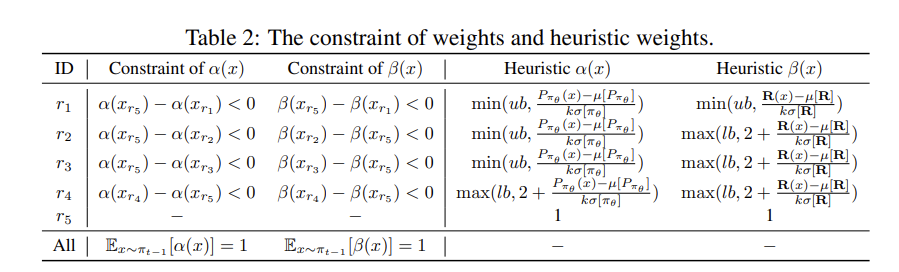

# Day 6 LLM与持续学习

[TOC]


## 1. 持续学习在LLM中使用场景

在本文中，我们参考近期的Survey [1] [2]，将LLM CL分为三个主要阶段：持续预训练（Continual Pre-Training，CPT），持续微调/指令微调（Continual Fine Tuning/Instruction T， CFT/CIT）以及持续(模型)对齐（Continual Alignment， CA）。让我们逐个了解每个阶段的意义。

### 1.1 持续预训练（Continual Pre-Training, CPT）

CPT主要面对的是“知识/语料”的长期演化。即定期用最新数据继续自监督训练，使模型保持时效性与可用性，并为后续阶段提供可迁移的通用能力；与此同时，也要避免跨阶段灾难性遗忘，例如别把指令/对齐能力洗掉。在论文 [1] 明确指出，CPT 的动机包括：补新事实、适配专门领域（比如医疗和法律）、扩展语言等，让模型“与世界同步”。两篇综述都把 CPT → DAP →（下游微调）作为“垂直连续性”的上游阶段来讲。

#### 1.1.1 作用域

- **更新事实（temporal knowledge）**：使用连续快照/动态数据流（新闻、论文、社媒）让模型吸收“发生在昨天/上周”的新知识；既要学新，也要减忘旧，并配合自动化的真实性校验流程。常见的实时更新数据来源有TemporalWiki、CKL、Firehose 等时间/新闻/社媒流的信息。
- **更新领域（domain shift）**：两路思路——（a）跨多领域的增量预训逐步积累；（b）把通用模型持续打磨成领域专家（如金融、零售等），常结合参数初始化与蒸馏以兼顾兼容性和效率。
- **扩展语言/代码（language & code）**：面向弱资源语言、方言与新兴俚语，以及多语言代码任务，强调可达性与文化语境的纳入（代码方面还有连续代码学习与无标注代码预训思路）

在论文中，作者提到在CPT的过程中发现，很少有专门针对CPT阶段的算法。而且大多数工作知识用到了类似于我们在上一阶段学习的参数隔离的adaptor的方法，只有极少数修改了模型本身（例如replay或者正则）。

除此之外，在论文[1]中，作者在CPT和CFT中间还插入了Domain-Adaptive Pre-training (DAP)：在**通用预训练之后**，用**大量未标注的领域语料**对模型做一段“持续/进一步”的预训练，以便更好地适配后续**下游任务**（而不是直接去做有监督微调）。这里最大的区别就是，在DAP阶段使用的数据都是domain-specific data，例如典型的策略有DAPT等就是将一些来自不同领域的机构公开的无标记数据直接拿来在PT模型上作第二段的训练。该综述还统计了 DAP 在不同领域（法律、医疗、金融、科学、代码、多语言、电商等）的实践，并强调很多工作在 DAP 阶段**显式或隐式**引入了 CL 技术（回放、参数正则、结构扩展）以应对“**纵向遗忘**”（丢失通用能力）。笔者在这里将他们合并到CPT，因为

- DAP 与 CPT 的训练目标与数据形态一致；
- 采用的CL方法（考虑的方面）也大致相同。

#### 1.1.2 方法

- **数据编排**：将新的语聊/知识（比如新闻、论文、社媒等**动态数据源**）按时间分块（t₁, t₂, …），每轮新块与**少量旧块回放**混合。
- Replay-based：对时间序列语料做小体量旧域回放（ER）或外部记忆（降低时效学习带来的遗忘）。
- Regularization：用 EWC 等限制关键参数漂移；或对旧模型做输出蒸馏（不持有旧数据时尤其有用）。
- 参数隔离（论文中写道最常用）：以 Adapters/LoRA 方式对新增域做参数增量，控制显存和训练时长。在一些近期的工作中，还引入了MoE的方法（MoE, Lifelong-MoE）。

### 1.2 持续微调-指令微调 (Continual Fine Tuning/Instruction Tuning, CFT/CIT)

#### 1.2.1 动机以及作用域

论文 [1] [2] 将这一部分 细分为四类：

- **任务递增（Task-incremental）**：顺序学习一串不同任务的指令。
- **领域递增（Domain-incremental）**：在不同领域的指令流上持续适配。
- **工具递增（Tool-incremental）**：持续教模型学用新工具/接口（如 API、检索、计算器）。
- **类别增量（Class-incremental）**：在**不提供任务 ID**的前提下，逐步扩大**标签空间**做判别（典型是分类/归类类任务），同时保持历史类别的性能。（在论文[1]中，作者把**CIT 完全归于 TIL**（因指令天然携带任务信息））

简单地把新任务数据不断接着微调，常会导致**灾难性遗忘**，即对旧任务的表现显著下降。论文[2] 在 Task-incremental 小节里明确指出“直接在新任务上持续微调会遗忘已学知识与能力”。在工作方法上，CFT明显要比CPT更加广泛第运用了把不同的CL方法[1].

#### 1.2.2 方法

- **通用骨架（三件套）**：**小规模回放（Replay）＋参考策略约束（KL-to-ref）＋PEFT（LoRA / O-LoRA / Adapter）**。这三样在 LLM-CL 里最通用、性价比最高，两篇综述也一致认为它们使用频率高、效果稳定。
- **Task-incremental**：侧重**稳住指令表征**，并用 **O-LoRA 等正交子空间**来隔离新旧任务的参数更新。
- **Domain-incremental**：上游先做 **DAP/CPT**（少量通用数据回放并配 KL 约束），下游再按 Task-inc 的管线进行 **CFT**。
- **Tool-incremental**：需要补上**结构化的工具头**（工具选择与参数生成），如有必要再配**轻量 RL/组内相对法**来提升调用成功率与稳定性。

### 1.3 持续(模型)对齐 (Continual (Model) Alignment)

#### 1.3.1 动机以及作用域

用户价值/偏好/安全策略随时间变化；需**持续对齐**而不过度伤害指令/通用能力。Wu 将其单列为 **CA**；Shi 在 CFT 下称 **CMA**。在这一部分大概可以分为两部分

- **Continual Value Alignment**：随政策/伦理准则演进持续更新。
- **Continual Preference Alignment**：面向群体/地域/场景的偏好动态适配。

两篇综述对持续对齐的方法有一致共识：在工程实践中，最稳妥的做法是**保留一小部分旧偏好**与**安全样本**作为回放，并在每次增量训练时混入训练集，同时对当前策略施加指向上一轮已对齐策略的 KL 约束，用这对“回放＋KL 锚点”组合抑制因新偏好带来的遗忘与漂移；在此基础上，再以轻量的策略更新方式小步推进——要么采用 PPO、GRPO、 等低成本的 RL 变体，要么使用 DPO、IPO 等无需显式奖励模型的组内相对/监督式方法——与回放和正则配合，既减少对昂贵 RM 的依赖，又保持更新过程的稳定与可控。

#### 1.3.2 可选方法

- **DPO×CL（监督式偏好增量）**
   $\min_\theta \mathbb{E}_{(x, y^+, y^-)}\!\big[-\log \sigma\big(\beta(\log\pi_\theta(y^+|x)-\log\pi_\theta(y^-|x))\big)\big] + \lambda\,\mathrm{KL}(\pi_\theta\Vert \pi_{\text{old}}) \;+\; \text{replay(old-prefs)}$。
   说明：$\pi_{\text{old}}$ 为上一对齐轮；重放安全/旧偏好对，防“新偏好挤压旧偏好”。框架与 CA/CMA 的持续对齐一致。
- **GRPO/GSPO×CL（组内相对，弱化 RM 依赖）**：同一 prompt 采 $K$ 条响应，组内按得分归一成权重，做相对更新；再加 KL-to-old + 少量旧偏好回放。优点是稳定、便宜，贴合“持续小步对齐”。

<br>

## 2. CL 最新工作

我们主要将这一板块分为两部分：CRL for LLM 和 CFT for LLM post-train, 

### 2.1 CPPO（ICLR 2024）

CPPO: CONTINUAL LEARNING FOR REINFORCEMENT LEARNING WITH HUMAN FEEDBACK [3] 是近年来在该领域引用较多的一篇文章。

#### 2.1.1 Motivation

因为强化学习的主要动力是要让模型跟上**随时间变化**的人类偏好，但每来一个新领域/新偏好就整体重训 PPO+RM，耗时、费算力且有隐私顾虑。同时 LM 的大动作空间让 PPO 在新分布上**不稳、低效**。CPPO 的目标：在**离线持续学习（CL）设定下，用样本级加权**同时兼顾“学新（policy learning）/保旧（knowledge retention）”，并提升训练稳定性。

#### 2.1.2 核心想法

为了均衡学新和守旧这样看似矛盾的任务，作者从数据和实现上均次取一定策略：

1) 样本分类： 将样本根据奖励和生成概率分为五类；
2) 加权策略：为每一类样本分配不同的策略学习权重$\alpha(x)$和知识保留权重$\beta(x)$；
3) 优化目标：设计目标以最大化策略学习和只是保留的加权和；
4) 权重学习：提出两种加权学习的方法：启发式和learnable

#### 2.1.3 算法

**1）样本分类**：首先把 rollout 样本按**生成概率 P**与**奖励 R**划为 5 类：高性能（High-performance， 高概率高奖励），过拟合（overfitting，高概率低奖励），高方差（High-variance, 低概率高奖励），噪声（Noisy, 低概率低奖励），正常；为每一类样本分配不同的策略学习权重$\alpha(x)$和知识保留权重$\beta(x)$。这里的

- $\alpha(x)$： 控制样本对策略梯度的贡献强度。α 大 → 强化学习、鼓励更新。
- $\beta(x)$：控制对旧策略/旧知识的保真强度。β 大 → 强蒸馏约束、不让策略偏离旧分布。

具体到每个样本，维护的两个数据集

| 类别                           | 概率 P       | 奖励 R       | 样本代表含义 / 典型数据                                      |
| ------------------------------ | ------------ | ------------ | ------------------------------------------------------------ |
| **High-performance（高性能）** | 高 ↑         | 高 ↑         | 模型生成概率大且奖励高，说明模型**非常自信且输出优质文本**。这类数据代表“已掌握的优良知识”或“高质量偏好样本”，在训练中应**强化和巩固学习**（大 α，小 β）。 |
| **Overfitting（过拟合）**      | 高 ↑         | 低 ↓         | 模型对低质量输出“过度自信”：样本 P 大但 R 低。代表模型学到了**错误偏好**或“模式化输出”，应**抑制策略更新、加强保持约束**（小 α，大 β）。 |
| **High-variance（高方差）**    | 低 ↓         | 高 ↑         | 生成概率低但奖励高：说明模型**有潜力但未学到此类优质样本**。代表“新颖有益但未覆盖的知识”，应**鼓励学习**（大 α，小 β）。 |
| **Noisy（噪声）**              | 低 ↓         | 低 ↓         | 概率与奖励都低，说明模型**既不自信也表现差**，多为噪声或无意义文本；应**双向削弱**更新（小 α，小 β）。 |
| **Normal（正常）**             | 处于均值附近 | 处于均值附近 | 占多数，既非极优也非极差，代表“稳定常规样本”；α、β 保持中等，提供基线稳定性。 |

这里最应该注意的是：同样是副样本，为什么noisy样本要保持双低而overfitting要保持大beta？这是因为过拟合样本**出现频率高（P 高）**，会频繁进入 batch，算法必须强力约束，让模型试图回到上一个更安全的策略附近；噪声样本是完全无意义且随机的样本，且出现的概率很低，对训练的**破坏力弱**，没必要花容量去“拉回旧策略”，如果给 **β 大**等于**把旧策略在随机/无意义区域里的概率分布蒸馏回来**，**固化这种概率很低的噪声**，占用“保持预算”，反而不利于把容量留给有价值知识。所以直接忽略更加安全（双低代表这类数据再反向时几乎没有梯度）。

**2）理论目标**：文中作者认为 RLHF 下更有效的是的方法是**只**对“**高生成概率**且**高奖励**”的样本子集做强化学习，并只对“**高奖励知识**”子集做保持约束， 所以理论目标为：
$$
\max_\theta \;\mathbb{E}_{(s,a)\in \mathcal D_1}\!\big[r_t(s,a)\big]
\;-\;\mathbb{E}_{(s,a)\in \mathcal D_2} D_{\text{KL}}\!\big(P_{\pi_\theta}(a|s)\,\|\,P_{\pi_{t-1}}(a|s)\big),
$$
其中
$$
\mathcal D_1=\{(s,a): s\!\sim\!S_t, a\!\sim\!\pi_\theta,\; P_{\pi_\theta}(a|s)>\mu[P]+\!k\sigma[P]\},
\quad \\
\mathcal D_2=\{(s,a): s\!\sim\!S_{t-1}, a\!\sim\!\pi_{t-1},\; r_t(s,a)>\mu[R]+\!k\sigma[R]\}.
$$
**D1** = 当前任务 $t$ 上、**当前策略** $\pi_\theta$ **很可能会生成**的样本子集（高生成概率）；在这些样本上**追求高奖励**最有效。**$D_2$** 是前一轮策略 $\pi_{t-1}$ 在上个任务中得到的**高奖励知识**子集；这些是“以前学到的、值得**保留**的好东西”，因此用 KL来**约束保留**这些知识。

**3）目标推广**：在理论目标的基础上，为了保持低内存（为了避免在作KL的时候要保留全词表概率），改用**真 token 的对数概率**的 L2 距离作为保持罚项：
$$
L^{\text{KR}}_i(\theta)=\big(\log P_{\pi_\theta}(x_i)\;-\;\log P_{\pi_{t-1}}(x_i)\big)^2.
$$
这样一来，结合PPO的损失函数，我们把CPPO的目标写成带 **指示权重** $I_{\mathcal D_1}(x), I_{\mathcal D_2}(x)$ 的 PPO 变体：
$$
J'(\theta)
=\mathbb{E}_i\!\left[
I_{\mathcal D_1}(x)\,L^{\text{CLIP}}_i(\theta)
\;-\;
I_{\mathcal D_2}(x)\,L^{\text{KR}}_i(\theta)
\;-\;
c\,L^{\text{VF}}_i(\theta)
\right].
$$
由于 $\mathcal D_1,\mathcal D_2$ 的样本按 Cantelli 不等式**很稀疏**，作者把指示函数推广为之前提到的**正实权重** $\alpha(x),\beta(x)$：
$$
J(\theta)
=\mathbb{E}_i\!\left[
\alpha(x)\,L^{\text{CLIP}}_i(\theta)
\;-\;
\beta(x)\,L^{\text{KR}}_i(\theta)
\;-\;
c\,L^{\text{VF}}_i(\theta)
\right].
\tag{6}
$$
**4）权重学习**：启发式heuristic或者可学习learnable方法来动态调整策略学习权重$\alpha(x)$和知识保留权重$\beta(x)$。在原文中，**启发式方法**是一种查表的方法，根据给定的约束的条件（文章给了五个分别代表五类样本的的锚点），来动态改变两个参数。图1给出了文章的约束示例，其中

- 左列是**不等式次序**，在一定程度上反映了不同样本类型间的权重约束条件，例如：$\alpha(x_{r5})-\alpha(x_{r1})<0$ 意味着 $\alpha(x_{r1})>\alpha(x_{r5})$，即**高性能样本的 $\alpha$** 必须**大于**正常样本的 $\alpha$。
- 右列给出一套**可直接算的映射**，把样本的**标准化概率/奖励**经由 **min/max + 上下界 $lb,ub$** 裁剪，生成满足上面约束的 $\alpha(x),\beta(x)$。



*Figure 1 启发式Heuristic算法的查表距离，图源 [3]，这种方法的问题是不够智能，可能不太能覆盖所有的条件。*

另一种是**可学习的方法**：不再人为设定阈值，而是把“哪些样本应当增/减 α, β”的经验规则写成不等式约束，转化为一个小的可微优化问题，学习一批次样本的最优权重。**实现步骤：**

a）定义权重函数：
$$
\alpha(x) = (ub - lb)\,\sigma(\phi_1^\top x)+lb,\quad
\beta(x)  = (ub - lb)\,\sigma(\phi_2^\top x)^2+lb,
$$
其中 σ 是 Sigmoid，(lb,ub) 是上下界（如 0.5–1.5）。

b）设计损失函数（式 (7)）：
$$
\begin{aligned}
\mathcal L_{\text{coef}}(\phi)
&=\mathbb{E}\!\left[(\alpha-1)^2+(\beta-1)^2\right]\\
&\quad+\tau\big[
(\alpha_{r5}-\alpha_{r1})+(\beta_{r5}-\beta_{r1})+... \big],
\end{aligned}
$$
$\tau$是超参，文中取0.1。其中每个差值项体现“应当增/减”的约束：

- 高性能样本 α,β 都应比普通样本大；
- 过拟合样本 α 小 β 大；
- 高方差样本 α 大 β 小；
- 噪声样本 α,β 都小。

c）每个 rollout 批次都单独优化 $\mathcal L_{\text{coef}}$，使用SGD优化器，得到一组临时权重参数 $\phi_1,\phi_2$，并将对应 α(x)、β(x) 应用到式(6) 的训练目标中。

#### 2.1.4 结果

- CPPO 在两段 DIL 上优于 PPO 重训与强 CL 基线（EWC、Policy Consolidation 等），同时**更稳**、**遗忘更少**；
- **稳定性**：在非持续设定下，相比原始 PPO，加入 CPPO 的样本加权/保持项后，**KL 与 value 误差波动更小、收敛更快**。
- **人工评测**（100 条 TL;DR）：CPPO 的 Likert 得分显著高于 PPO，**接近 ChatGPT**（p<0.05）。

<br>

### 2.2 COPR（ACL 2025）

COPR: Continual Human Preference Learning via Optimal Policy Regularization [4] 

#### 2.2.1 Motivation

依然是持续更新RLHF中偏好演化。传统 **RLHF** 三阶段流水线（SFT→训练RM→PPO）在 CL 场景下**算力昂贵、流程僵硬**；而 **DPO** 等离线方法虽省去 RL，但容易**放大偏好间隙、降低多样性，出现偏好坍塌**，且对历史任务有遗忘风险。论文提出 **COPR**，目标是在**不重走RL循环**的前提下，实现**高效、稳健**的持续偏好学习，既学新偏好又保留历史能力。

可以看出动机与CPPO基本相似，但是作用的维度其实是在偏好优化层，非直接对应RL，更像是持续偏好优化CPO。

#### 2.2.2 方法论概览

提出了COPR的框架, 总体来说:

- 用**最优策略理论**把前一阶段策略 $\pi_{t-1}$ 与当前任务的“最优策略” $\pi_t^*$ 联系起来，并把**历史最优策略**当作**学习约束**来抑制遗忘。
- 再用从 **Bradley–Terry** 推导的**适度奖励函数（MRF）**避免极端确定性与偏好坍塌。
- **整体通过**拉格朗日对偶自适应平衡“学新/保旧”。

#### 2.2.3 算法流程

**1）偏好学习目标迁移**：首先回顾一下，DPO在进行loss的推导时，启发于经典 RLHF 目标（反向 KL 约束的奖励最大化）：
$$
\max_{\pi_\theta}\ \mathbb{E}_{y\sim \pi_\theta} [\, r_\phi(x,y)\,] - \beta\,\mathrm{KL}\!\left(\pi_\theta(\cdot|x)\,\|\,\pi_{\mathrm{ref}}(\cdot|x)\right).
$$

在若干假设下，其**最优解**满足（对每个固定的 输入$x$）：
$$
\pi^*_\tau(y\mid x)
=\frac{1}{Z(x)}\,\pi_{\text{ref}}(y\mid x)\,
\exp\!\Big(\tfrac{1}{\beta} \, r(x,y)\Big),
$$
其中 $Z(x)=\sum_y \pi_{\text{ref}}(y\mid x)\exp(\tfrac{1}{\beta}r(x,y))$ 是配分函数(partition function)，我们之前也探讨过，由于该项与y无关，所以一定程度上该项可以写作：
$$
\pi_t^*(y|x)\ \propto\ \pi_{t-1}(y|x)\,\exp\!\big(\tfrac{1}{\beta}\,r^{(t)}(x,y)\big).
$$
对应的**持续学习CL的总体目标**是让当前策略逼近所有历史和当前任务的最优策略：
$$
\min_\theta \sum_{i=1}^{t}\ \mathbb{E}_{x\sim D_i}\Big[\mathrm{KL}\big(\pi_\theta(\cdot|x)\ \|\ \pi_i^*(\cdot|x)\big)\Big].
$$
**2）用“采样分布”绕开配分函数并作为学习对象**：在这基础上，我们定义在一个提示 $x$ 的有限候选集合 $Y_x$ 上的**采样分布**(文中有公式推导，基本就是消除了与y无关的项)：
$$
P_t^*(y\,|\,Y_x)\ \triangleq\ \frac{\pi_t^*(y|x)}{\sum_{y'\in Y_x}\pi_t^*(y'|x)}
\ =\ \frac{\pi_{t-1}(y|x)\exp(\tfrac{1}{\beta}r^{(t)}(x,y))}{\sum_{y'\in Y_x}\pi_{t-1}(y'|x)\exp(\tfrac{1}{\beta}r^{(t)}(x,y'))}.
$$
在**采样充分**时，拟合 $P_t^*$ 与直接拟合 $\pi_t^*$ 等价（必要充分条件命题）。COPR的做法是：

- 将奖励拆成**优势分数与期望回报（Expected Rewards）**：$r(x,y)=\mathrm{Adv}(x,y)+\delta(x)$。采样分布仅与优势有关（$\delta(x)$ 抵消），从而稳定训练：

$$
P_t^*(y|Y_x)=\frac{\pi_{t-1}(y|x)\exp\big(\tfrac{1}{\beta}\mathrm{Adv}(x,y)\big)}{\sum_{y'\in Y_x}\pi_{t-1}(y'|x)\exp\big(\tfrac{1}{\beta}\mathrm{Adv}(x,y')\big)}.
$$

**3）适度奖励函数（Moderate Rewards Function, MRF）**：接下来，作者使用MRF来避免偏好坍塌。传统的DPO推导基于 Bradley–Terry 模型配对的排序损失 $L_{\text{rank}}=-\log\sigma(r(x,y_w)-r(x,y_l))$​， 也就是直接使用奖励差
$$
\Delta r = r(x, y_w) - r(x, y_l)
$$
推导最优策略；若 $\Delta r$ 过大，则
$$
\pi^*(y_w|x)\!\to\!1,\quad \pi^*(y_l|x)\!\to\!0,
$$
模型会只输出少量高分响应，出现“偏好坍塌”（preference collapse）或“过度确定性”。文章分析得到：奖励在人类偏好排序位次上**近似线性**，且最优/最劣回报差的范围可按 **Beta$(J_x-1,2)$** 采样（文章附录A.4中有证明），继而给出**有界的线性优势（bounded advanatge function）**：
$$
\mathrm{Adv}(x,y_j)\ =\ r_x\cdot\Big(\tfrac{2}{J_x-1}\,j\ -\ \tfrac{J_x+1}{J_x-1}\Big),\quad r_x\sim \mathrm{Beta}(J_x-1,2).
$$

- 这里$r_x$是奖励强度系数。奖励差最大值约为 $2r_x$，最小值约为 $-2r_x$。
- $r_x$ 的分布自动控制了**奖励幅度随样本数自适应缩放**。
- 通过选择合适的 $\beta$ 把 $\pi_t^*$ 限制在**不过度极化**的范围，缓解 DPO 类方法“$p(y_w)\!\to\!1,\ p(y_l)\!\to\!0$​”引起的确定性过强与多样性下降。

**4）目标函数：学新（拟合）+ 保旧（约束）**

- **学新**：把当前策略 $\pi_\theta$ 的采样分布 $P_\theta(y|Y_x)=\frac{\pi_\theta(y|x)}{\sum_{y'}\pi_\theta(y'|x)}$ 拟合到最优采样分布 $P_t^*$（计算P_t的公式请见 2）采样分布），采用**等权 MSE**（避免 KL 对低概率“潜在正确答案”权重过小），并且作样本级平均上：

$$
J_t^{\text{fit}}(\theta)\ =\ \mathbb{E}_{x\sim D_t}\ \sum_{y\in Y_x}\ |Y_x|^{-1}\,\big[\log P_\theta(y|Y_x)-\log P_t^*(y|Y_x)\big]^2.
$$

- ​	外层：对 prompt $x$ 的期望；

  - 内层：在该 $x$ 的候选集合 $Y_x$ 上**等权平均**；

  - 单个 $y$ 的 $\log P_\theta$ 又是 token-level **对数概率的和**。文中的公式似乎没有显性地给出这一推论。GSPO的思路和这个有一点相似。

这里需要强调，$P_t^*$只是一个**静态目标分布**，代表「如果我在这批**新数据/新任务**上完美地学完本任务，我希望新模型的分布长成这样」。但这个分布 **不是神经网络模型本身**。它只存在于有限的候选集合 $Y_x$ 上，不具备生成能力。所以药用参数模型对他进行重新拟合，只不过我们绕开了RL采用更偏向偏好学习的方法。

- **保旧**：历史任务 $i$仅保留小型重放缓冲 $R_i$ 上的目标采样分布值，构造二次距离约束（阈值 $d_i$ 用初始参数 $\theta_0$ 在 $R_i$ 上计算）：

$$
\min_\theta\ J_t^{\text{fit}}(\theta)\quad
\text{s.t.}\ \ J_i^{\text{C}}(\theta)\le 0,\ i=1..t-1,
$$

仔细来说，那就是对每个历史任务 $i，在其小型重放缓冲 $$R_i$ 上约束**当前策略**与**该任务的最优采样分布**之间的偏差， 不超过阈值 $d_i$：
$$
J_i^{\text{C}}(\theta)
=\mathbb{E}_{x\sim R_i}\ \sum_{y\in Y_x}\ |Y_x|^{-1}\,
\big[\log P_\theta(y\mid Y_x)\;-\;\log P_i^*(y\mid Y_x)\big]^2\;-\;d_i\ \le 0.
$$
这里

- $P_i^*(y\mid Y_x)$ 是历史任务 $i$ 的**最优策略的采样分布**（训练任务 $i$ 完成时就已得到/缓存）；与$P^*_t$不同，它来自旧任务数据与情景；在持续学习阶段，我们**不再回放旧任务的原始数据**，只用当时已算好的、轻量缓存的 **$\log P_i^*$** 来做知识保持约束。
- $d_i$ 是阈值：用**初始参数** $\theta_0$ 在同一缓冲上计算出的同型误差，作为“允许的漂移上界”（当下训练不应比 $\theta_0$ 偏得更多）。

**5）拉格朗日对偶自适应平衡**

- 把约束问题变为

$$
\min_\theta\ \max_{\lambda\ge 0}\ \Big[J_t^{\text{fit}}(\theta)\ +\ \lambda\cdot J^{\text{C}}(\theta)\Big],\quad 
J^{\text{C}}=\sum_{i=1}^{t-1}\lambda_i\,J_i^{\text{C}}.
\tag{18}
$$

训练时用 $\Lambda=1+\sum_i\lambda_i$ 归一化整体损失并**交替**更新 $\theta$（梯度下降）与 $\lambda$（梯度上升，$\lambda=e^\sigma$ 保正）：
$$
L(\theta)=\Lambda^{-1}\big[J_t(\theta)+\lambda\,J^{\text{C}}(\theta)\big],\quad
\ln\lambda_i^{m+1}=\ln\lambda_i^m+\alpha\,\lambda_i^m\,J_i^{\text{C}}(\theta^m),\ 
\theta^{m+1}=\theta^m-\tfrac{\eta}{\Lambda}\nabla_\theta[J_t+\lambda J^{\text{C}}].
\tag{19,20}
$$
这样能**动态放缩**“保旧”强度，避免固定权重下顾此失彼。

#### 2.2.4 总结

COPR主要是提出了一种方法，用于在持续学习阶段避开RL的重训练，首先利用类似偏好学习DPO的方法，估计了一在新任务上的最优分布，持续使用新的参数模型去拟合这个静态分布；同时，在不回放旧数据的前提下（只使用旧数据在最优分布熵的缓存），对旧知识进行类似蒸馏的学习。

这一篇工作对于数学的要求较高，尤其是在MRF中涉及到奖励强度参数的采样方法。

<br>

### 2.3 InsCL（NAACL 2024）

InsCL: A Data-efficient Continual Learning Paradigm for Fine-tuning Large Language Models with Instructions [5] 是一篇针对CFT的论文。

#### 2.3.1 Motivation

LLMs在现实应用中需持续适应新任务（如新知识、新语料），但在持续微调（continual fine-tuning）中容易出现灾难性遗忘（catastrophic forgetting）。**Replay-based 方法**是应对遗忘最常用的方式（重放部分旧任务数据），但传统重放策略：

- 忽视了**任务间的语义差异**；
- 未能利用**指令（instruction）信息**作为高质量任务描述；
- 计算量高、采样粗糙、难以评估数据质量。

因此作者提出 InsCL (Instruction-based Continual Learning)，希望在不增加模型结构或参数的前提下，通过指令本身的语义信息，设计一种数据高效（data-efficient）、动态（dynamic）、**高质量（quality-aware）**的重放策略。

#### 2.3.2 核心理念

InsCL 是一种**基于指令语义的重放式持续学习框架**，通过两大机制来减少遗忘：

1. **动态重放（Dynamic Replay）**：依据任务间的相似度调整各旧任务的重放量；
2. **指令信息度指标（InsInfo）**：量化指令的复杂度与多样性，用于筛选高质量重放数据。

#### 2.3.3 算法

**1）动态重放机制（Dynamic Replay）**

当前任务 $D_i$ 到来时，从所有旧任务 $D_j$（$j < i$）中选取不同数量的样本 $R_j^{\alpha*}$，数量与任务相似度成反比。

**相似度度量：**

- 每一个任务都由多个指令组成,  例如

  ```yaml
  Task A:
    "Translate the sentence to French."
    "Translate the word to English."
    "Summarize the text."
  Task B:
    "Fix grammar errors."
    "Explain why the answer is wrong."
  ```

  因此, 作者定义任务将由其指令的嵌入向量（embedding）组成, 即$D_i = \{x_1, x_2, \ldots, x_{n_i}\}$(论文使用的是 **LLaMA-7B**来生成词嵌入向量,再平均池化得到每一句的句嵌入向量); 再定义指令嵌入分布记为$\mu$；

- 使用 **Wasserstein Distance (WD) $W(\mu_A, \mu_B)$** 计算任务间的分布差异: WD描述了一种来衡量分布间相似性(或者说距离)的方法. 论文里的连续写法是
  $$
  W(\mu_A,\mu_B)=\inf_{\pi\in\Pi(\mu_A,\mu_B)}\int d(x_A,x_B)\,d\pi(x_A,x_B),
  $$
  其中 $\pi$ 是耦合(A/B任务的联合)分布，$d(\cdot,\cdot)$ 是地面代价函数（例如欧式距离 $\|x_i-y_j\|_2$ 或“余弦距离” $1-\cos(x_i,y_j)$）；但是因为我们处理的问题更像是离散情况,所以文中的具体处理可以直观理解成:
  $$
  W(\mu_A,\mu_B) = \min_\pi \sum_{i,j=0}^{T} \pi(x^i_A,x^j_b) \times \text{dis}(x^i_A,x^j_B)
  $$

  也就是说：

  - 每个任务（这里指Task A/B之间）的**指令嵌入分布**分别是 $\mu_A,\mu_B$；$x_A,x_B$是两个任务中每条指令的嵌入向量；
  - $\pi(x_A,x_B)$ 表示“Task A 的某个指令嵌入 $x_A$”与“Task B 的某个指令嵌入 $x_B$”之间的语义对应关系及匹配权重；文中似乎没有显性指出如何计算这一点,只是说使用嵌入相率出现的概率近似求解.
  - dis代表两个指令嵌入的余弦距离(对应上连续中的地面代价函数).

**动态分配公式：**
$$
\alpha^*_j = \frac{W_{j,i}}{\sum_{k=1}^{i-1}W_{k,i}} \times \alpha
$$
i,j指代不同的任务集合. 也就是说给与新任务相似度更小(即距离更大)的旧任务分配**更多重放份额**。

**2）指令信息度指标（Instruction Information Metric, InsInfo）**

在 InsCL 中，作者希望判断一条指令是否值得被拿来重放。直觉上，如果一条指令又长又复杂、语义多样，那它可能帮模型保留更多知识，因此**信息量更高**。为此，论文提出了一个指标**InsInfo**，它衡量每条指令的复杂性和多样性。具体做法是：

1. 使用 **GPT-4** 为每条指令生成“意图标签（intention tags）”；这里需要注意一条指令可能包含多种语义标签,比如令：

   > “请总结下面这段文字并把结果翻译成英文。”

   GPT-4 可能会给出两个标签(因为这条指令实际上包含两个语义任务。)：

   - Summarization（摘要）
   - Translation（翻译）

2. 过滤与聚合标签（lemmatization + phrase-BERT + DBSCAN 聚类）；

3. 对一条指令，假设它最后有 $T$ 个标签，那么计算InsInfo公式是：
   $$
   \text{InsInfo} = \sum_{t=1}^{T}\log\frac{N}{f_t}
   $$

   - $T$：该指令的标签数，越多语义越丰富。
   - $f_t$：该标签在所有指令中出现的次数，出现得越少说明越稀有；
   - $N$：历史指令总数。

举个例子:

| 指令                                                  | 标签                         | 出现频率                                                    | 信息量贡献               |
| ----------------------------------------------------- | ---------------------------- | ----------------------------------------------------------- | ------------------------ |
| Summarize the following text and translate to English | {Summarization, Translation} | Summarization: 常见 → (f_1=500)Translation: 稀有 → (f_2=50) | (\log(N/500)+\log(N/50)) |
| Correct grammar errors                                | {Grammar Correction}         | 常见 → (f=800)                                              | (\log(N/800))            |

这可以理解为，对一条指令，统计其包含的 $T$ 个（已归一化的）标签 $\{t\}$，并从**历史指令池**N里取每个标签的出现频次 $f_t$。**标签越稀有、越多代表该指令信息量越大**。

**采样策略：**接下来作者会利用这个分数来决定在重放阶段“多重放哪些指令”：

- 先算出每个指令类别或标签簇的平均分 $s_{j,k}$；

- 再根据这个分数把当前任务的重放份额 $\alpha_j^*$ 分配给不同标签簇：
  $$
  \beta_{j,k} = \frac{s_{j,k}}{\sum_k s_{j,k}} \cdot \alpha_j^*
  $$

- 最后，从高分标签对应的数据里等概率抽取样本(在“指令 = $k$”对应的数据子集里**等概率采样** $\beta_{j,k}$ 条。)

总结: $\alpha_j^*$计算的是某个旧任务的重放份额, $\beta_{j,k}$代表在当前标签k在任务j上可以分到几条重放数据. 

#### 2.3.4 评估

数据集：SuperNI（765个任务，整合为16类任务）

评价指标：**Relative Gain（相对增益）**
$$
\text{Gain}_i = \frac{1}{i-1}\sum_{j=1}^{i-1}\frac{R_{i,j}}{\text{upper\_bound}_j}\times100
$$
训练顺序：随机 / 反向 / Curriculum（由易到难）, 结果

➡️ **InsCL 相比随机重放提升 3.0%，相比无重放提升 28%**。
➡️ 在不同训练顺序下表现最稳定，验证了其稳健性与通用性。

<br>

### 2.4 Multi-Stage LLM Fine-Tuning with a Continual Learning Setting NAACL 2025

作者在这篇文章中，指出持续学习两大关键痛点：

1. **知识冲突**：新旧答案相矛盾，导致模型“混淆/幻觉”。
2. **微调数据量远小于预训练规模**：模型难以稳定学习新知识而不破坏旧能力。

#### 2.4.1 核心思想

作者提出一个**面向多阶段**的三段式持续学习范式（每一阶段都跑这三步）：

1. **基于“偏好”的学习偏置（ Preference Based Learning Bias, PBL）**：先用当前模型对每个训练样本产生 K 个候选输出，按与目标答案的相似度把候选拆成“**知识兼容**（Y_align）”与“**冲突**（Y_conf）”，然后对齐前者、抑制后者。
2. **自蒸馏数据增强（Self-Distillation Augmentation）**：让模型自己扩写输入（补背景、加逻辑、释义改写），在不引入外部知识源的情况下**扩量与增难度**。
3. **动态数据筛选（Dynamic Selection）**：用启发式方法过滤掉无效/噪声增强样本，保留**对模型最有用**的增广数据进入训练集。

#### 2.4.2 算法

1）PBL：把“该学/该忘”显式写进损失

- **候选生成**：对输入 $x$ 用当前模型 $\pi_\theta(\cdot|x)$ 采样 $K$ 次得到集合 $Y=\{y'_i\}_{i=1}^K$。

- **相似度判定**：用**句向量余弦**与阈值 0.7（grid search 得到）把 $Y$ 分成 $Y_{\text{align}}$ 与 $Y_{\text{conf}}$。

- **正偏好损失（鼓励像对的那样说）**：
  $$
  \mathcal L_{\text{PP}}=-\!\!\sum_{y'\in Y_{\text{align}}}\!\!\log\!\frac{\pi_\theta(y'|x)}{\pi_{\text{ref}}(y'|x)}
  $$
  这个损失的负号意味着我们在**最大化比值** $π_θ/π_{ref}$。如果一个响应 $y′$ 属于“正确”的那类（Y<sub>align</sub>），我们希望新模型比旧模型更倾向于生成它。

- **负偏好损失（惩罚像错的那样说）**：
  $$
  \mathcal L_{\text{NP}}=\sum_{y'\in Y_{\text{conf}}}\log\!\frac{\pi_\theta(y'|x)}{\pi_{\text{ref}}(y'|x)}
  $$
  它没有负号，所以当 $π_θ(y′|x)$ 高于参考模型时，loss 会增大，训练会让模型减少生成这些冲突样本的概率。

- **总损失**：$\mathcal L=\alpha\mathcal L_{\text{PP}}+\beta\mathcal L_{\text{NP}}$。其中 $\pi_{\text{ref}}$ 为**冻结的参考模型**，$\alpha,\beta$ 控制两部分权重。直观地，这是把“学谁、忘谁”编码为**相对参考模型的对数几率**优化。

2）自蒸馏增强：三类可复制模板

不依赖外部知识源，直接用 LLM 产出增广版 $(\hat x,y)$以缓解在持续学习微调的数据有限的情况（实际上就是提示词工程），具体做法有：

- **Background Knowledge Integration（补充背景）**：给原问题加上下文/背景描述；
- **Logic-Compatible Expansion（逻辑扩展）**：就同主题**加深推理链路**、保证与原答案一致；
- **Paraphrase Augmentation（释义改写）**：重写同义问法，提高表达多样性。

3) 动态数据筛选：两步互信息打分

- 定义把 $x,\hat x$ 抽象成 $x',\hat x'$（这里原文没有太说清楚，姑且认为是用嵌入模型生成了x的嵌入向量），计算 Mutual Information （MI，共现频次统计）衡量输入相似度；MI定义如下（经典的信息论定义形式）：
  $$
  MI(x'; \hat{x}') = 
  \sum_{w, \hat{w}'} N(w, \hat{w}') 
  \log \left( 
  \frac{N(w, \hat{w}')}{N(w) N(\hat{w}')} 
  \right)
  $$
  其中：

  - $N(w, \hat{w}')$：表示词x' and \hat x'中的词 $w$ 与 $\hat{w}'$**共同出现的次数**；
  - $N(w)$、$N(\hat{w}')$：分别是词 $w$、$\hat{w}'$**各自出现的频次**。

- 同理用 $\hat x$ 作为提示生成 $\hat y$，再计算 $\text{MI}(y,\hat y)$ 衡量**输出一致性/有效性**。若 $MI(x';\hat{x}')$ 越大，说明增强后的句子在语义上与原句越一致，因此被认为是**高质量的增强样本**。

- 用阈值 $\theta$ 选取 $\text{MI}(x',\hat x')\times \text{MI}(y,\hat y)>\theta$ 的增强样本进入最终训练。

#### 2.4.3 评测设置与指标

- **两类场景**：
  - **Setting I（域内演化）**：同一数据域，答案在后续阶段被**手工修改**成与先前相冲突的版本，模拟现实“知识变更”。
  - **Setting II（跨域递增）**：逐域加入（如科技→医疗→金融…），并保证任意两域间**≥1000** 共享样本，用**人为制造的跨域冲突**测试写新不忘旧。
- **指标**：
  - **ACC**：注入后总体准确率。
  - **KGR**：只看“之前错、现在对”的**知识增益比**。
  - **KRR**：只看“之前对、现在仍对”的**知识保持率**。定义详见附录。

//Rethinking the Stability-Plasticity Trade-off in Continual Learning from an Architectural Perspective

//Knowledge Retention for Continual Model-Based Reinforcement Learning


## References

[1] Shi, H., Xu, Z., Wang, H., Qin, W., Wang, W., Wang, Y., ... & Wang, H. (2024). Continual learning of large language models: A comprehensive survey. *ACM Computing Surveys*.

[2] Wu, T., Luo, L., Li, Y., Pan, S., Vu, T., & Haffari, G. (2024). Continual Learning for Large Language Models: A Survey. *ArXiv, abs/2402.01364*.

[3] Zhang, H., Yu, L., Gui, L., Yang, M., He, Y., Wang, H., & Xu, R. (2024). *CPPO: Continual Learning for Reinforcement Learning with Human Feedback*. Paper presented at International Conference on Learning Representations 2024. https://openreview.net/forum?id=86zAUE80pP

[4] Han Zhang, Lin Gui, Yu Lei, Yuanzhao Zhai, Yehong Zhang, Zhuo Zhang, Yulan He, Hui Wang, Yue Yu, Kam-Fai Wong, Bin Liang, and Ruifeng Xu. 2025. [COPR: Continual Human Preference Learning via Optimal Policy Regularization](https://aclanthology.org/2025.findings-acl.281/). In *Findings of the Association for Computational Linguistics: ACL 2025*, pages 5377–5398, Vienna, Austria. Association for Computational Linguistics.

[5] Yifan Wang, Yafei Liu, Chufan Shi, Haoling Li, Chen Chen, Haonan Lu, and Yujiu Yang. 2024. [InsCL: A Data-efficient Continual Learning Paradigm for Fine-tuning Large Language Models with Instructions](https://aclanthology.org/2024.naacl-long.37/). In *Proceedings of the 2024 Conference of the North American Chapter of the Association for Computational Linguistics: Human Language Technologies (Volume 1: Long Papers)*, pages 663–677, Mexico City, Mexico. Association for Computational Linguistics.

## Appendix

### COPR中的MRF推导

#### 1.什么是Beta分布

- Beta 分布是一种**定义在区间 [0,1] 上的连续概率分布**。如果 $X \sim \mathrm{Beta}(\alpha, \beta)$，它的概率密度函数是
  $$
  f(x;\alpha,\beta) = \frac{x^{\alpha-1}(1-x)^{\beta-1}}{B(\alpha,\beta)}, \quad 0<x<1,
  $$
  其中 $B(\alpha,\beta)$ 是归一化常数。

- 当 $\alpha$、$\beta$ 取不同值时，分布的形状会变化：

  - $\alpha>1,\beta>1$：分布在中间鼓起（中等值多）。
  - $\alpha<1,\beta>1$：分布偏向 0（小值多）。
  - $\alpha>1,\beta<1$：分布偏向 1（大值多）。

​	所以 Beta 分布常用来**建模“比例”或“范围值”**，因为它天然在 [0,1] 之间波动。

#### 2. 为什么 COPR 用 Beta 分布控制奖励幅度

在 COPR 中，作者希望奖励差的范围「不要太大」，否则会像 DPO 那样 $p(y_w)\to1, p(y_l)\to0$。作者推导出：对一组长度为 $J_x$ 的样本，其「最大奖励 − 最小奖励」的范围服从近似的 Beta 分布：
$$
r_x \sim \mathrm{Beta}(J_x-1, 2).
$$
这意味着：

- $r_x$ ∈ [0,1]；
- 期望值约为 $E[r_x] = \frac{J_x-1}{J_x+1}$，随样本数增大而趋近 1；
- 所以 $r_x$ 控制了当前 prompt 的**奖励尺度**：候选多时允许略大，候选少时自动缩小。

#### 3. 奖励函数的线性表达式

在文章中，作者定义每个候选样本的优势为：
$$
\mathrm{Adv}(x,y_j)
= r_x \cdot \Big(\frac{2}{J_x-1}j - \frac{J_x+1}{J_x-1}\Big),
\quad j=1,2,\dots,J_x.
$$
我们来看看这个式子的范围：

1. 当 $j=1$（最差样本）：
   $$
   \mathrm{Adv}_{\min} = r_x \Big(\frac{2}{J_x-1}\cdot1 - \frac{J_x+1}{J_x-1}\Big)
   = r_x \Big(\frac{2 - (J_x+1)}{J_x-1}\Big)
   = -r_x.
   $$

2. 当 $j=J_x$（最好样本）：
   $$
   \mathrm{Adv}_{\max} = r_x \Big(\frac{2J_x}{J_x-1} - \frac{J_x+1}{J_x-1}\Big)
   = r_x.
   $$

所以 **Adv 值的范围大约是 $[-r_x, r_x]$**。

这就说明：

- $r_x$ 决定了整个奖励的上下界；
- 不同的 prompt 会从 Beta 分布采样不同的 $r_x$，从而**动态调节奖励强度**；
- 任何一个样本的 reward 都被“夹”在一个有限区间里，不可能爆炸到 ±∞。