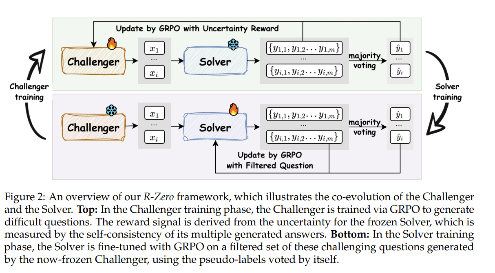

# 3 | LLM推理中的奖励设计与过程监督

[TOC]

在大模型推理（如数学推导、常识推理、多跳问答）中，如何设计有效的**奖励信号**对模型的行为加以引导，是强化学习方法成功的关键。本节分为两部分，第一部分系统讲解**LLM推理中的奖励设计**主要类别及代表性工作，第二部分聚焦“**过程监督**”及Verifier/PRM生态的演进，帮助读者深入理解如何通过过程级反馈来提升模型推理的稳定性和可靠性。

<br>

## 第一部分：LLM推理中的奖励设计类别

近年来针对大型语言模型（LLM）推理的强化学习研究中，出现了多种奖励设计方案[1]。根据奖励信号来源与作用环节，可将其大致分为以下几类：

### 1. 结果导向奖励（Outcome-based Reward, sparse reward）

**定义：** 结果导向奖励只根据推理的最终输出结果给予反馈信号，而不关心中间推理过程的细节。例如，在数学题求解中，仅当最终答案正确时给予正奖励，否则不给奖励（或给负奖励）。这类奖励通常是**稀疏**且**终局式**的：整个推理链只有在终点得到一个总体评价[2] 。

**代表工作：** 很多当前的LLM-RL方法多采用结果监督训练模型（GRPO，DAPO等），尤其在分配优势函数上。一些早期的工作也采用或者比较了该方法的问题，例如，

- DeepMind-SORMs（2022）比较了只基于最终答案正确性的**Outcome监督**与逐步反馈的**Process监督**效果，发现单纯Outcome奖励虽然标注成本低，但对模型纠正中间错误的帮助有限。
- OpenAI在“Let’s Verify Step by Step”（2023）中也作为对照训练了Outcome型奖励模型，结果该模型只解决了约50%的MATH基准题，而结合过程监督的模型可解78%，明显胜出。

为提升纯Outcome奖励的效率，后续研究提出了一些改进策略。例如，

- InternLM团队提出的**OREAL框架***（2025）

  - **正向采样学习**：通过best-of-N（BoN）采样获取高质量解答进行行为克隆；BoN采样通过对正支持度的穷举搜索，在固定KL约束下实现最优胜率；

  - **负向采样学习**：BoN 选“最好”的一条，会系统性低估负样本的梯度贡献（例如 Best-of-4 时，负样本被选中的概率远小于原策略下的真实发生概率，因为二元奖励里，只要采样池里**有任意一条正样（答案对）**，BoN 一定选正样），导致用原始 0/1 奖励做策略梯度会不一致；基于此，OREAL对失败样本设计了额外的奖励重整，先对每题跑多条样本以估通过率，再按通过率对负样本打“放大过的负奖励”。这样缓解了稀疏二元奖励带来的训练困难。

  - OREAL还训练了一个基于Outcome信号的**逐字奖励模型**，将最终二元反馈分解为对推理链中各Token的重要性估计，从而实现更细粒度的梯度信号。具体来说，它是学一个 **token-level reward function w(sₜ)**，使得 **(1/T)∑ₜ w(sₜ) ≈ r(s)**（该序列的真实奖励）； 训练的loss函数是，对verifier得到的二元奖励r(s)和对基于w(s_t) (s = sum(s_t))的对序列s的正确性预测的交叉熵：
    $$
    \mathcal{L}_{CE}=-\mathbb{E}_{(s,r)}[r\log p(s)+(1-r)\log(1-p(s))]
    $$

  - 这让我们能**给关键 token 更大权重**，把梯度聚焦到“真正决定成败的那几步”。

**典型公式：** 在结果导向设置下，可将最终正确视为目标事件。例如，对于问题$Q$和模型输出$Y$，定义奖励$R=\mathbf{1}{Y \text{正确}}$（正确为1，错误为0）。策略优化往往采用强化学习中的REINFORCE或PPO，目标是最大化$\mathbb{E}[R]$。由于$R$稀疏，实践中常结合**奖励塑形**（reward shaping）技巧，如将通过函数$F(Y)$转换的得分作为奖励，或者使用类似胜率提升的探索方法。例如，一种称为“Outcome-Based Exploration (OBE)”的方法通过在训练中动态调整探索/利用平衡，鼓励模型尝试更多可能得到正确答案的路径。

**优缺点：** 

- Outcome奖励的**优点**是标签获取容易（只需判断最终回答对错），且与任务目标直接相关。它在结果客观明确的任务（如编程过测试、数学计算）中非常自然.
- 但**缺点**也很突出：由于只有终局反馈，模型难以定位是哪一步出错，导致**信用分配**不明确，训练信号极度稀疏，这往往导致学习效率低下、收敛缓慢。尤其在长链推理中，一个错误步骤就可能令最终答案错误，而Outcome奖励直到序列结束才给信号，模型很难根据如此稀疏的信号学会避免中途错误。

<br>

### 2. 步骤级奖励（Step-based Reward， 属于Process Reward/dense rewards）

**定义：** 步骤级奖励会对推理链中的每个中间步骤进行评估，为每一步提供细粒度的反馈信号。也就是说，模型在推理过程中的每一步操作（例如中间算式、推理语句）都会得到一个奖励值，指示该步是否正确、有用或符合逻辑。理想情况下，每个正确的中间推理步骤都获得正奖励，错误步骤获得负奖励，从而引导模型**逐步**走向正确解答。

**代表工作：** 例如

- OpenAI的“Let’s Verify Step by Step” (Lightman et al., 2023) 是步骤级奖励的里程碑工作之一。研究者构建了包含80万个人类标注步级反馈的数据集**PRM800K**，用于训练一个“过程奖励模型”（Process Reward Model, PRM）去评估数学题解答过程中的每个步骤是否正确。他们发现，与只看最终答案的奖励模型相比，PRM能显著提高模型推理的可靠性：结合PRM的策略在MATH测试集上解题成功率远超仅Outcome监督的策略。
- 另一项工作来自deepmind-**Solving Math Word Problems with Process- and Outcome-based Feedback**则更早比较了过程反馈与结果反馈，指出过程监督可以定位并纠正推理链中的局部错误，训练稳定性更好，而结果监督往往无法发现模型思路中的细小谬误。
- DeepMind在2024年的**Math-Shepherd**项目中，探索了无需人工标注、自动生成步骤反馈的方法。Math-Shepherd利用模型自我校验，判定自己的某步推理是否可靠，实现了**无人工参与**的步骤级强化训练。总体而言，步骤级奖励通过更**密集的反馈**克服了稀疏奖励难题，被证明可以提升模型在数学、代码等多步骤推理任务上的表现。

**实现细节：** 步骤级奖励通常需要一个**裁判模型**或规则来判定每步正误。

- 如果有标准解题步骤，则可直接比对模型步骤与标准解答是否一致；
- 但更多情况下需要训练一个PRM（例如分类模型）判断“给定问题和当前部分解答，这一步是否合法/正确”。

常用的训练目标是最大化每个正确步骤被判为“正确”的概率，同时最小化错误步骤被误判的概率，可通过对每步进行二元交叉熵损失来训练PRM。更先进的方法引入了**排序损失**来强调正确步骤的评分应高于错误步骤一定幅度。例如

- PQM[5]模型将每步赋予一个$Q$值（表示从当前步继续推理最终正确的概率估计），并用**排序约束损失**确保真正正确的步骤Q值恒大于错误步骤。这种比较损失比逐步独立判断更有效地利用了序列信息，强化了PRM对整链的把控。

**应用场景：** 步骤级奖励已广泛应用于数学推理、代码合成等需长链思考的场景。例如数学推理上，可以使用

- 关键子目标命中；等式化简 / 等价检查等方法（使用计算机代数系统做裁判（CAS：SymPy/Mathematica））

多跳问答中，每跳检索或推理都可被Verifier检查以获取奖励。再比如在代码生成时，

- 每行代码通过编译或单元测试验证即可即时得到反馈信号作为奖励。因此步骤级奖励也常与**工具使用**结合，如调用计算器验证中间计算结果、运行代码检查部分输出等，实现**即时纠错**式的训练。
- 静态与规范检查（lint/类型/安全）。

**优缺点：** 

- 步骤级奖励的**主要优点**是反馈密度高，大幅改善了信用分配问题，使训练更加稳定高效。模型能够“知错就改”，逐步优化自己的思维链。此外细粒度监督也提升了模型推理的**可解释性**，因为我们可以检查每步评分了解模型哪里出错。
- 它的**缺点**在于对数据和模型提出更高要求：
  - 需要大量逐步标注（获取成本高）或可靠的自动Verifier；
  - 另外PRM模型本身可能存在**泛化**问题，在新题型或开放领域下未必知道如何判定步骤对错。

因此最近也出现了折中方案：结合Outcome信号**合成**步骤奖励（下文“自我提升奖励”部分讨论），或利用强大的预训练模型作为通用裁判（下文“Verifier型奖励”部分讨论）。

<br>

### 3. 偏好导向奖励（Preference-based Reward，Both）

**定义：** 偏好导向奖励（PBR）是利用人类或AI对输出结果的**主观偏好**来塑造模型行为的一种范式。在这种设置下，奖励不直接来源于任务是否客观正确，而是来源于对多个可能输出的相对偏好比较。典型做法是让人工（或辅助模型）对模型输出的质量、合理性、风格等打分或排序，然后训练一个**奖励模型**去拟合这些偏好。训练好的奖励模型就可以对新输出打分作为强化学习的奖励信号。

**代表工作：** OpenAI的**RLHF（基于人类反馈的强化学习）**是**偏好结果导向奖励**（Outcome-level Preference）的典型代表。例如在InstructGPT中，研究者让人类标注者比较模型不同回答的优劣，构建偏好数据，然后训练一个奖励模型$r_\theta(x,y)$，使其对人类偏好的回答打出更高的分数。具体训练使用Bradley-Terry模型的对数概率损失，即最大化$\sigma(r_\theta(y_c)-r_\theta(y_r))$，其中$y_c$和$y_r$分别是被偏好和被淘汰的回答 \theta^,theta(y_c)。损失函数可写为：
$$
\mathcal{L}_{\text{RM}}(\theta) = -\log \sigma\!\Big(r_\theta(y_c|x) - r_\theta(y_r|x)\Big),
$$
通过最小化该损失来调整$\theta$。训练一段时间后，$r_\theta$就能近似模拟人类的偏好判断。这样的奖励模型结合PPO算法对预训练LLM进行微调，成功对齐了GPT-3模型的回答与人类偏好（如更礼貌、有用、无毒）。

在推理任务中，偏好模型也发挥了作用，尤其是偏好过程（Process-level Preference）。例如

- **Constitutional AI**让模型根据一系列原则自己评判输出，从而替代人工偏好；
- 又如近期有工作引入**步骤级偏好**，让人工对比两条推理链中哪个更合逻辑，然后训练**偏好版PRM**对步骤质量打分。上述ICLR 2026提交的研究利用MCTS生成多种解题链，由偏好比较构建高质量步骤数据，训练了**PPRM（偏好过程奖励模型）**，并在强化学习中取得比传统PRM更稳健的效果。他们采用了Bradley-Terry偏好损失来训练PPRM，使其更好地适应带偏好噪声的数据，并结合改进的GRPO算法稳定地优化策略模型.

**典型应用：** 偏好导向奖励特别适用于**缺乏客观评价标准**的开放性任务。例如**创意写作**、**对话助理**等场景，没有唯一正确答案，但可以通过人类偏好引导模型输出更符合人意。在推理任务中，偏好信号可用来鼓励模型输出**思维过程清晰**、**解释完善**的解答，而不只是给出一个裸答案。例如可以让人类对比“仅给答案”和“给出步骤+答案”两种回答，更偏好后者，则模型会受到奖励驱动去呈现完整推理过程。偏好奖励还能**配合规则**：如结合**AI审阅者**，利用大模型判定哪个推理更合理，将其偏好作为近似奖励（即所谓RLAIF，基于AI偏好的RL）。

**优缺点：** 

- 偏好导向奖励的**优势**在于灵活性强，能将人类价值观、审美标准等引入模型训练，实现对**安全性**和**交互质量**的对齐。这对开放领域对话、道德推理等尤为重要。
- 然而其**劣势**是
  - 偏好往往带有**主观性和不稳定性**。不同标注者偏好可能不一致，甚至同一人标准前后不一，这给奖励信号引入噪声，可能导致模型学到与任务无关的偏差。
  - 另外偏好奖励模型本身可能过于迎合训练数据中的偏好，出现**奖励模型不可靠**的问题。因此在实践中常结合其它信号（如约束、规则）并严格监控，以平衡模型行为。例如OpenAI在RLHF基础上加入了**原则约束**（Constitution）以减少极端迎合。

总之，偏好型奖励适合融合人类经验指导模型，但需注意其正确性和稳定性，尤其在要求客观正确的推理任务中，要避免让模型一味追求人类偏好而牺牲逻辑严谨。

<br>

### 4. 验证器型奖励（Verifier-based Reward， Both）

**定义：** 验证器型奖励利用一个外部的**验证机制**来评估模型输出或中间步骤的正确性，从而产生奖励信号。这里的验证器可以是独立训练的模型（如判别器、奖励模型），也可以是程序化的判定（如单元测试、数学公式检验）。关键在于，引入了一个**与生成模型相分离**的裁判，对LLM的解答进行判分打分。验证器型奖励常用于那些有明确**可验证准则**的任务，如数学、代码、事实问答等。

**代表工作：** 这类方法的一个典型例子是OpenAI在代码生成中的实践：

- 模型产生代码后，通过运行代码看是否通过测试用例来给予奖励信号。如果通过测试则奖励1，否则0——测试运行环境就充当了验证器。

- 在LLM推理领域，类似地有工作使用**符号数学引擎**验证计算步骤，或用知识库检索验证事实。例如2025年的研究**Rubrics as Rewards**[7]提出为LLM设计一套自动评分规则（rubric），比如推理链是否包含某些关键步骤、最终答案单位是否正确等，令模型按此评分优化。其核心思路：

  - 痛点：RLVR 在数学/代码等“可验证”领域很强，但在真实场景（医学、科学问答等）里，评价依赖多维、主客观混合的标准，难以直接给出“对/错”的奖励。RaR，一种on-policy reinforcement learning， 提出用**实例级 Rubric（清单式评分标准）直接当奖励**，把 RL 扩展到“不可验证”领域。

  - **Rubric 作为奖励函数**：每个样本的 Rubric 由若干条可解释的准则组成，每条有权重 $w_j$ 与可判定函数 $c_j(x,\hat y)\in\{0,1\}$；**显式聚合**的标量奖励为
    $$
    r(x,\hat y)=\frac{\sum_{j=1}^{k} w_j\,c_j(x,\hat y)}{\sum_{j=1}^{k} w_j}\,,
    $$
    也支持**隐式聚合**：把整套 Rubric 交给judge LLM 直接打一个标量分
    $$
    r_{\text{implicit}}=f_\phi(x,\hat y,\{d_j\}).
    $$

  - **Rubric 的生成与原则**：Rubric 需满足 4 个设计要点：

    - **专家锚定（Grounded in Expert Guidance）**: rubrics应该根植于和映射参考答案/专家信号。理想情况下，应该全面由人类专家得到。
    - **覆盖全面（Comprehensive Coverage）**：需要包含诸如事实/逻辑/完整性/风格/安全 +  Negative criteria（pitfalls）
    - **重要性权重（Criterion Importance）**：rubrics需要对不同的评判标准分配权重，保证重要的评判项（比如factual correctness）的优先级更高。（相对正确性来说，回答风格的优先级更低。）
    - **自洽可独立判定（Self-Contained Evaluation）**：每条能单独打分，不需要其他rubric的上下文环境。

  - 实际用强 LLM（如 o3-mini、GPT-4o）在**参考答案引导**下，为每个样本生成 7–20 条标准并带类别权重（Essential/Important/Optional/Pitfall）。

- 此外，**LLM-As-Judge** 也是近期热门方向：即使用一个强大的语言模型（如GPT-4)来充当验证者，评判另一模型的回答。Zheng等人（2024）在ProcessBench基准上比较了开源PRM和GPT-4等大模型裁判，发现强大的Prompt式裁判在数学步骤错误识别上**明显优于**现有专门训练的PRM。这揭示了当前PRM的局限：很多PRM是基于最终答案概率来推断步骤正误，若模型通过错误推理巧合得出正确答案，PRM会被误导。相反，GPT-4这类通识模型可以综合语义和常识对过程进行更全面的评估。因此，也有工作尝试**联合训练生成器和验证器**：一方面优化生成模型提高解题率，另一方面优化验证模型提高判错率，两者相互协作增强推理效果。

  注：最近有不少论文也专门指出 LLM-as-Judge 的局限：

  - Systematic biases：**位置偏置**（先/后出现更吃亏）、**长度/絮叨偏置**（越长越像“高质量”）、**自我增强偏置**（更偏好与自己风格/家族相似的回答）等；[8]
  - IUI‘25：相关≠可靠；单靠法官可能评不准、也带不来提升：LLM 法官与人类评分**相关但不稳定**，对不同任务/配对/提示很敏感；应保留人类参与，不能完全替代;[9]
  - ICLR‘25： 用 GPT-4 等做法官去“重排/打分”，**不如把训练数据翻倍来得稳**。[10]

**实现方式：** Verifier型奖励的实现依赖具体验证器形式。

- 如果是**程序验证**，往往写明判定规则：如执行代码、比对输出，或将数学表达式与参考解比对等。这类奖励高度可靠，只要规则完备即可精确判断。但规则制定需要任务专家知识，推广性有限。
- 如果是**模型验证**，则需要训练或调用一个判别模型$V$。典型做法是训练$V(x,y)$输出一个分数，代表回答$y$对问题$x$的正确性概率。$V$可以用监督学习（有标签的正确/错误数据）训练，也可用前述偏好法训练（让判别模型学人类评分）。
- 还有一种**生成式验证**方法：令验证模型以生成方式工作，生成“正确”或“错误”等标签（相当于让验证器自己也是LLM），通过与预期答案对比判断正误。这种方法等价于将验证看作序列任务，从而可以利用预训练模型强大的顺序建模能力来评估奖励。

无论何种验证器，一旦它定量输出评价（如正确概率0~1或评分0~100），即可作为强化学习的奖励源。训练时策略模型会尝试最大化验证器给出的得分。

**优缺点：** 

- 验证器型奖励的**优势**是当验证标准可靠时，奖励非常准确且可扩展。例如代码测试、人算校验几乎不会误判，还能自动大规模应用。这种方法将“判断正确”这一任务外包给了专门机制，释放了生成模型的负担，从而往往得到更稳定的训练信号。
- **缺点**在于：若验证器本身不可靠，会影响训练效果。例如用另一个模型当裁判，可能引入偏见或错误判断，甚至出现模型学会“投机取巧”迎合验证器（Reward Gaming）。同时，训练一个高质量验证器本身也需要数据和成本。近期研究显示，单一验证器可能有盲区，因此出现了**多裁判融合**的思路：比如结合符号验证+统计模型验证，或多个风格不同的验证模型投票，以提高评估稳健性。

**应用场景：** 凡是存在**客观可检查**标准的推理任务，Verifier奖励都非常适用。例如数学证明中可借助定理验证器检查推导合法性，逻辑推理题可借助逻辑约简器验证结论，问答可利用检索验证答案出处等。在知识型问答里，也有工作用搜索引擎验证模型回答的事实准确性，将检索结果与回答比对作为奖励信号，鼓励模型产出可验证的答案。

<br>

### 5. 自我提升奖励（Self-improvement Reward）

**定义：** 自我提升奖励指的是模型无需外部监督，由自身产生反馈信号来改进推理的方法。换言之，模型通过**自我评估、自我博弈、自我一致性**等机制，生成内部奖励来优化策略。这类方法尝试摆脱对大规模人工标注或外部环境的依赖，利用模型的内在知识和不确定性来实现强化学习。

**代表思想：** 

- **自洽性（Self-Consistency）**[11] 是LLM自我提升的典型思路之一。首创这方法的工作发现，令模型对同一问题生成多条独立的思维链，往往多数情况下错误链的最终答案各不相同，而**正确答案更可能成为众数**。据此，可将“输出是否与多数解一致”作为一个信号：若某次输出的答案与多数答案相同，则置信度高、可给予正向奖励，反之则视为可疑。这实际上让模型“和自己的多个分身比赛”，以投票结果作为反馈。
- 类似地，**自我对弈（Self-Play）**也是常用策略：模型充当提问者和回答者互相博弈，提出的问题只有正确回答才能得高分，否则扣分，如此在无外部数据时依然能生成大量训练实例。腾讯在2025年的翻译领域研究**SSR-Zero**[12]就是让一个模型自问自答，将回答和参考答案比对产生得分，进而不断提升翻译质量。
- 自我提升还包括**自我质疑（Self-Reflection）**机制：模型生成答案后，再**生成一个对该答案的详细评审或解析**，若发现矛盾之处则判定原答案有误，可**作为负奖励促使模型修改**。这类似于让模型先扮演学生再扮演老师，自己给自己打分纠错。一些研究让模型在回答前先生成“I think ... because ...”的链，再由同一模型检查这链条是否合理，如果不合理就返回重构，如此循环直至链条自恰，再输出答案。

**无监督奖励信号：** 自我提升类方法的精髓在于发掘任务本身蕴含的**隐式反馈**。例如

- 模型对某数学题答案非常不自信（概率很低）就说明可能错误，可将**置信度**本身当作奖励优化目标，让模型倾向于产生更高自信度且正确率高的回答。
- 又或者，答案如果违背已知常识，可以用一个事先存储的常识库检验，发现矛盾就给负奖励等等。
- 还有研究让模型不断调整自身**熵值**（不确定性），鼓励其在该谨慎时谨慎、该果断时果断——比如对于很确定的步骤快进，对于拿不准的多探索几种方案再决定。

2025年的工作**No Free Lunch[13]**探讨了多种模型内部信号（如生成长度、格式、置信度）的利用，证明在没有外部监督时，这些**内源信号**亦可引导一定程度的学习。总之，自我提升类奖励广泛利用模型“自带的”信息或动态行为来形成反馈闭环。

**实例：** 

- **SSR-Zero**（2025，腾讯混元）[12] 为了提升翻译质量，使同一个预训练模型同时充当 **Actor 与 Judge**。对每个源句，先生成一组候选译文，再用“评审提示”让模型**自打分（0–100）**，分数即作为强化学习奖励信号；无需人工参考译文或额外奖励模型，属于**参考无关、全在线、完全自监督的 RL**。

  - **小数据起效**：仅用 **13K 单语样本（英/中各 6.5K）** 在 Qwen2.5-7B 上使用GRPO训练，得到 **SSR-Zero-7B**；在 WMT23/24 与 FLORES-200 的中英互译上，超过 TowerInstruct-13B、GemmaX-28-9B，甚至优于通用的大模型 Qwen2.5-32B-Instruct。

  - 奖励设计：

    - **Self-Reward $r_{\text{self}}$**：用“Judge Prompt”让**训练中的同一个模型**读取源句与某个候选译文，输出 **0–100** 质量分；从 `<answer>` 标签中用正则抽取分值：$r_{\text{self}} = M_{\text{self}}(\text{src}, \text{trans})$。
    - **Format-Reward $r_{\text{format}}$**：检查是否遵循 Actor Prompt 要求的输出格式（如 `<answer>` 包裹答案），对齐 R1-like 训练范式：$r_{\text{format}}=1$（合格）或 $0$（不合格）。
    - **总体奖励**：

    $$
    r_{\text{all}}=\begin{cases}
    1+r_{\text{self}}, & r_{\text{format}}\neq 0\\
    0, & r_{\text{format}}=0
    \end{cases}
    $$

- **R‑Zero**（2025， Tencent AI lab Seattle）[14] 是一套完全零数据自我质疑的自进化方案：用同一个基础 LLM**复制**出两名角色——**Challenger** 负责**自动出题**、**Solver** 负责**解题**；两者通过 **GRPO** 分别优化、**交替冻结**并共同进化。出题端用“**不确定性奖励**”逼近 Solver 能力边界（最难而又可解），再做聚类去重与格式校验；解题端则对这些题用**多数投票伪标签 + RLVR**做强化学习。整个流程**零人工数据、零外部标签**，却能显著提升数学与通用推理

  - **阶段A（训练出题者 Qθ）：** 让 Qθ 产题 → 用**冻结**的 Solver Sϕ 多次作答 → 定义众数（majority voting）的结果为标签，计算所有答案的平均**正确率**或者说“**不确定性**”，以 Sϕ 的**自洽度/不确定性**给 Qθ 奖励并用 GRPO 更新。具体来说，对生成题目 $x$，让当前 Sϕ 采样 $m$ 个答案 $\{y_j\}$，以众数为伪标签 $\tilde y(x)$，经验“正确率”
    $$
    \hat p(x;S_\phi)=\frac{1}{m}\sum_{j=1}^m \mathbf{1}\{y_j=\tilde y(x)\}.
    $$
    定义奖励（最大在 50% 处）：
    $$
    r_{\text{uncertainty}}(x)=1-2\Big|\hat p(x;S_\phi)-\tfrac12\Big|.
    $$
    学习者能力边界为该正确率为50%的位置，文章中强调这个位置也是**最有效的课程**出现的位置；

  - **阶段B（训练解题者 Sϕ）：** 冻结 Qθ → 取其生成的“**边界难度**”题目（Filtered set, 剔除过易/过难/不稳定题），按多数投票得到伪标签 → Sϕ 生成一组答案，对**完全匹配**者给 **1**，否则 **0**：
    $$
    r_j=\mathbf{1}\{x_j=\tilde y_i\};
    $$

  - 按照这个流程循环往复，协同演化。详见 Fig. 1。

  

  *Fig.1 R-Zero， 图片来自原论文 [14]*

- 再如**Confidence is All You Need**证明只用模型对答案的置信度（无需任何标注）作为奖励信号进行少样本RL微调，也能显著提升推理正确率。

- **Absolute Zero**则把模型完全置于自对弈环境，通过自问自答来练习复杂推理，在无人工数据下达到了有监督微调接近的效果。

**优缺点：** 自我提升奖励的**长处**在于**不需要人工标注或外部环境**，因此成本低且通用性强。它激发了模型的主动性，让模型利用自己的判断来改进自己，具有一定的创新性。在开放领域或无法大量标注的任务上，这是极具吸引力的方案。另一方面，它的**短板**也很明显：模型的自我反馈信号质量有限，容易出现**自我强化幻觉**。例如模型可能重复某种偏误而没有外力纠正；自我评判的可靠性也取决于模型已有能力，如果初始模型太弱，它的自我反馈往往也是错的，可能把自己带偏。因此实践中常将自我反馈与少量真实反馈结合，或随着模型变强逐步减少人工介入，形成**课程学习**式的路径。此外，自我提升类方法有时收敛慢，甚至可能出现模型自洽但与真实世界不符的怪异行为（因为奖励不是直接衡量客观正确）。因此，将自我提升作为辅助，多信号融合，通常效果更佳。

<br>

## 第二部分：过程监督与Verifier/PRM生态演进

大型模型在复杂推理任务上稳定性不足的问题，引出了**过程监督（Process Supervision）\**范式：即关注模型\**推理过程**的对错，而非仅关注最终结果。过程监督依赖能够评估中间步骤的**过程奖励模型（Process Reward Model, PRM）**或验证器来提供反馈。下面我们围绕近年来过程监督及PRM生态的进展，介绍关键工作和组合策略。

### 1. PRM800K数据集的提出与意义

OpenAI在2023年发布的**PRM800K**数据集是过程监督领域的重要里程碑 [2]。PRM800K（Process Reward Model 800K）包含了约80万个人类标注的数学题**逐步解题过程**及每个步骤的正误判断标签。这些数据主要源自MATH数学竞赛题：人工为每道题撰写了详细的解题链，并在每步注明该步是否正确、合乎逻辑。这为训练PRM提供了大规模高质量的监督信号。

**动机：** 在此之前，缺乏大规模的过程监督数据是训练PRM的瓶颈之一。OpenAI团队认识到，仅用Outcome监督，模型在数学等复杂推理中仍频繁犯逻辑错误。而人类擅长逐步检查推理链，因此构建一个大规模逐步反馈数据集有望让模型也学会“像人类一样”审阅推理过程。PRM800K的发布正是为了解决“需要高质量过程级奖励信号”这一难题，为研究者提供了宝贵资源。

**使用方式：** 研究者利用PRM800K训练了一个奖励模型（即PRM），输入数学题、模型解题步骤序列，输出每个步骤正确的概率。训练目标是让PRM对数据集中标记为“正确”的步骤打分高，对“错误”步骤打分低，可以采用逐步的BCE损失或排序损失。最终训练出的PRM可以用在两个方面：(1) **离线评估**：作为裁判评价不同模型解题过程的好坏，提高评测精度；(2) **在线训练**：与策略模型结合进行强化学习，通过实时判定每步对错来给予策略模型反馈。OpenAI在他们的研究中，使用PRM预测的分数作为奖励，在数学题解答任务上对模型进行PPO微调，显著提升了模型的解题正确率。他们报告，在MATH测试集中，使用过程监督训练的小模型性能超过了使用结果监督的大模型，凸显PRM的价值。

**影响：** PRM800K的发布引发了业界对过程监督的广泛关注，带动了后续一系列研究。一方面，不少团队基于PRM800K继续改进PRM模型的架构与训练方法（例如引入比较损失、值函数等，如PQM[5]等变体）。另一方面，它促使大家思考如何降低对人工标注的依赖，因此催生了**隐式PRM**等新思路（详见下节）。此外，PRM800K也被用来构建**ProcessBench **[15]等评测基准的一部分。总之，PRM800K为过程监督奠定了数据基础，其规模和质量让训练高性能PRM成为可能，被视作过程奖励模型领域的“ImageNet”。

### 2. 新一代PRM训练方法：隐式PRM与“思考链”融合

尽管有了PRM800K这样的数据集，全盘人工标注的思维链毕竟代价高昂，难以覆盖所有领域。2024年以来，研究者探索了新一代的PRM训练方法，试图**降低对显式过程标签的依赖**，或者**将PRM更紧密地融入到模型的思考过程中**。这里介绍两个代表概念：**隐式PRM**和**PRM-思考链训练**。

**隐式PRM（Implicit PRM）：** 隐式PRM的核心理念是“**无过程标签，也能得到过程级奖励**”。具体来说，隐式PRM先**仅用最终结果的标签**来训练一个Outcome Reward Model (ORM)，然后**间接推导**出对过程的评价。

- 一种实现方式来自2024年底的工作[16] ：“先把PRM当作普通结果奖励模型训练，然后用它做过程评分”。例如，训练一个模型来预测“给定问题和模型最终答案，答案是否正确”（这不需要逐步标注，只需最终正确/错误标签）。训练好后，在推理过程中，这个模型可以对**部分解答**进行评估：通过计算在当前前缀下最终正确的概率，作为该步骤的一个得分。这本质上相当于把结果模型当作值函数$V(s)$或$Q(s,a)$来用。具体来说，
  - 用**隐式过程奖励（implicit PRM）**：只用**最终结果标签**就训练出一个能给**逐 token/逐步**密集奖励的模型，然后把它**在线更新**并与 RL 结合，形成 PRIME 框架。这样既有稠密信号，又不需要步骤标注。
  - 更具体地，一些隐式PRM方法利用**语言模型对数几率**：比如参考模型$\pi_{\text{ref}}$和当前模型$\pi$，定义

$$
r_\phi(y) = \beta \log \frac{\pi_\phi(y)}{\pi_{\text{ref}}(y)}
$$

这原是RLHF中衡量生成质量的指标（鼓励模型概率相对于参考增加）进行比较，从而计算奖励信号。隐式PRM将这种整体序列的奖励信号“拆”到每个位置：通过前向计算，每产生一个新token就可以即时计算一个$\Delta r$（类似优势函数），衡量该token对最终reward的贡献。如此无需人工标注逐步对错，也获得了**逐字级别**的稠密奖励。这个思路被证明在强化数学推理时非常有效：上海AI实验室的PRIME方法进一步将隐式PRM用于RL循环中，每轮生成解答并用结果验证器和隐式PRM共同打分，然后更新策略模型和PRM，成功实现了高效的在线强化训练。值得注意的是，隐式PRM相当于**用模型自己的判断替代了人工逐步判断**，因此其质量取决于Outcome模型本身的强大程度；然而它确实提供了一种可扩展的途径，让过程监督不再100%依赖昂贵的人类标注。

**PRM-思考链训练：** 这里指的是将PRM融入**思维链生成**过程的训练框架中。传统PRM是独立于主模型的，一个判别器或评分模型。而“PRM-思考链”方法试图让生成模型在**生成思维链的同时**就考虑到PRM的反馈，从而训练出本身就内置验证能力的模型。

- 一种方案是在SFT（监督微调）阶段就加入“最短有效链”的偏好，让模型偏向产生既正确又简洁的链，从而为后续PRM评分打好基础。

- 在思维链中使用PRM，参考结果做匹配打分。典型例子例如2025年的“ Good Learners Think Their Thinking”提出，它让 PRM先在**步级**识别“反思位置”“首个致错步”，再在错误原因到反思之间判定各步对错；对**错误解**则把 *think* 与 *answer* 做**匹配**，把致错分支标成“有缺陷”，未匹配步记为“不确定”。这些产出都是评估信号，而非面向下一步生成的提示。

- 另一种更明确的方法是**生成式PRM（Generative PRM）**。让PRM不只是输出分数，还能生成**理由**或**建议**来指导下一步推理。例如：

  - GenPRM： 把“过程监督”从**判别式打分**改为**生成式裁判**：PRM 在给每一步「对/错」判定前，先**自己进行 CoT 推理**并**做代码校验**，随后输出带依据的判断。这一改动让 PRM 也能做**测试时扩展（TTS）**：并行采样多条“裁判思路”，用投票聚合，显著提升稳健性与上限。

    - 给定题目 $x$，让策略模型产生逐步解答序列 $\tau=\{a_1,\dots,a_T\}$（we apply a step forcing approach to generate solutions）。把每个中间“状态”记为 $s_t=[x,a_{1:t-1}]$。用动态**蒙特卡洛（MC）滚动**（多次rollout，采样 $K$ 条不同的完整解答轨迹，求结果奖励（1 or 0）的平均）估计从状态/动作出发得到正确答案的概率（根据回答Pass@1的概率来动态设定MC rollout次数K）。

    - 相对进展估计 RPE（Relative Progress Estimation）:用来估计K采样的进展，作者**定义**：
      $$
      P_t=\frac{MC(s_t,a_t)}{MC(s_t)} \quad\text{（或差分 }MC(s_t,a_t)-MC(s_t)\text{ 的变体）}
      $$
      直观地理解，就是看执行动作后，问题是否**更容易**（是否结果被采纳的1多了，如果多则说明这一步在正确的路径上）再用阈值 $\epsilon$ 把最终标签二值化：$\hat r_t=\mathbf{1}\{P_t\ge \epsilon\}$；

    - 为每个候选步骤自动生成**理由（rationale）**，并用**可执行代码**做一致性核验，生成“**理由-反馈**”对。作者用 **QwQ-32B** 作为理由生成模型（RGM），并行执行三步管线：先 CoT 分析，再运行代码核对，再给出与候选步的**一致/冲突**反馈（使用和LLM-as-a-judge的label结果做共识过滤， 筛掉不一致的数据，作者提到丢弃约51%的数据）。最终得到23K数据。

    - 训练两个PRM： 使用生成好的数据做SFT训练，**判别式**$r_\psi$用交叉熵拟合概率 $\Pr(\text{Yes}|s_t,a_t)$（文中式(2)）；生成式 PRM（GenPRM）在判定前生成理由 $v_t$ 并**读取反馈 $f_t$**（学会reasoning和verify），最后输出 **Yes/No** 判定 $\hat r_t=r_\psi(\text{Yes}\mid s_t,a_t,v_{1:t},f_{1:t})$；
  
    - 通过 TTS（测试时扩展）提升性能：对**同一中间步骤**并行采样 **N 条“GenPRM 的思考-校验路径”**，把每条路径给出的 Yes 概率做**平均/投票**，得到更稳健的过程判定（公式(6)(7)）。这让 **1.5B GenPRM 超过 GPT-4o、7B 超过 Qwen2.5-Math-PRM-72B**（ProcessBench），且**难题收益更大**。
  
  - 类似地，OpenAI的**RL Tango**让生成模型和验证模型交替优化：生成模型产生解答交给验证模型打分，验证模型也在这个过程中学会更好地评判，两者通过共同的奖励目标（如最终答案正确且过程无误）交织训练。这类方法让“验证”成为生成模型思考链的一部分，最终得到的模型往往在推理时自带“第六感”，即对自己每步有判断力。例如有模型在生成每步时都会附带一个置信分数或理由（这可看作模型内部学到了一个隐式PRM）。

**总的来说**，隐式PRM和PRM-思考链训练都是为了解决传统PRM局限性而提出的创新方向：前者解决数据稀缺，通过结果信号合成过程信号；后者打通了生成与验证环节，使模型思考与评判同步进行。这些新方法在2024-2025年展现出强大潜力，被视为让推理更稳健高效的下一步关键。

### 3. ProcessBench基准的构造与用途

随着各种过程监督方法涌现，如何系统评估模型的**过程可靠性**成为新的需求。**ProcessBench**就是在此背景下提出的评测基准。它由阿里巴巴Qwen团队构建，旨在测量模型**定位推理过程错误**的能力。

**构造：** ProcessBench专注数学领域，汇集了3,400道中小学到奥赛难度的数学题。每道题提供若干由模型自动生成的**完整解题过程**（包含多步推理），并由**多位专家人工标注**出其中**第一个出现错误的步骤**（如果该解答有错误的话）。如果整条推理无误则标注“无错误”。这样的标注方式意味着ProcessBench要求模型输出一个整数（错误步编号或-1表示无错）。相比传统只判断对错的评测，ProcessBench提供了更细粒度的监督信号，可用于衡量模型发现自身谬误的本领。

**用途：** ProcessBench有两类典型被评模型：一是**PRM类模型**：给定题目和完整解题过程，让PRM判断每步对错，从而定位首错步。二是**批判式模型（critic model）**：即直接用一个通用LLM通过提示来一步步审阅这份解答，指出第一个错误。例如提示可以是：“你将看到一道题和一个解题过程，请找出其中最早的错误步骤编号”。ProcessBench可以比较这两类方法的表现。初步结果发现，在简单题上，一些零样本提示的大模型（如GPT-4）充当的critic居然比特定训练的PRM效果更好。这说明当前PRM在跨域泛化、理解复杂数学语义上仍有差距。然而在高难度题目上，无论是PRM还是LLM批判者，表现都显著下降。因此ProcessBench提醒我们高难推理场景下的**监督缺口**：模型可能算对了答案但推理过程荒谬，现有指标未能捕捉；或模型过程逻辑看似正确但最后一步出错，单看答案正确率也不能说明问题。ProcessBench鼓励开发更智能的过程裁判和更稳健的推理策略来应对这些挑战。

**科研价值：** ProcessBench已经推动了一系列工作。例如，有人用它来训练新的PRM，使其对人类专家标注的错误更加敏感，提高PRM对各类数学错误模式的覆盖率。也有人尝试将GPT-4的逐步批判过程收集下来，蒸馏成一个小模型，以期兼具大模型广度和小模型速度。ProcessBench也启发研究者去构造其他领域的过程评测，如常识推理的ProcessBench，代码执行的ProcessBench等。目前，它已成为过程监督领域的标准测试之一，被用来验证新算法在**发现并纠正推理错误**方面的能力是否有所提升。

### 4. 过程监督 vs. 结果监督：场景适用、优势与局限

**适用场景：** 结果监督适合那些**结果易判定**且不强调过程透明度的任务，比如单轮问答、分类决策等。这类任务通常只关心输出对不对，模型的中间思考路径并不影响使用。而过程监督适用于**过程复杂且结果本身不足以衡量能力**的任务，如数学、代码、逻辑推理、解题问答等。在这些任务中，我们希望模型不仅答对，还**答得对路**，因为过程本身很重要：它决定了模型的鲁棒性和可解释性。尤其在要求高可靠性的场景（医疗诊断推理、法律推理），过程监督能帮助确认模型并非“歪打正着”。

**优势对比：** 过程监督相对于结果监督的主要优势有：

- **更稠密的反馈信号：** 过程监督提供每一步的奖惩，极大缓解了稀疏奖励问题，训练更高效稳定。模型不会在长时间“蒙圈”后才知道对错，而是步步得到指导。
- **错误定位与纠正：** 通过过程监督，模型学会发现并纠正自身推理中的错误环节。例如在数学题中，如果中途算错，过程监督会标记这一步错误，下次模型就能重点改进这一环节，而结果监督下模型只知道最后错了却不知错在哪。
- **提升推理透明性：** 过程监督要求模型显式输出思维链并加以审查。这使模型决策过程对人类而言更可追踪，从而利于解释和信任。同时也方便融合人类知识（人可以检查中间步骤）。
- **稳定性与鲁棒性：** 很多研究表明，采用过程监督后，模型在挑战性推理任务上的表现更加稳定，对提示变动和分布外问题也更稳健。因为模型不再依赖“一步到位”的隐秘机巧，而是真正学会了循序渐进地思考。过程监督在一定程度上减少了模型胡乱猜测得到正确答案的偶然性。

另一方面，结果监督也有一些过程监督难以比拟的优点：

- **标注或反馈获取成本低：** 判断最终对错通常比标注整条推理链简单快捷得多。因此结果监督可容易地应用于大规模数据或在线交互中。而过程监督往往受限于标注难度，数据规模较小且集中在少数领域（如数学）。
- **较少约束模型输出形式：** 结果监督不强制模型输出思维链，模型可以自主选择最擅长的解题方式表达答案。这在一些**开放任务**中是优势。例如文学创作不需要过程链，过程反而可能束缚模型创造力。
- **避免错误累积：** 有时过程监督可能让模型每步都暴露其不成熟的推理，反而增加犯错机会。结果监督则允许模型在内部自由探索，只提交最终答案。这类似人类考试时只写答案不给演算过程——模型可以用自己的隐秘方法得到正确答案即可。

**局限与挑战：** 两种监督都有局限性。结果监督的核心局限在于**无法指导过程**，容易产生“**瞎对答案**”现象，即模型答案对了但理由完全错。这在安全关键场景下非常危险，因为模型可能靠不可靠捷径得出正确输出，一旦环境略变就可能失败。过程监督的局限则在于**高依赖数据和验证器质量**。如果步骤标注不准确或不一致，会误导模型；如果验证器本身能力有限（如只能发现算术错误，但对逻辑谬误无感），那模型仍可能学会逃避验证器检查的漏洞（比如生成看似正确实则逻辑循环的解释）。另外，过程监督可能导致模型过度**冗长啰嗦**，每步都穷举，从而降低了推理效率。如何让模型在保持过程正确的同时又简洁高效，是个挑战。近期一些研究正探讨**思维链压缩**，希望找出**最短有效链**来监督模型，以减少不必要步骤。

**组合策略：** 最有前景的是将两种监督**优势互补**。例如，可以用少量过程标注训练一个PRM辅助模型推理（提供中间指导），但最终仍用Outcome信号来把关（只有最后答案正确才通过）。或者先用结果监督预训练一个模型学会基本任务，再用过程监督精调以纠正细节错误。OpenAI的经验是，先训练一个Outcome奖励模型，然后用于标注过程（即隐式PRM思路），相当于Outcome信号为Process信号“引路”。总之，根据任务需求，灵活结合两种监督，可以达到事半功倍的效果。

### 5. 稳定推理闭环：PRM与TTS、回溯、早停、投票机制的结合

为了实现高度稳定可靠的推理，单纯训练强大的模型往往不够，我们需要在**推理过程（Test-Time）**引入控制机制。**稳定推理闭环**指的是集成多种手段，让模型在推理时能够自我检查、纠错和决策何时结束，从而将错误概率降至最低。PRM（或Verifier）在其中扮演核心角色，辅助机制包括测试时计算预算的调度（TTS）、回溯重试、动态终止（早停）以及多裁判/多解答投票等。

让我们结合一个假想的推理过程来说明这些机制如何闭环协作：

```python
# 稳定推理闭环伪代码 (以数学题为例)
problem = "请证明：对于所有自然数n，命题P(n)成立..."
reasoning = []
for step_index in range(max_steps):
    step = model.generate_next_step(problem, reasoning)
    reasoning.append(step)
    verdict = PRM.evaluate_step(problem, reasoning)  # PRM给当前完整推理前缀打分
    if verdict < THRESH_FAIL:  
        # 当前步骤被判为错误，需要回溯
        reasoning.pop()  # 移除错误步骤
        model.update_state_on_failure(step_index)  # 模型内状态更新（避免重复犯同样错误）
        alternative = model.generate_alternative_step(problem, reasoning, step_index)
        reasoning.append(alternative)
    if verdict < THRESH_UNCERTAIN:
        # PRM信心不足，可能进入分支探索
        candidates = [model.generate_alternative_step(problem, reasoning) for _ in range(K)]
        # 让PRM评估多个候选步骤，选择评分最高的
        best_step = argmax(candidates, key=lambda s: PRM.evaluate_step(problem, reasoning+[s]))
        reasoning[-1] = best_step
    if step.ends_with_final_answer():
        break

# 验证最终答案，多裁判投票
final_answer = reasoning[-1]
vote_scores = [voter.judge_final_answer(problem, final_answer) for voter in verifier_committee]
if sum(vote_scores) < VOTE_THRESHOLD:
    # 若多裁判认为最终答案不可靠，可考虑重新开始或标记不确定
    final_answer = "未能确定答案"
return final_answer
```

上面的伪代码演示了一个闭环推理策略，其中包含：

- **Test-Time Sampling (TTS) 策略化计算：** 并非所有问题都需要耗费大量计算力。通过PRM的反馈，我们可以**自适应地调度**计算预算。例如，当PRM对当前步骤很不确定时，我们触发**多样性采样**（如上例中生成多个候选步骤）以增加探索；相反，如果PRM一路打分很高，表示模型思路顺畅可信，我们可以采取**早停**策略提前结束推理，以节省计算。这样的机制确保将宝贵的计算集中在困难环节，而不浪费在已经确定的部分，提高推理效率和可靠性。
- **回溯纠错：** 当PRM判定某步错误时，不让模型盲目继续，而是即时回退到错误发生处重新尝试。这类似于人类解题时发现算错一步会擦掉重算。通过回溯，模型可以避免“一错到底”，而是有机会纠正之前步骤的错误，从而**减少连锁错误**。指出，在数学推理中引入这种“错即重试”机制，可将解题成功率显著提高，因为模型不会因为早期一个小错导致后续全盘皆输。
- **早停（Early-Exit）：** 有两种早停，一是**正确早停**：如果模型已经在中途找到解答且PRM高度确信正确，就没必要啰嗦继续，直接给出答案即可。二是**错误早停**：如果模型多次尝试仍被PRM判为错误（说明进入死胡同），则及时放弃当前路径，避免浪费算力，可能采取重新开始或干脆拒答。这种策略可防止模型在错误思路上无限纠缠，从而**节约算力并避免输出无效长篇**。近期有强化学习工作（如S-GRPO）直接在训练中加入早停动作，让模型学会判断何时适可而止，以优化推理长度和正确率的平衡。
- **Verifier集成与投票：** 最终答案产出后，可以集合多个验证信号来**投票**决定是否接受该答案。例如，上例中引入了一个“小委员会”包含不同裁判：有的可能是规则（算术验证）、有的是模型（GPT-4判答案）、有的是PRM对整链评分等。通过简单投票或加权投票，如果大多数裁判认可答案，则输出；否则视情况回滚或提示不确定。这种**多裁判融合**利用了不同验证器的互补优势，减少单一裁判误判的风险。2025年的趋势表明，从单一PRM走向**多视角裁判**可以进一步提升推理可靠性。例如，一个裁判专长数学细节检查，另一个擅长常识审阅，再加上语言流畅度检查等，共同保证过程和结果万无一失。

通过上述闭环机制，LLM的推理过程形成了自我监督、自我修正的循环。在这个循环中，**PRM/Verifier是核心**：它提供的评分就像汽车的刹车和方向盘，使得模型这个“驾驶员”不会一路偏离正确轨道。配合TTS调度油门、回溯掉头、早停刹车、多裁判GPS导航，整套系统才能安全抵达目标答案。实践表明，这种闭环可以将原本冗长不可靠的长链推理，转化为**短链+验证**的可控路径。在一些数学和代码基准上，引入闭环后的小模型甚至逼近或超越了大模型裸推理的表现。

最后，我们将Verifier型奖励与上述闭环过程联系起来：在奖励设计的分类中，“Verifier-based Reward”强调训练时借助验证器提供奖励信号。而过程监督与闭环推理，则是将验证器贯穿于训练和推理的各个阶段，形成一个完整生态。两者在理念上一脉相承：都基于**“先判断过程对错，再决定行动”**的思想。指出PRM的出现是为了解决仅终局监督不足的问题，通过对每步决策赋予监督信号增强了模型性能。同理，在闭环推理中，我们把验证器反馈嵌入推理流程，实现了**训练-推理双层面的过程监督**。可以说，Verifier型奖励是过程监督在训练侧的体现，而闭环推理则是过程监督在测试侧的延伸。二者相辅相成，目标都是让模型**想清楚每一步**再继续，最终提升复杂推理任务的成功率和可靠性。

## 总结

本教程以循序渐进的方式介绍了LLM推理中的奖励设计类别和过程监督生态。我们从Outcome、Step、Preference、Verifier、自我提升五种奖励设计切入，通过代表性工作分析其原理、公式和典型应用，帮助读者理解每种奖励如何引导模型思考。接着，我们阐述了过程监督范式的兴起，介绍了OpenAI PRM800K数据集奠定的基础，以及隐式PRM等新方法如何降低过程标注代价。我们还探讨了ProcessBench评测推进下，PRM与大模型裁判协同的现状。通过对比过程监督与结果监督，我们明确了各自的适用场景和优劣，并强调了将两者结合以取长补短的思路。最后，我们描绘了一个融合PRM、TTS、回溯、早停、投票的稳定推理闭环，展示了如何在推理阶段形成生成-验证-再生成的循环，不断提高推理正确率。

总而言之，让模型学会**“Step by Step”**地可靠推理，需要精心设计奖励信号和推理策略。从训练中的奖励模型，到推理时的多裁判闭环，都是在为模型的每一步思考保驾护航。随着研究的进展，我们有望看到更智能的PRM、更通用的过程监督，以及模型推理能力和稳定性的进一步提升。这将使LLM在数学、逻辑、科学等复杂推理任务上发挥更大潜力，真正做到既会算答案，又会讲道理。


## Reference

1. Zhang, K., Zuo, Y., He, B., Sun, Y., Liu, R., Jiang, C., ... & Zhou, B. (2025). A survey of reinforcement learning for large reasoning models. *arXiv preprint arXiv:2509.08827*.
2. Lyu, C., Gao, S., Gu, Y., Zhang, W., Gao, J., Liu, K., ... & Chen, K. (2025). Exploring the limit of outcome reward for learning mathematical reasoning. *arXiv preprint arXiv:2502.06781*.
3. Lightman, H., Kosaraju, V., Burda, Y., Edwards, H., Baker, B., Lee, T., ... & Cobbe, K. (2023, May). Let's verify step by step. In *The Twelfth International Conference on Learning Representations*.
4. Uesato, J., Kushman, N., Kumar, R., Song, F., Siegel, N., Wang, L., ... & Higgins, I. (2022). Solving math word problems with process-and outcome-based feedback. *arXiv preprint arXiv:2211.14275*.
5. Li, W., & Li, Y. (2024). Process reward model with q-value rankings. *arXiv preprint arXiv:2410.11287*.
6. Wang, P., Li, L., Shao, Z., Xu, R. X., Dai, D., Li, Y., ... & Sui, Z. (2023). Math-shepherd: Verify and reinforce llms step-by-step without human annotations. *arXiv preprint arXiv:2312.08935*.
7. Gunjal, A., Wang, A., Lau, E., Nath, V., He, Y., Liu, B., & Hendryx, S. (2025). Rubrics as rewards: Reinforcement learning beyond verifiable domains. *arXiv preprint arXiv:2507.17746*.
8. Li, Q., Dou, S., Shao, K., Chen, C., & Hu, H. (2025). Evaluating Scoring Bias in LLM-as-a-Judge. *ArXiv, abs/2506.22316*.
9. Annalisa Szymanski, Noah Ziems, Heather A. Eicher-Miller, Toby Jia-Jun Li, Meng Jiang, and Ronald A. Metoyer. 2025. Limitations of the LLM-as-a-Judge Approach for Evaluating LLM Outputs in Expert Knowledge Tasks.
10. Dorner, F. E., Nastl, V. Y., & Hardt, M. (2024). Limits to scalable evaluation at the frontier: LLM as Judge won't beat twice the data. *arXiv preprint arXiv:2410.13341*.
11. Wang, X., Wei, J., Schuurmans, D., Le, Q., Chi, E., Narang, S., ... & Zhou, D. (2022). Self-consistency improves chain of thought reasoning in language models. *arXiv preprint arXiv:2203.11171*.
12. Yang, W., Zheng, M., Song, M., Li, Z., & Wang, S. (2025). Ssr-zero: Simple self-rewarding reinforcement learning for machine translation. *arXiv preprint arXiv:2505.16637*.
13. Zhang, Yanzhi, et al. "No Free Lunch: Rethinking Internal Feedback for LLM Reasoning." *arXiv preprint arXiv:2506.17219* (2025).
14. Huang, C., Yu, W., Wang, X., Zhang, H., Li, Z., Li, R., ... & Yu, D. (2025). R-Zero: Self-Evolving Reasoning LLM from Zero Data. *arXiv preprint arXiv:2508.05004*.
15. Zheng, C., Zhang, Z., Zhang, B., Lin, R., Lu, K., Yu, B., ... & Lin, J. (2024). Processbench: Identifying process errors in mathematical reasoning. *arXiv preprint arXiv:2412.06559*.
16. Cui, G., Yuan, L., Wang, Z., Wang, H., Li, W., He, B., ... & Ding, N. (2025). Process reinforcement through implicit rewards. *arXiv preprint arXiv:2502.01456*.
17. He, T., Mu, R., Liao, L., Cao, Y., Liu, M., & Qin, B. (2025). Good Learners Think Their Thinking: Generative PRM Makes Large Reasoning Model More Efficient Math Learner. *arXiv preprint arXiv:2507.23317*.
18. Zhao, J., Liu, R., Zhang, K., Zhou, Z., Gao, J., Li, D., ... & Zhou, B. (2025). Genprm: Scaling test-time compute of process reward models via generative reasoning. *arXiv preprint arXiv:2504.00891*.