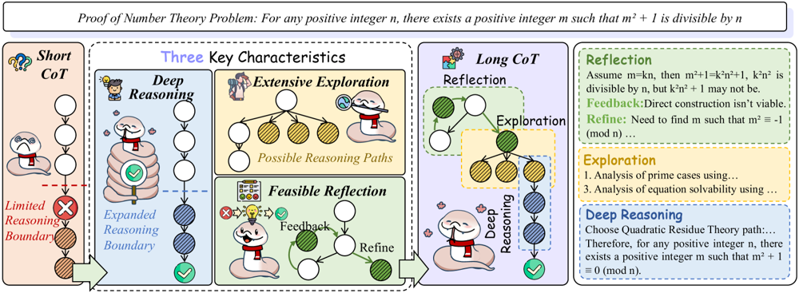

# 5 | 长链与短链 CoT 的对比研究与训练教程

[TOC]

## 1. Chain-of-Thought 推理的作用与长/短链定义

**Chain-of-Thought（思维链）**是在大型语言模型（LLM）推理时显式生成中间推理步骤的一种技术，其作用是让模型“逐步思考”，从而提升复杂任务（如数学、逻辑推理、代码理解）的解题能力。通过在生成最终答案前展开一系列逻辑步骤，CoT 能够将复杂问题分解为子问题并逐步解决，提高推理准确性和过程可解释性。近年来，依赖**长链思维（Long CoT）**推理的大模型（如 OpenAI 的 O1、DeepSeek 的 R1）在数学和编程等领域取得了突破性进展。

*图1：Long CoT vs. Short CoT 示意图。长链思维包含**深度推理**（多层逻辑）、**广泛探索**（并行尝试不同思路）和**反馈反思**（对中间结果的评价和改进），从而突破短链思维的局限。示例证明题中，短链CoT因推理边界有限而过早终止，而长链CoT 通过假设验证（Reflection）、多策略探索（Exploration）和深入演绎（Deep Reasoning）找到正确解答。来自论文:Towards Reasoning Era: A Survey of Long Chain-of-Thought for Reasoning Large Language Models*

如图1所示，我们将**短链思维（Short CoT）*定义为传统较浅的思维链，其推理步骤相对较少、深度有限。例如对于简单数学题，短链CoT可能只进行一两步心算即可得出答案。而长链思维（Long CoT）\**指包含更多步骤、迭代和反思的深入推理过程，常用于复杂问题求解。长链CoT具有三大典型特征： (1) 深度推理：推理层次更深入，例如引入辅助定理或多层因果推断；(2) \*\*广泛探索\*\*：对不确定的中间推理分支进行发散思考，平行考虑多种可能途径；(3) \*\*可行反思\*\*：在推理过程中引入自我检查和反馈机制，及时修正谬误。相较而言，短链CoT 往往缺乏上述特征，仅进行线性、单一路径的推演，因而在复杂任务上容易陷入“浅尝辄止”或重复冗余的思路。典型例子：对于一个需要证明数论命题的问题，\*\*短链CoT\*\*或许只给出一两句直觉性的论断，因缺乏充分论证而失败；而\**长链CoT**会详细展开证明步骤，例如先假设验证特殊情形，得到反馈后再 refine 推理，最终完整证明命题成立（如图1右侧所示）。总之，CoT 通过让模型模拟人类逐步思考的过程，在**推理**型任务中发挥关键作用，而长链与短链则代表了思考深度和广度的两个不同层次。下面我们将对比它们各自的优劣。

## 2. 长链 vs. 短链：推理准确率、成本稳定性与泛化能力对比

**推理准确率**：长链思维在某些复杂任务上可以显著提升模型解题成功率，因为更深入的分解和演绎能覆盖关键细节。然而，**“不要想太多”**（Don’t Overthink It）的最新研究却指出：对于**同一道题目**，较短的思维链往往更有可能得到正确答案——短链比长链**最高可提升约34.5%的正确率**！这是因为冗长的推理可能引入偏离正轨的噪音步骤，反而降低正确率。如 Meta 等提出的短链策略表明：针对每个问题，从模型生成的多个解答中选取**最短的推理链**，其正确率显著高于随机选取或最长链。一些研究甚至发现对于某些任务，**推理长度与准确率不显著相关**。因此，在不损失必要推理的前提下，压缩思维链往往有益。值得注意的是，对于特别复杂的问题（如高等数学证明），长链仍是找到正确解的必要手段，但应避免无谓的赘述。

**Token 成本与效率**：长链CoT 的代价是显著更多的Token开销和推理时间。较长的“思考”序列会增加模型**推理计算成本**，在部署中引发延迟和费用。而短链策略能大幅降低成本：例如 short-1@k 方法通过并行生成多个答案并**仅采用最先完成的那个**，在**保持性能的同时减少了约40%的推理token**消耗；short-3@k 方法让前三条完成的思维链投票决策，较传统多数投票提高准确率的同时将墙时降低最多33%。换言之，短链能够以更少的计算获得等效甚至更好的结果。图2对比了传统多数投票（需要完整采样所有链）与短链优先策略：可见short-1@k只等待**一条**链完成即提前停止，大幅节约了后续计算，而且在示例中它直接选中了正确答案49，而多数投票因干扰链较多最后错选了52。

*图2：传统多数投票 vs. **short-1@k** 短链推理策略示例。多数投票需要等待所有$k$条思维链完成并汇总（上，4条链得出答案分别为52、49、33、52，最终多数答案52错误），而short-1@k只执行$k$条链中首条完成的推理，将其答案49直接输出（下）。短链策略显著减少了总体推理步骤，避免了冗长思考带来的计算浪费和潜在错误。*

**稳定性与鲁棒性**：长链思维引入更多步骤，理论上有机会在过程中**自我纠错**（通过可行反思来修正早先的错误推断）。这意味着对于某些复杂推理，长链可能更稳定地趋近正确解，例如通过检查中间结果并回溯调整，提高最终答案可靠性。然而，过长的推理也可能导致**错误累积和不稳定**：如果超过模型可靠推理的边界，“深究”反而令模型偏离正确轨道。研究表明模型的**“过度思考”**现象存在阈值：性能随推理长度增加先提升，\**超过某个阈值后反而下降\**。因此超出模型能力的冗长推理是不稳定的，会引发逻辑混乱或前后矛盾。短链因步骤精简，错误累积风险较低，每一步都更接近模型训练分布下熟悉的输出形式，因而在**常规场景**下往往输出稳定、一致。综上，短链在避免模型走偏方面更有优势，而长链若运用得当（恰到好处地深入而不过犹不及）则能发挥自我检查的稳定作用。

**泛化能力**：长链CoT体现出让模型**更好地泛化到复杂任务**的潜力。通过在训练或提示时鼓励模型展开详细推理，模型可学会解决超出简单模式匹配的问题，具备接近人类多步推理的能力。例如，长链允许模型在多学科知识和复杂逻辑推理上整合信息，这对于跨领域的**推理泛化**是必要的。另一方面，短链由于步骤少，更依赖模型内隐的即知即解能力，在所见类问题上表现良好，但遇到需要**跳出直觉**、多步推出的新问题时可能力不从心。因此，提升模型泛化性通常需要一定程度的长链推理支持。不过，也有工作发现，当问题足够简单时，引入长链反而可能引发**不必要的模式**，让模型发挥欠佳。总的来说，应根据任务复杂度选择合适的链长：**简单任务不过度思考，复杂任务不草率省略**，才能兼顾泛化性与效率。这一原则在近期Test-Time Compute研究中被强调：固定长度推理对简单问题经常**过度计算**而对困难问题**计算不足**。未来的自适应推理（详见第4节）正是为了解决这一不匹配而提出。

## 3. 长链与短链的生成方法：提示策略与模型训练

**提示设计策略**：不同的提示（prompt）策略可以引导模型生成偏长或偏短的思维链，从而实现对推理过程的控制。常用的包括：

- **逐步链式提示（Standard CoT）**：直接在问题后附加类似“让我们一步步思考”的指令。这是基础的CoT提示，会引导模型给出**中等长度**的推理步骤。若问题简单，生成的CoT自然较短；问题复杂则可能较长，但长度不受明确控制。
- **从易到难提示（Least-to-Most, LtM）**：这是一种将问题**分解**的提示工程策略。具体做法是引导模型**先列出子问题**：从最容易的子任务开始，逐步解决后再解决更难的部分。例如提示可以是：“**首先**找到问题中最简单的部分并解决它，然后依次解决更难的问题，最后给出总解答。”LtM 提示往往产出较**长链**但结构清晰的推理，因为模型会先输出一系列子问及其解，再汇总结论。实践表明这种方法在需要分步推理的任务（如数学证明、多段推理问题）上效果显著提升。
- **计划-求解提示（Plan-Solve）**：这是一种**两段式**提示方法。在第一阶段，要求模型先给出解决问题的总体思路或计划；第二阶段再根据这个计划展开详细求解。例如提示：“让我们先制定一个完整的解决计划。然后根据该计划逐步求解问题并给出答案。”在Plan阶段模型可能仅列出步骤要点（形成**短链**的高层摘要），Solve阶段再详述每步（形成**长链**的具体推理）。这种方法的优势是让模型有全局视野，避免漫无目的地冗长思考，从而在需要的时候产出深入推理，而在明确易解的部分不浪费笔墨。Plan-Solve 提示在零样本链式推理中的效果已被验证，可明显提升复杂推理任务的正确率。
- **其他策略**：包括**反向链推理**（如“从结论倒推原因”以验证正向推理正确性）、**依据提示**的思维链（比如要求模型按给定格式逐步回答）等。这些均属于提示工程的方法，目的是在不改变模型参数的情况下，引导其输出所需长度和风格的推理链。

通过巧妙的Prompt设计，我们可以在一定程度上**控制思维链的长度和结构**，服务于不同需求。例如，为提高可靠性可要求模型详细论证每一步（倾向长链）；为追求效率则可提示模型直接给出简洁结论或仅少量关键步骤（倾向短链）。

**模型训练方法**：除了推理时的提示，引导模型产生长/短链还可以通过训练过程中的数据和目标设计来实现：

- **监督微调（SFT）**：即使用人工标注或高质量的思维链过程数据对模型进行微调训练。如果训练数据中包含**详细的步骤分解**，模型日后回答时就更倾向生成长链CoT；反之，如果训练时倾向于简洁的推理路径，模型就学会给出短链答案。例如，近期研究构建了不同版本的训练集：**S-short**（每题只保留最短的正确思维链）、**S-long**（保留最长的链）、**S-random**（随机长度链）来微调模型。结果发现：**用短链数据微调后的模型不仅推理更快而且正确率更高**，而用长链数据微调反而增加了推理时间且性能无明显提升。这说明训练数据中思维链的长度分布会直接影响模型推理风格和效果。
- **过程监督（Process Supervision）与结果监督**：传统强化学习训练LLM多采用结果监督，即仅根据最终答案对错来回馈奖励（称为Outcome Reward Model, ORM）。而**过程监督**则利用对中间步骤的评价来指导模型（例如每步对或错都有标记），通常通过**过程奖励模型（PRM）\**实现。OpenAI 提出了大规模过程监督数据集\**PRM800K**，含80万条模型解题思维链的逐步对错标注。借助这些数据，可训练一个**过程奖励模型**来评估LLM每一步推理是否正确，从而在强化学习中给模型细粒度的指导。这种方法使模型更擅长长链推理的探索，因为它能在中途纠偏，不像结果监督那样要等最终答案再判断。例如，Microsoft 的 **rStar-Math** 项目结合了一个小型LLM策略模型和一个过程奖励模型，通过自我博弈式训练，让小模型在没有大模型蒸馏的情况下也掌握深度数学推理。他们利用过程监督信号引导Monte Carlo树搜索扩展思维链，并在每步进行验证筛选。实验表明过程监督能显著提高复杂推理题的解答率，不过也存在**reward hacking**等挑战（模型可能学会迎合奖励而非真正理解）。总体而言，过程监督有利于训练模型拓展长链推理能力，但实现难度较高，需要大量高质量逐步标注数据。
- **强化学习（RL）微调**：许多先进的**推理大模型**通过RLHF（人类反馈强化学习）等方式进一步打磨推理链长度。例如OpenAI的O1模型和DeepSeek的R1模型据报道在RL微调过程中学会了产生更长的思维链，从而在数学和多步骤推理任务上性能提升。在RL训练中，可以设定奖励鼓励模型输出一定长度范围的CoT（过短或过长都惩罚）以平衡性能。也有工作提出在RL过程中动态调整奖励，使模型既不过度简略也不啰嗦冗余地回答，从而接近最优推理长度。
- **知识蒸馏和迁移**：将**大模型的长链推理能力**迁移给**小模型**也是一个研究方向。通过让小模型模仿大模型的思维链输出（蒸馏），小模型能以较短链取得与大模型长链近似的效果。这在推理效率上很有意义，因为小模型推理更快但需要引导其产生高质量链。类似地，多任务训练、链上少样本学习等也能提升模型在不同长度推理上的适应性。

总之，通过**提示策略**和**训练过程设计**的结合，研究者可以在一定程度上塑造模型的推理链风格：既可以得到详尽完备的长链推理模型，也可以训练出擅长一针见血给出简洁推理的模型。在实践中，两者常结合使用，例如先用SFT教会模型连贯思考，再用RL调优其思维链长度分布，从而实现性能与效率的平衡。

## 4. 长链压缩与早停机制：动态门控策略及公式

尽管长链CoT有助于复杂推理，但任意延长思维链并非一直有利。“测试时计算”（Test-Time Compute, **TTC**）研究关注如何在**推理阶段动态调整思维链长度**或计算量，以实现效率与性能的最佳折中。其核心是在确保准确率的同时，**压缩过长的推理链**或**对简单任务提前终止推理**（early stopping），避免过度思考浪费计算。典型的门控机制包括：

- **固定预算下的可控推理（Controllable, Level 1）**：为每个问题预先设定一个**计算预算 $C$**，如允许的最大思维链长度或采样链条数，然后让模型在此限制内尽量输出最佳答案。形式化而言，可将其描述为约束优化：在预算$C$下**最大化**模型性能$P(r,x)$，即 $\max_{r \in R} P(r,x)$ s.t. $E(r,x) \le C$（其中$E(r,x)$表示消耗的计算，如token数量或模型调用次数）。直观解释：限定最多思考多少步，然后要求模型在有限步内**想得尽可能对**。这种方法给予用户对计算开销的明确控制，实现**有限计算下的性能最优**。例如，多数投票通常需要固定采样$n$条链；通过减小$n$或限定每条链最长$m$个token，可以直接约束最大计算量。
- **自适应的动态推理（Adaptive, Level 2）**：不提前设定固定预算，而是让模型**根据问题难度或自身置信度**动态决定需要推理多深。简单来说，就是**模型边想边判断“要不要再想”**：如果觉得有把握了就提前停，否则继续深挖。这可以通过在目标函数中加入对推理长度的惩罚项来实现，如 $\max_{r} {P(r,x) - \alpha \cdot \text{Cost}(r)}$，其中$\text{Cost}(r)$是推理消耗（如token数），$\alpha$是权衡精度与效率的系数。当$\alpha$适当选择时，模型会自动在收益递减时停止深入。这类方法本质上将**“推理几步”**作为决策的一部分。例如，当模型对某步答案置信度很高，继续下去收获变小且代价变大，就可以触发停止。 when the correct)研究表明这种自适应策略比固定预算更高效：因为简单问题模型会很快收敛停止，而遇到困难问题又会自动分配更多计算。
- **基于置信度的早停（Confidence-based Halting）**：这是动态推理的一种具体实现。模型在生成思维链的过程中，随时监控对最终答案的**置信度**。当置信度超过某一阈值$\tau$时，就认为“想得差不多了”，触发提早收尾。例如，HALT-CoT 方法设置了判断条件：一旦模型当前输出的最终答案概率分布足够“尖锐”（如熵低于阈值，或**最大候选答案概率超过$\tau$**)，则立即停止继续生成推理步骤。用公式表示：设$P_t(y^*|x,r_{<t})$为在推理进行到第$t$步时模型对某候选答案$y^*$是正确答案的概率，如果 $\max_{y} P_t(y|x,r_{<t}) > \tau$，则停止思维链并直接输出此时概率最高的答案$y^*$。这种方法利用模型自身的**置信度信号**作为停机准则，无需额外监督信号。需要注意置信度阈值的选择：值设得过高，模型可能依然会进行很多步；值过低，又可能过早终止犯错。因此，有研究使用滑动窗口的UCB算法自适应调整阈值，以兼顾不同难度问题。总的来说，置信度早停让模型“有信心时就别多想”，避免无谓的长链。
- **基于验证投票的早停（Verifier/Voting Early Exit）**：另一种思路是通过**并行多样推理**和**投票**来及早确定答案。如前文提到的short-m@k即是一例：它启动$k$个并行思维链，但**无需等待全部完成**，而是在最先结束的$m$条链得到答案后就立即采用**多数票**决策结果。若已有超过半数链同意某答案，则没必要浪费算力算剩下的链，直接输出共识答案即可。这等效于一种动态停止规则：对于并行采样集合${r_i}$，若存在某候选答案$a$，使得 `$Count_{\text{finished}}(a)/m \ge 0.5$`，则提前停止剩余采样并输出$a$。更一般地，可以设定阈值$\gamma$：一旦当前完成的链中有$\gamma$比例都得到同一答案，就认为达成高置信度共识，终止推理。这种**自适应投票**在大多数情况下能显著减少采样次数，同时几乎不影响准确率。Meta团队的试验显示，与固定采样16次的自洽投票相比，引入置信度投票早停（CGES算法）平均将所需模型调用次数减少近70%（16降至4.9），而准确率几乎无损。除了多数投票，还可以引入一个**外部验证模型**来评估当前部分推理的质量：例如每生成一步，就用验证器判断“这一推理路径最终能否得出正确答案”。如果验证器认为当前路径很可能错误，模型可以**及时放弃当前思路**（相当于剪枝），转而尝试别的路径；反之如果验证器对当前中间结果很满意，则可以允许模型多花些计算沿此路径深入。这样的**边生成边验证**机制，相当于为思维链加了“守门员”，在推理尚未完成时提前淘汰明显错误的分支，以提高效率和准确率。实践中，有工作将self-consistency和验证结合，设计了两阶段的淘汰筛选过程，使模型在生成若干候选答案后，能自动剔除低质量答案，只对高质量候选继续扩展，从而减少无谓计算。

上述机制很多已经通过公式或算法伪码实现：例如Confidence-Guided Early Stopping (CGES) 提供了**贝叶斯后验**的框架，将每条思维链的答案置信度视为证据，不断更新对各候选答案的后验概率，当后验质量超过阈值就停止采样 when the correct)；REFRAIN框架则引入判别器检测思维链何时开始“原地打转”并应停止，并通过bandit算法动态调整停止时机 on reasoning,difficulty without supervision or fine)。总的目标是在**尽量少的推理步骤**下取得与长链等同的正确率。这种**弹性推理**思想也体现在最新方法如CoT-Valve中：它通过在模型中加入一个“阀门”来控制生成链条长度，针对简单问题自动压缩推理冗余，对于复杂问题则保留必要的长链，从而实现推理的弹性伸缩。

需要强调的是，门控压缩和早停策略的前提是**不牺牲准确率**或将损失控制在可接受范围内。例如，CoT-Valve方法成功将一个32B模型在GSM8K上的平均思维链从 **741** 个token压缩到 **225** 个，仅使准确率从95.07%略降到94.92%（基本无损），而在更难的AIME题目上将平均链长从6827减到4629，仅多出1道题答错。这表明对于简单任务，原有推理中存在大量冗余，可以大胆砍掉；但对极复杂任务，即便去掉三分之一步骤模型依然需要**几千tokens**的长链才能保证高分。这也再次验证了前述观点：**“难题需要长思考，易题不必多纠结”**。通过置信度阈值、自适应投票等手段，我们可以让模型**在该长的时候充分长，该短的时候尽量短**，从而提升整体推理效率。

## 5. 实验案例分析：不同任务中长链 vs. 短链表现差异

不同类型和难度的任务对于长链/短链CoT有各自的适用性。下面通过2025年有代表性的基准任务，考察长短思维链的效果差异：

- **GSM8K（小学数学应用题）**：这是一组比较简单的算术和文字题。对于此类**中低难度**的题目，短链CoT通常已经足够应付。大量研究发现，大模型在GSM8K上即使不给出详细步骤也能直接算对绝大多数题；而强行生成很长的推理过程往往只是啰嗦重复，不提高正确率。例如，一个1.5B的小模型用贪心方法解GSM8K表现较差，但如果允许它尝试5次然后选最好答案，准确率就接近32B大模型；可见**通过多次短链尝试也能逼近大型模型效果**。另一方面，小模型在GSM8K上的**平均CoT长度竟是大模型的4倍以上**（冗余反复的内容居多）。这暗示我们：较弱的模型往往“想太多却想不对”，而较强的模型能用更精炼的步骤直击答案。因此，像GSM8K这样的任务，可以通过短链和自洽投票来显著提升效率而不损失准确率。CoT-Valve实验证明了这一点：压缩**70%**以上的推理内容，GSM8K准确率几乎不变。因此在GSM8K上，**短链+多数投票/检验**的策略非常有效，比让模型絮絮叨叨想一大堆更好。
- **MATH（高级数学竞赛题库）**：该数据集汇集了高中奥赛和大学数学竞赛题，题目复杂且步骤繁多。**长链CoT**在此类任务上的重要性凸显。OpenAI等发现，增加模型的推理步长显著提升数学题正确率。例如，一个基础7B模型直接作答MATH可能不到50%正确率，但通过生成详细证明步骤并结合验证模型筛选，正确率可大幅提高。**rStar-Math项目**就是证明：他们让一个7B策略模型结合自我进化的长链推理，最终在MATH测试集达到**90.0%\**的高分！相比之下，未用长链深思的模型只有约40-60%的水平。这表明在复杂数学推理中，\*\*长链是解题的关键\*\*；模型需要逐步推导、分案例讨论、前后反思，才能避免错误并逼近人类解题思路。值得一提的是，rStar-Math通过长链MCTS搜索和过程监督，使小模型也能媲美甚至超越某些大模型（其7B模型成绩超过了OpenAI O1-preview等大模型）。因此在MATH任务上，越是详细严谨的思维链往往效果越好。当然，过长链也可能引入噪音，因此像\**MathPrompter**等工作提出用程控提示或工具辅助，确保长链推理每一步都可靠。
- **AIME（美国高中数学邀请赛）**：AIME题被认为比MATH一般题更难，需要更有创造性的多步推理。对这类**极高难度**的问题，单纯短链基本无法奏效，模型往往需要**探索性长链推理+自我纠错**才能有所斩获。例如，GPT-4等大模型在零样本时AIME准确率很低，但通过链式思考和反思提示可明显提高。前述rStar-Math在AIME上的表现也验证了长链的威力：他们的系统平均能解出**8/15道题（53.3%）**——这个成绩已逼近AIME考试Top 20%人类考生的水平！而普通模型在AIME上可能连1-2题都解不出。CoT-Valve的实验亦显示：AIME题目的推理链极长，平均达数千Token，但**无法大幅压缩**而不损失正确率。即使缩减三分之一长度，仍然错了一道题，可见长链在这些题上几乎是“刚需”。因此，AIME这样的竞赛难题需要模型充分发挥长链思维潜力，尝试多种方法、深入演绎，每一步都小心验证，才有可能找到正确答案。
- **常识推理与阅读理解**：在这类日常语言推理任务上，一般不需要特别长的思维链。研究发现对于共识性的常识问答，**短链甚至直接回答往往已经够用**，长篇大论反而增加出错机会。一些分析指出，当问题难度不大时，LLM倾向于**过度解释**会“想出”与题无关的内容，致使答案跑偏。因此，对常识性问答，短链或跳过CoT（直接回答）有时效果更佳。此外，在需要**解释型输出**的任务中，可以先用短链找到答案，再要求模型对该答案给出一个合理的解释（这段解释本身不影响正确率，只作为附加输出）。这样既保证正确率又提供了简洁思维链，比模型先想一长串再作答更稳健。因此，对于非复杂推理任务，**应适当限制思维链长度**，让模型简洁作答以避免“翻车”。

综合来看：**任务难度**是决定采用长链还是短链策略的重要因素。简单任务“短打快攻”既省时又准确；复杂任务则需要“步步为营”展开充分推理。2025年的多项研究致力于开发**自适应推理框架**，使模型能针对不同任务自动调整链长。例如上文提到的自适应门控方法，就让模型对简单问题早停，对困难问题深挖，从而在广泛任务上都取得高效的性能。在下一节中，我们将讨论未来值得探索的方向，其中很多都围绕如何进一步提高这种**智能化的长/短链决策**。

## 6. 总结与未来研究方向

通过上述对比，我们可以看到长链和短链Chain-of-Thought各有其适用场景和优劣。**长链CoT**擅长处理复杂、多步骤的问题，在数学证明、代码推理等需要深度思考的任务上表现突出，但也伴随着推理开销大、可能“过度思考”带来错误等问题。**短链CoT**则以高效率和简洁取胜，在常识性问题和易解任务上往往既快又准，但面对高复杂度推理时可能力有不逮。2025年的一系列研究工作（包括Long CoT综述、短链优选方法、高效推理综述等）为我们提供了深入理解这两种思维链的框架和方法。

展望未来，几个值得关注的研究方向包括：

- **多模态长链推理**：当前的CoT研究主要聚焦文本领域，未来将扩展到**多模态**。这意味着让模型在图像、表格、音频等多种信息源上也能产生日志式的推理链。例如，让模型一边看图一边用语言描述推理过程，或者在机器人控制等场景生成带有状态评估的思维链。这需要解决多模态信息的对齐和统一编码，以及跨模态推理步骤的表示。
- **推理效率与实时性**：随着应用对LLM实时性的要求提高，如何在**不牺牲准确率**的前提下进一步降低推理步骤和计算是长期课题。例如，发展更智能的**早停算法**、设计轻量级验证模型来及时纠正错误路径，以及利用并行计算和异步推理加速CoT on reasoning,difficulty without supervision or fine)。另外，**推理步骤的压缩/折叠**也是方向之一：能否让模型在内部隐式地推理多步，但对外只输出关键步骤？近期的Soft CoT思路（将部分推理放到隐层进行）提供了一条可行途径。总之，让模型学会**“只想必要的东西”**，提升推理**性价比**，对大规模应用非常重要。
- **知识与推理融合**：长链推理往往涉及外部知识的调用与整合。未来研究将探讨如何将**知识检索**、**工具使用**无缝融入CoT。例如，引入模块让模型在推理链中可以查询知识库/互联网，当缺少信息时及时补充；或者调用计算器、定理证明器等工具辅助每一步推理的验证。OpenAI的Code Interpreter、工具增强型CoT等都是朝这方向迈出的探索。理想情况下，模型能够自动判断某步需要调用知识或工具，并将结果纳入后续推理，从而实现**知识丰富的长链CoT**。这也涉及**记忆与长程依赖**问题：让模型在长链过程中不遗忘前面的关键细节，并能在需要时回溯利用之前的结论。
- **复杂推理的安全性和可靠性**：随着长链CoT让模型思考得越来越“深入”，也带来了**错误传播**、**幻觉**甚至恶意利用的风险。未来需要开发机制来**监控和约束思维链**内容，确保其逻辑合理且不偏离安全边界。例如，研究如何检测思维链中的不稳定模式（类似人类的强迫思考、死循环）并干预；如何设计**一致性判别器**来评估多条思维链是否围绕同一结论，以发现模型是否在自相矛盾。另外，在多代理系统中，长链CoT也可能引发复杂的交互，需要考虑博弈和决策安全。
- **理论基础与解释性**：尽管CoT提升了模型性能，但我们对其内部工作机理尚缺乏理论解释。未来研究或将借助可解释AI的方法，构建**认知模型**来解释LLM为何通过CoT能解题，以及找出哪些类型的问题特别需要长链才解得出。一些初步工作将LLM视为一种有限状态机或使用信息论分析推理过程。深入的理论研究将帮助我们回答：长链推理究竟增加了模型的哪方面能力？在哪些情况下短链一定不够？这一方向的进展将为设计新的模型结构（也许有专门的“推理模块”或“工作记忆”机制）提供指导。
- **个性化和任务自适应**：不同任务、甚至不同用户需求下，理想的思维链长度和风格都可能不同。未来的LLM应能够**自适应地调整推理链**，或者由用户偏好来配置。比如在考试情景中希望模型写出详细步骤以示过程，在直接问答场景则希望答案简明扼要。为此，可以研究让模型学习一个**元策略**：根据当前问题难度和上下文，决定采用长链还是短链，甚至决定具体采用哪种提示策略（如先Plan再Solve等） when the correct)。这一方向需要模型具备一定的**元认知能力**，知道“**何时该多想，何时该少想**”——这正是人类专家的特征之一。

综上所述，长链与短链CoT作为大型语言模型推理的两种范式，各自拥有独特的优势。研究者应根据任务需求权衡取舍，或通过自适应方法结合两者的优点。在**推理新时代**的大背景下，如何让模型既能进行深入严谨的长程推理，又能保持高效稳健，是一项具有挑战且意义重大的课题。期待未来出现更多创新工作，进一步推动CoT推理在理论和应用上的发展，为迈向通用人工智能的目标奠定坚实基础。

## Reference：
[1] Towards Reasoning Era: A Survey of Long Chain-of-Thought for Reasoning Large Language Models、
[2] *Don’t Overthink It: Shorter Reasoning Chains Improve Performance (2025)*、
[3] *A Survey of Reasoning LLMs (2025)* on reasoning,difficulty without supervision or fine、
[4] *Adaptive and Controllable Test-Time Compute Survey (2025)*、
[5] *rStar-Math 项目*、*OpenAI PRM800K (2023)*